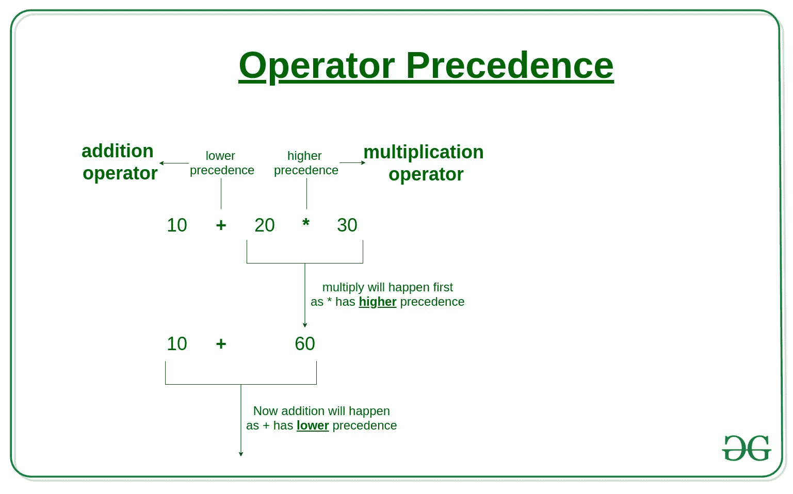
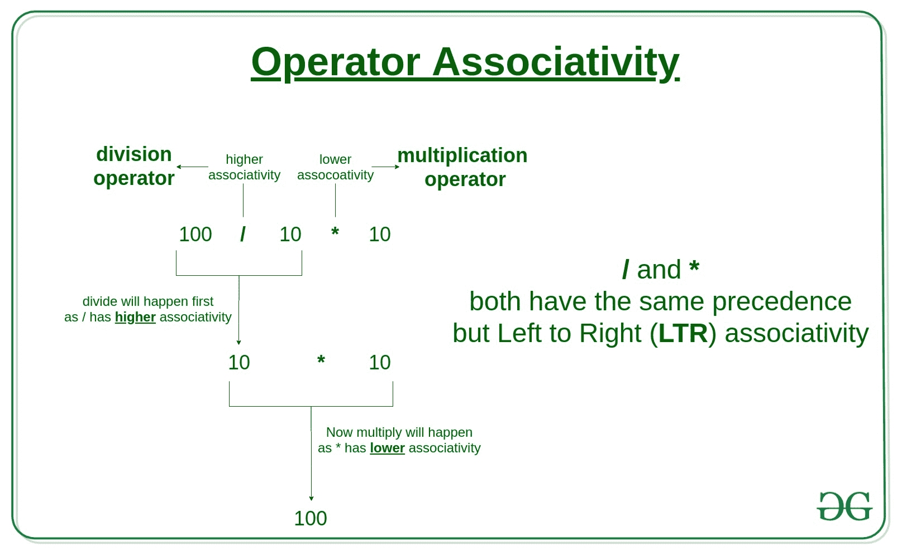
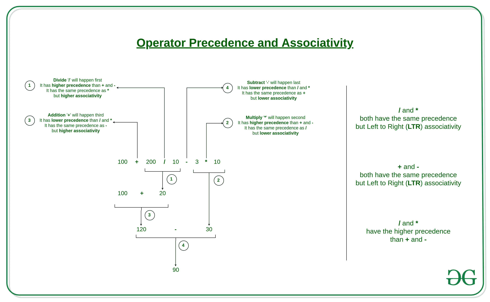

# Python 中运算符的优先级和结合性

> 原文:[https://www . geeksforgeeks . org/python 中运算符的优先级和关联性/](https://www.geeksforgeeks.org/precedence-and-associativity-of-operators-in-python/)

在 Python 中处理运算符时，我们必须了解 Python 运算符优先级和结合性的概念，因为这些决定了运算符的优先级。否则，我们将看到意想不到的输出。

**运算符优先级:**在具有多个不同优先级的运算符的表达式中使用，以确定首先执行哪个操作。

**示例:**求解

```
10 + 20 * 30

```

[](https://media.geeksforgeeks.org/wp-content/uploads/20190708163349/Operators-Precedence.jpg)

```
10 + 20 * 30 is calculated as 10 + (20 * 30)
and not as (10 + 20) * 30

```

**代码:**

## 蟒蛇 3

```
# Precedence of '+' & '*'
expr = 10 + 20 * 30

print(expr)
```

**输出:**

```
610

```

**例:**现在来看看**逻辑**‘**或**‘&**逻辑**‘**运算符上的一个例子。**如果**块被执行，即使年龄为 0。因为逻辑“**的优先级大于逻辑“**或**”。****

## ****蟒蛇 3****

```
**# Precedence of 'or' & 'and'
name = "Alex"
age = 0

if name == "Alex" or name == "John" and age >= 2 :
    print("Hello! Welcome.")
else :
    print("Good Bye!!")**
```

******输出:******

```
**Hello! Welcome.** 
```

****因此，要运行“ **else** ”块，我们可以使用括号 **( )** ，因为它们的优先级在所有运算符中最高。****

## ****蟒蛇 3****

```
**# Precedence of 'or' & 'and'
name = "Alex"
age = 0

if ( name == "Alex" or name == "John" ) and age >= 2 :
  print("Hello! Welcome.")
else :
  print("Good Bye!!")**
```

******输出:******

```
**Good Bye!!** 
```

******运算符关联性:**如果一个表达式包含两个或多个具有相同优先级的运算符，则使用运算符关联性来确定。可以是 **L** eft 至 **R** ight 或从 **R** ight 至 **L** eft。****

******示例:** '* '和'/'具有相同的优先级，它们的关联性为**L**eft**t**o**R**ight，因此表达式“100 / 10 * 10”被视为“(100 / 10) * 10)”。****

****[](https://media.geeksforgeeks.org/wp-content/uploads/20190708164646/Operators-Associativity-1.jpg)****

******代码:******

## ****蟒蛇 3****

```
**# Left-right associativity
# 100 / 10 * 10 is calculated as 
# (100 / 10) * 10 and not 
# as 100 / (10 * 10)
print(100 / 10 * 10)

# Left-right associativity
# 5 - 2 + 3 is calculated as 
# (5 - 2) + 3 and not 
# as 5 - (2 + 3)
print(5 - 2 + 3)

# left-right associativity
print(5 - (2 + 3))

# right-left associativity
# 2 ** 3 ** 2 is calculated as 
# 2 ** (3 ** 2) and not 
# as (2 ** 3) ** 2
print(2 ** 3 ** 2)**
```

******输出:******

```
**100
6
0
512** 
```

> ******运算符优先级和结合性是运算符的两个主要特征，它们决定了在没有括号的情况下子表达式的求值顺序。******

******示例:**求解****

```
**100 + 200 / 10 - 3 * 10** 
```

****[](https://media.geeksforgeeks.org/wp-content/uploads/20190708173715/Operator-Precedence-and-Associativity-2.jpg)****

```
**100 + 200 / 10 - 3 * 10 is calculated as 100 + (200 / 10) - (3 * 10)
and not as (100 + 200) / (10 - 3) * 10** 
```

******代码:******

## ****蟒蛇 3****

```
**expression  = 100 + 200 / 10 - 3 * 10
print(expression )**
```

******输出:******

```
**90.0** 
```

****请参考下面的优先级和关联性表。此表列出了从最高优先级到最低优先级的所有运算符。****

<figure class="table">

| **操作员** | **描述** | **关联性** |
| --- | --- | --- |
| ( ) | 圆括号 | 从左向右 |
| ** | 指数 | 从右向左 |
| * / % | 乘法/除法/模数 | 从左向右 |
| + – | 加法/减法 | 从左向右 |
| <> | 按位左移，按位右移 | 从左向右 |
| > > = | 关系小于/小于或等于
关系大于/大于或等于 | 从左向右 |
| == != | 关系等于/不等于 | 从左向右 |
| 是，不是在，不在 | 身份成员操作符 | 从左向右 |
| & | 按位“与” | 从左向右 |
| ^ | 按位异或 | 从左向右 |
| &#124; | 按位包含或 | 从左向右 |
| 不 | 逻辑非 | 从右向左 |
| 和 | 逻辑“与” | 从左向右 |
| 或者 | 逻辑或 | 从左向右 |
| =
+=-=
* =/=
% =&=
^= &#124; =
<<=>>= | 赋值
加法/减法赋值
乘法/除法赋值
模/位“与”赋值
位“异或”赋值
位左/右移位赋值 | 从右向左 |

</figure>