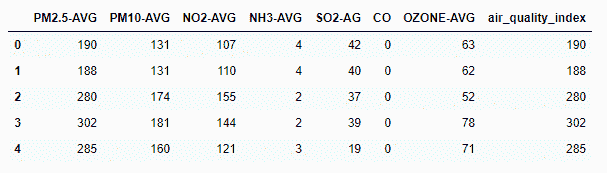

# 用 Python 预测空气质量指数

> 原文:[https://www . geeksforgeeks . org/predicting-air-quality-index-use-python/](https://www.geeksforgeeks.org/predicting-air-quality-index-using-python/)

让我们看看如何用 Python 预测空气质量指数。空气质量指数是根据化学污染物数量计算的。通过使用机器学习，我们可以预测空气质量指数。

**AQI:** 空气质量指数是每天报告空气质量的指数。换句话说，它是衡量空气污染如何在短时间内影响一个人的健康。空气质量指数是根据标准时间间隔内测量的特定污染物的平均浓度计算的。一般大多数污染物的时间间隔为 24 小时，一氧化碳和臭氧为 8 小时。

我们可以通过空气质量指数来了解空气污染的情况

<figure class="table">

| **AQI 等级** | **AQI 范围** |
| 好的 | 0 – 50 |
| 温和的 | 51 – 100 |
| 不健康的 | 101 – 150 |
| 对强壮的人不健康 | 151 – 200 |
| 危险的 | 201+ |

</figure>

让我们使用机器学习概念找到基于化学污染物的空气质量指数。

**注意:**下载数据集点击[此处](https://drive.google.com/drive/u/1/folders/1136eU0kEhxIUfpQpTfoe-BbvjfwkugEm)。

### **数据集描述**

它包含 8 个属性，其中 7 个是化学污染量，1 个是空气质量指数。PM2.5-AVG、PM10-AVG、NO2-AVG、NH3-AVG、SO2-AG、OZONE-AVG 为独立属性。空气质量指数是一个依赖属性。因为空气质量指数是根据 7 个属性计算的。

由于数据是数字，并且数据中没有缺失值，因此不需要预处理。我们的目标是预测 AQI，所以这个任务不是分类就是回归。所以由于我们的类标签是连续的，所以需要**回归**技术。

回归是**监督学习技术**，在给定范围内拟合数据。Python 中的回归技术示例:

*   随机森林回归器
*   阿达助推回归器
*   装袋回归器
*   线性回归等。

## 蟒蛇 3

```
# importing pandas module for data frame
import pandas as pd

# loading dataset and storing in train variable
train=pd.read_csv('AQI.csv')

# display top 5 data
train.head()
```

**输出:**



## 蟒蛇 3

```
# importing Randomforest
from sklearn.ensemble import AdaBoostRegressor
from sklearn.ensemble import RandomForestRegressor

# creating model
m1 = RandomForestRegressor()

# separating class label and other attributes
train1 = train.drop(['air_quality_index'], axis=1)
target = train['air_quality_index']

# Fitting the model
m1.fit(train1, target)
'''RandomForestRegressor(bootstrap=True, ccp_alpha=0.0, criterion='mse',
                      max_depth=None, max_features='auto', max_leaf_nodes=None,
                      max_samples=None, min_impurity_decrease=0.0,
                      min_impurity_split=None, min_samples_leaf=1,
                      min_samples_split=2, min_weight_fraction_leaf=0.0,
                      n_estimators=100, n_jobs=None, oob_score=False,
                      random_state=None, verbose=0, warm_start=False)'''

# calculating the score and the score is  97.96360799890066%
m1.score(train1, target) * 100

# predicting the model with other values (testing the data)
# so AQI is 123.71
m1.predict([[123, 45, 67, 34, 5, 0, 23]])

# Adaboost model
# importing module

# defining model
m2 = AdaBoostRegressor()

# Fitting the model
m2.fit(train1, target)

'''AdaBoostRegressor(base_estimator=None, learning_rate=1.0, loss='linear',
                  n_estimators=50, random_state=None)'''

# calculating the score and the score is  96.15377360010211%
m2.score(train1, target)*100

# predicting the model with other values (testing the data)
# so AQI is 94.42105263
m2.predict([[123, 45, 67, 34, 5, 0, 23]])
```

**输出:**

<video class="wp-video-shortcode" id="video-506008-1" width="640" height="360" preload="metadata" controls=""><source type="video/mp4" src="https://media.geeksforgeeks.org/wp-content/uploads/20201029163454/Air-Quality-Index-Prediction-in-python.mp4?_=1">[https://media.geeksforgeeks.org/wp-content/uploads/20201029163454/Air-Quality-Index-Prediction-in-python.mp4](https://media.geeksforgeeks.org/wp-content/uploads/20201029163454/Air-Quality-Index-Prediction-in-python.mp4)</video>

由此，我们可以说，根据给定的测试数据，我们得到了 123 和 95，因此空气质量指数是不健康的。