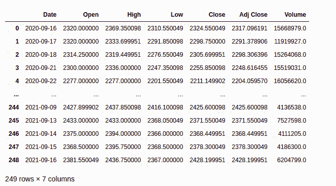

# 利用支持向量机预测股价方向

> 原文:[https://www . geeksforgeeks . org/预测-股价-方向-使用-支持向量机/](https://www.geeksforgeeks.org/predicting-stock-price-direction-using-support-vector-machines/)

我们将实施一个端到端的项目，使用支持向量机为我们直播交易。你可能听说过股票市场这个术语，它创造了成千上万人的生活，摧毁了数百万人的生活。如果你不熟悉股票市场，你可以浏览一些关于市场的基本资料。

## 使用的工具和技术:

*   计算机编程语言
*   支持向量分类器
*   雅虎金融
*   Jupyter 笔记型电脑
*   蓝移

## 逐步实施

### 步骤 1:导入库

## 蟒蛇 3

```
# Machine learning
from sklearn.svm import SVC
from sklearn.metrics import accuracy_score

# For data manipulation
import pandas as pd
import numpy as np

# To plot
import matplotlib.pyplot as plt
plt.style.use('seaborn-darkgrid')

# To ignore warnings
import warnings
warnings.filterwarnings("ignore")
```

### 第二步:读取股票数据

我们将阅读从雅虎财经网站下载的股票数据。数据以 OHLC(开、高、低、关)格式存储在 CSV 文件中。要读取 CSV 文件，可以使用熊猫的 [read_csv()](https://www.geeksforgeeks.org/python-read-csv-using-pandas-read_csv/) 方法。

**语法:**

```
pd.read_csv(filename, index_col)
```

**注:**我们已从雅虎财经网站下载了信实工业在 NSE 交易的近 1 年数据。

**使用的文件:**

## 蟒蛇 3

```
# Read the csv file using read_csv 
# method of pandas
df = pd.read_csv('RELIANCE.csv')
df
```

**输出:**



### 第三步:数据准备

数据在使用前需要被处理，因此日期列应该作为索引

## 蟒蛇 3

```
# Changes The Date column as index columns
df.index = pd.to_datetime(df['Date'])
df

# drop The original date column
df = df.drop(['Date'], axis='columns')
df
```