# 使用 ColumnTransformer、OneHotEncoder 和 Pipeline 进行预测

> 原文:[https://www . geesforgeks . org/prediction-use-column transformer-one hotencoder-and-pipeline/](https://www.geeksforgeeks.org/prediction-using-columntransformer-onehotencoder-and-pipeline/)

在本教程中，我们将使用 ColumnTransformer、OneHotEncoder 和 Pipeline 来预测每个具有不同功能的客户的保险费成本。
我们将导入必要的数据操作库:
**代码:**

```py
import pandas as pd
import numpy as np

from sklearn.compose import ColumnTransformer
from sklearn.model_selection import train_test_split, cross_val_score
from sklearn.impute import SimpleImputer
from sklearn.preprocessing import OneHotEncoder, StandardScaler, MinMaxScaler
from sklearn.pipeline import Pipeline
from sklearn.ensemble import RandomForestRegressor
```

我们现在将加载数据集，该数据集在这里可用:
每一行都是不同的个体，有年龄、性别、体重指数(bmi)、受抚养人人数、他们是否吸烟、他们所属的地区以及他们支付的保险费。

**代码:**

```py
df = pd.read_csv('https://raw.githubusercontent.com / stedy / Machine-Learning-with-R-datasets / master / insurance.csv')
df.head()
```

<center>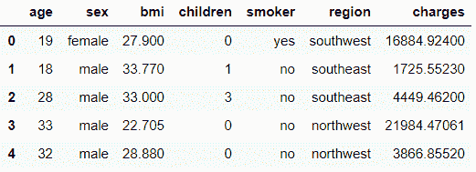</center>

**Code:**

```py
df.info()
```

<center>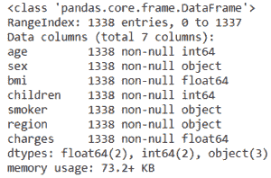</center>

**代码:**

```py
df.isna().sum()
```

<center>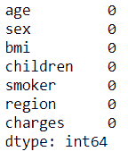</center>

我们看到没有。但我们会在这个数据集中引入‘杂质’，只是因为一片平静的大海从来没有造就出一个熟练的水手！……除了我们需要缺失值来更好地演示 ColumnTransformer 这一事实之外。

**代码:**

```py
np.random.seed(0) # for reproducibility
for _ in range(10):
    r = np.random.randint(len(df))
    c = np.random.randint(6)
    df.iloc[r, c] = np.nan
```

对于范围(10)，我们暗示我们需要数据中 10 个位置的 NaN，无论是不同行中的每个 NaN 还是一行中的多个 NaN，我们都不会介意。

**代码:**

```py
df.isna().sum()
```

<center>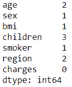</center>

We’ll now split the data into train and test sets.

**代码:**

```py
X_train, X_test, y_train, y_test = train_test_split(df.drop('charges', 1),
                                                    df['charges'],
                                                    test_size = 0.2, random_state = 0)
```

现在进入 ColumnTransformer！
column transformer 接受一个列表，其中包含我们希望在不同列上执行的转换的元组。每个元组需要 3 个逗号分隔的值:第一，转换器的名称，它实际上可以是任何东西(作为字符串传递)，第二是估计器对象，最后一个是我们希望在其上执行该操作的列。

**代码:**

```py
trf1 = ColumnTransformer(transformers =[
    ('cat', SimpleImputer(strategy ='most_frequent'), ['sex', 'smoker', 'region']),
    ('num', SimpleImputer(strategy ='median'), ['age', 'bmi', 'children']),

], remainder ='passthrough')
```

首先，我们将估算分类栏。我们将使用最频繁的或“模式”类型的插补，分类栏是“性别”、“吸烟者”和“地区”。为了简单起见，我们将这个变压器命名为“猫”。
类似地，我们将使用各个列的中间值对数值列进行插补。我们现在需要告诉 ColumnTransformer 它应该如何处理剩余的列，即没有执行转换的列。在我们的例子中，使用了所有的特性，但是如果您有“未使用”的列，您可以指定在转换后是删除还是保留这些列。我们将保留它们，因此传递余数=“pass through ”,而不是默认的删除这些列的行为。我们也可以将这些列指定为它们的整数位置，而不是它们的名称，比如['年龄'，' bmi '，' children']，我们可以说[0，2，3]等。现在我们将拟合并转换 X_train 以查看输出，默认情况下，该输出是 numpy 数组:
**代码:**

```py
first_step = trf1.fit_transform(X_train)
first_step
```

<center>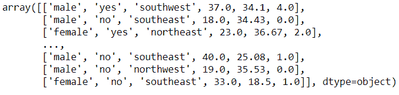</center>

We’ll make a data frame out of it:
**Code:**

```py
pd.DataFrame(first_step).head()
```

<center>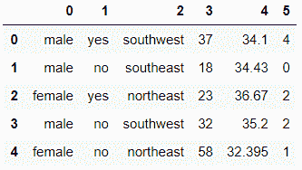</center>

您是否注意到列已被重新排序，列名现在已丢失？它们已经按照我们传递给 ColumnTransformer 的 Transformer 的顺序进行了重新排序，也就是说，我们首先要求它估算分类列，因此它们被放在第一位，以此类推…

**代码:**

```py
pd.DataFrame(first_step).isna().sum()
```

<center>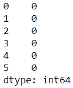</center>

We can check what each transformer is doing by using the ‘names’ we passed in the tuples:
**Code:**

```py
trf1.named_transformers_
# this is a dictionary, with the names of the transformers as keys.
```

<center>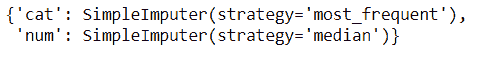</center>

**代码:**

```py
trf1.named_transformers_['num'].statistics_
# you see, these were the median values of each of the three numerical columns.
# for any transformer, you can access its specific attributes this way.
```

<center>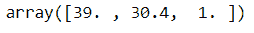</center>

既然所有的列都没有缺失值，我们就可以继续对分类列进行编码了。

**注意:OneHotEncoder 无法处理丢失的值，因此在编码前将其删除非常重要。**现在，我们为编码制作另一个 transformer 对象。我们不能在“trf1”中这样做，因为在那个时间点，X_train 中有丢失的值，而 OneHotEncoder 不能处理前面讨论的丢失的值。因此，我们首先需要移除丢失的值，然后将这个新的*‘first _ step’*数组(没有丢失的值)传递给 OneHotEncoder。

**代码:**

```py
trf2 = ColumnTransformer(transformers =[
    ('enc', OneHotEncoder(sparse = False, drop ='first'), list(range(3))),
], remainder ='passthrough')
```

我们将稀疏参数设置为 False(因为我们想要密集的数组输出)，我们可以根据我们拟合的模型类型，在是否删除第一个伪编码列之间切换，以避免“伪变量陷阱”。了解更多信息[这里](https://www.geeksforgeeks.org/ml-dummy-variable-trap-in-regression-models/):一般经验法则:如果使用基于线性的模型，删除伪编码的列，如果使用基于树的模型，不要删除它。另外，您看到如何为 columns 参数指定*列表(范围(3))* 而不是列名了吗？这是因为现在，我们已经丢失了列名(如“first_step”中所示)，但是我们知道分类列是前三列(在重新排序之后)，因此我们指定了[0，1，2]。

**代码:**

```py
second_step = trf2.fit_transform(first_step)
pd.DataFrame(second_step).head()

# Now we have our one hot encoded data ! Sweet !
```

<center>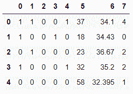</center>

**管道来了！**我们可以在单个管道实例中执行所有这些步骤。管道还需要元组列表，每个元组又需要两个值:步骤名和对象名。

**代码:**

```py
pipe = Pipeline(steps =[
    ('tf1', trf1),
    ('tf2', trf2),
    ('tf3', MinMaxScaler()), # or StandardScaler, or any other scaler
    ('model', RandomForestRegressor(n_estimators = 200)),
# or LinearRegression, SVR, DecisionTreeRegressor, etc
])
```

**代码:**

```py
# we'll use cross_val_score with 5 splits to better examine our model.
# we'll send our entire 'pipe' object to the cross_val_score and it will take
# care of all the preprocessing work for us ! cvs = cross_val_score(pipe, X_train, y_train, cv = 5)
print("All cross val scores:", cvs)
print("Mean of all scores: ", cvs.mean())
```

<center>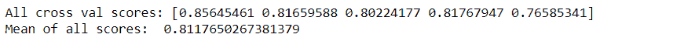</center>

So our model is around 81.2% accurate. You could try different regressors, tweak parameters, use StandardScaler or other scalers, and see if you can achieve better results. We can use GridSearchCV to do this work of finding best set of parameters for us. We’ll now fit the model on the entire training set, and predict results on the test set:

**代码:**

```py
pipe.fit(X_train, y_train)
```

<center>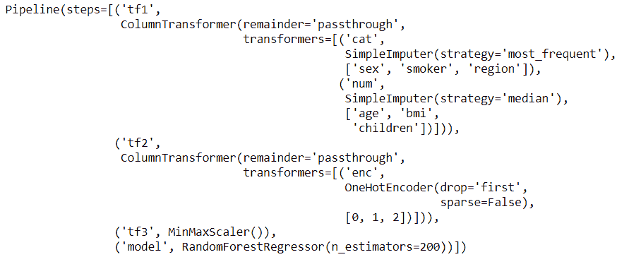</center>

**代码:**

```py
preds = pipe.predict(X_test)

# This is how the original test set insurance prices and 
# our predicted ones stack up

pd.DataFrame({'original test set':y_test, 'predictions': preds})
```

<center>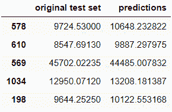</center>