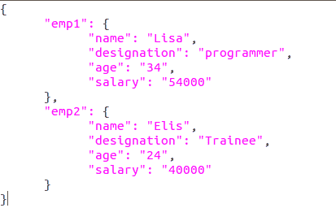

# Python 中的漂亮打印 JSON

> 原文:[https://www.geeksforgeeks.org/pretty-print-json-in-python/](https://www.geeksforgeeks.org/pretty-print-json-in-python/)

**JSON** 是一种存储和获取数据的 javascript 符号。数据通常存储在 JSON、XML 或其他数据库中。这是一种完全独立于语言的文本格式。为了处理 JSON 数据，Python 有一个名为`json`的内置包。

**注意:**更多信息请参考[使用 Python 读取、写入和解析 JSON】](https://www.geeksforgeeks.org/read-write-and-parse-json-using-python/)

#### 漂亮的印刷 JSON

每当使用 Python 中的内置模块“json”将数据转储到字典中时，显示的结果都与字典格式相同。在这里，漂亮打印 JSON 的概念出现在图片中，在图片中，我们可以显示以可呈现的格式加载的 Json。

**例 1:**

```py
# Write Python3 code here

import json

json_data = '[{"Employee ID":1,"Name":"Abhishek","Designation":"Software Engineer"},' \
            '{"Employee ID":2,"Name":"Garima","Designation":"Email Marketing Specialist"}]'

json_object = json.loads(json_data)

# Indent keyword while dumping the
# data decides to what level 
# spaces the user wants.
print(json.dumps(json_object, indent = 1))

# Difference in the spaces 
# near the brackets can be seen
print(json.dumps(json_object, indent = 3))
```

**输出:**

```py
[
 {
  "Employee ID": 1,
  "Name": "Abhishek",
  "Designation": "Software Engineer"
 },
 {
  "Employee ID": 2,
  "Name": "Garima",
  "Designation": "Email Marketing Specialist"
 }
]
[
   {
      "Employee ID": 1,
      "Name": "Abhishek",
      "Designation": "Software Engineer"
   },
   {
      "Employee ID": 2,
      "Name": "Garima",
      "Designation": "Email Marketing Specialist"
   }
]

```

**示例 2:** 假设我们想要漂亮地打印来自 JSON 文件的数据。

**JSON 文件:**



```py
import json 

# Opening JSON file 
f = open('myfile.json',) 

# returns JSON object as  
# a dictionary 
data = json.load(f) 

print(json.dumps(data, indent = 1)

# Closing file 
f.close() 
```

**输出:**

```py
{
 "emp1": {
  "name": "Lisa",
  "designation": "programmer",
  "age": "34",
  "salary": "54000"
 },
 "emp2": {
  "name": "Elis",
  "designation": "Trainee",
  "age": "24",
  "salary": "40000"
 }
}

```