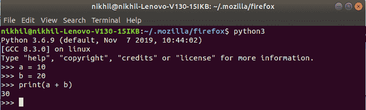
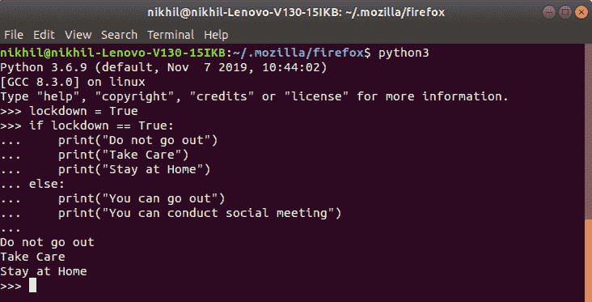

# Python 中的主次提示

> 原文:[https://www . geesforgeks . org/primary-and-secondary-prompt in python/](https://www.geeksforgeeks.org/primary-and-secondary-prompt-in-python/)

在 Python 的交互外壳上看到的`">>>"`标志称为提示。Python 的交互式 shell 在终端上激发命令“python3”(如果我们正在处理 python 版本 3)后出现，它有两个这样的提示。

```py
">>>" - Primary prompt
"..." - Secondary prompt
```

当我们在终端上发射命令“python3”时，屏幕上立即会出现>>>标志。这个“> > >”标志只是主要提示。

每当光标在终端上的主要提示旁边闪烁时，这意味着解释器将接受“一个且仅一个”指令，并且如果发现该指令有效，则立即执行该指令

**示例:**



首先，解释器将立即执行`a = 10`，同时它将创建一个整数对象，在该整数对象中存储 10，并将该特定对象绑定到名为“a”的变量

执行完第一条指令后，解释器移动到下一条指令`b = 20`并立即执行，就像执行`a = 10`一样，最后打印输出。

但是，一旦我们看到第二个提示是“…”，这意味着现在我们已经进入了一个块，该块可以是 if 块、else 块、elif 块、while、for 或任何其他块。一旦进入一个块，'…'表示，在"…"前面输入的该块的所有指令将由解释器作为"一系列指令"一起执行。

**示例:**



此后写 if 语句，自然解释器进入 if 块并开始显示“…”(第二提示)以指示现在解释器准备接受‘一系列指令’，如果‘if’语句被发现有效，这些指令将作为一组一起执行。