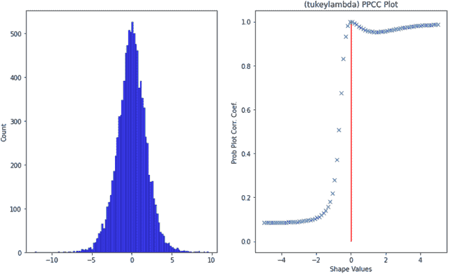
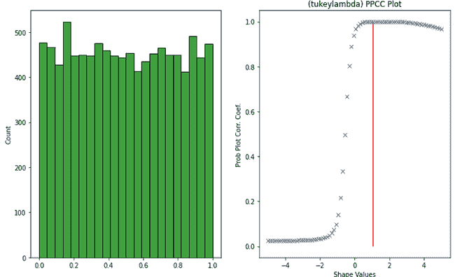
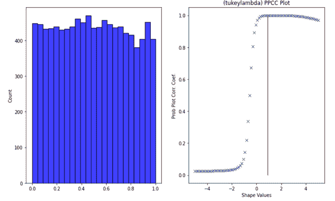

# 概率图相关系数

> 原文:[https://www . geesforgeks . org/概率-图-相关系数/](https://www.geeksforgeeks.org/probability-plot-correlation-coefficient/)

概率图相关系数(PPCC)是一种图形技术，用于识别最能描述数据集的形状参数。大部分的统计分析都是在假设分布形状的情况下进行的。然而，这些假设可能会受到挑战，因为根据形状参数，有时分布可能具有非常不同的形状。因此，最好找到形状参数作为分析的一部分，这样我们就可以对人口的分布更有信心。

PPCC 曲线由以下轴构成:

*   **纵轴**:概率图相关系数
*   **横轴**:形状参数值

PPCC 图的主要目的是首先找到形状参数的良好值。除了计算分布的形状参数之外，PPCC 图还可以用来决定哪个分布族最合适。

PPCC 情节回答了以下问题:

*   分布型家庭中最合适的成员是什么？
*   这个最适合的成员是否产生了足够好的适合度的？
*   与其他分布相比，这个分布族是否提供了良好的拟合？
*   形状参数的选择有多敏感？

具有形状参数λ的土耳其-λPPCC 图对于对称分布特别有用。它表示一个分布是短尾分布还是长尾分布，还可以进一步表示几种常见的分布。具体来说，

*   λ =-1，分布近似为*柯西*。
*   λ = 0，分布完全是逻辑的。
*   λ = 0.14，分布近似正态。
*   λ = 0.5，分布呈 U 型。
*   λ = 1，分布完全均匀。

如果土耳其-拉姆达 PPCC 图给出的最大值= 0.14，那么我们可以得出结论，正态分布是数据的良好近似。如果最大值为< 0.14 then it means a long-tailed distribution such as the double exponential or logistic would be a better choice. If the maximum value is -1, then it implies a very-long tailed distribution such as Cauchy. If the maximum value is > 0.14，则意味着非常短的分布，如贝塔分布或均匀分布。

### 履行

*   在这个实现中，我们将生成不同的分布，检查它们的土耳其-λ形状参数值，并绘制 PPCC 图。我正在使用谷歌合作实验室，它包含一些预安装的库，如 scipy，numpy，statsmodel，seaborn 等。但是，可以在本地环境中使用 *pip install* 轻松安装这些库。

## 蟒蛇 3

```
# import libraries
import numpy as np
import matplotlib.pyplot as plt
import scipy.stats as sc
import seaborn as sns

# generate different distributions
sample_size = 10000 
standard_norm = np.random.normal(size=sample_size)
cauchy_dist = sc.cauchy.rvs(loc=1, scale=10, size=sample_size)
logistic_dist = np.random.logistic(size=sample_size)
uniform_dist = np.random.uniform(size= sample_size)
beta_dist = np.random.beta(a=1, b=1, size=sample_size)

# Normal Distribution
fig, ax = plt.subplots(1, 2, figsize=(12, 7))
sns.histplot(standard_norm,kde=True, color ='blue',ax=ax[0])
sc.ppcc_plot(standard_norm, -5,5, plot=ax[1])
shape_param_normal = sc.ppcc_max(standard_norm)
ax[1].vlines(shape_param_normal,0,1, colors='red')
print("shape parameter of normal distribution is ", shape_param_normal)

# Cauchy Distribution
fig, ax = plt.subplots(1, 2, figsize=(12, 7))
sns.histplot(cauchy_dist, color ='blue',ax=ax[0])
ax[0].set_xlim(-40,40)
sc.ppcc_plot(cauchy_dist, -5,5, plot=ax[1])
shape_param_cauchy = sc.ppcc_max(cauchy_dist)
ax[1].vlines(shape_param_cauchy,0,1, colors='red')
print('shape parameter of cauchy distribution is ',shape_param_cauchy)

# Logistic Distribution
fig, ax = plt.subplots(1, 2, figsize=(12, 7))
sns.histplot(logistic_dist, color ='blue',ax=ax[0])
sc.ppcc_plot(logistic_dist, -5,5, plot=ax[1])
shape_param_logistic = sc.ppcc_max(logistic_dist)
ax[1].vlines(shape_param_logistic,0,1, colors='red')
print("shape parameter of logistic is ",shape_param_logistic)

# Uniform Distribution
fig, ax = plt.subplots(1, 2, figsize=(12, 7))
sns.histplot(uniform_dist, color ='green',ax=ax[0])
sc.ppcc_plot(uniform_dist, -5,5, plot=ax[1])
shape_para_uniform =sc.ppcc_max(uniform_dist)
ax[1].vlines(shape_para_uniform,0,1, colors='red')
print("shape parameter of uniform distribution is ",shape_para_uniform)

# Beta Distribution
fig, ax = plt.subplots(1, 2, figsize=(12, 7))
sns.histplot(beta_dist, color ='blue',ax=ax[0])
sc.ppcc_plot(beta_dist, -5,5, plot=ax[1])
shape_para_beta =sc.ppcc_max(beta_dist)
ax[1].vlines(shape_para_beta,0,1, colors='red')
print("shape parameter of beta distribution is :",shape_para_beta)
```


PPCC 图的正态分布

```
shape parameter of normal distribution is  0.14139046072745928
```


带有 PPCC 图的柯西分布

```
shape parameter of cauchy distribution is  -0.8555566289941865
```



PPCC 地块的物流配送

```
shape parameter of logistic is  0.003792036190661425
```



PPCC 图均匀分布

```
shape parameter of uniform distribution is  1.0681942803525217
```



贝塔分布与 PPCC 图

```
shape parameter of beta distribution is : 0.9158983492057267
```

#### 参考

*   [PPCC 地块 NIST](Probability Plot Correlation Coefficient Plot)