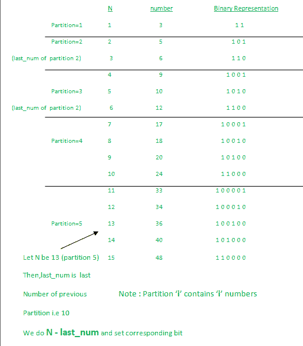

# 程序寻找正好设置了两位的第 n 个自然数

> 原文:[https://www . geeksforgeeks . org/program-to-find-第 n 个精确设置两位数的自然数/](https://www.geeksforgeeks.org/program-to-find-the-nth-natural-number-with-exactly-two-bits-set/)

给定一个整数 **N** ，任务是找到正好设置了两位的**第 N 个**自然数。
**例:**

> **输入:** N = 4
> **输出:** 9
> **解释:**
> 正好设置了两位的数字:3、5、6、9、10、12、……
> 第四位数字是 9
> **输入:** N = 15
> **输出:** 48

**天真的方法:**

1.  对所有[自然数](https://www.geeksforgeeks.org/natural-numbers/)进行循环，通过计数[在一个数](https://www.geeksforgeeks.org/count-set-bits-in-an-integer/)中设置的位，检查每个数是否设置了两位。
2.  打印有两个设定位的第 n 个数字。

**高效方法:**

1.  通过找到 N 所属的分区来找到最左边的集合位(分区‘I’中有‘I’个数字)。
2.  为了找到另一个集合位，我们必须首先找到 N 与前一个分区的最后一个数字的距离。根据它们的不同，我们设置相应的位。



1.  **注意:** [在数字 **K**](https://www.geeksforgeeks.org/set-k-th-bit-given-number/) :
    中设置第 I 位(i = 0，1，2…)

```
k = k | (1<<(i))
```

1.  **以下是上述方法的实施:**

## C++

```
// C++ Code to  find the Nth number
// with exactly two bits set

#include <bits/stdc++.h>
using namespace std;

// Function to find the Nth number
// with exactly two bits set
void findNthNum(long long int N)
{

    long long int bit_L = 1, last_num = 0;

    // Keep incrementing until
    // we reach the partition of 'N'
    // stored in bit_L
    while (bit_L * (bit_L + 1) / 2 < N) {
        last_num = last_num + bit_L;
        bit_L++;
    }

    // set the rightmost bit
    // based on bit_R
    int bit_R = N - last_num - 1;

    cout << (1 << bit_L) + (1 << bit_R)
         << endl;
}

// Driver code
int main()
{
    long long int N = 13;

    findNthNum(N);

    return 0;
}
```

## Java 语言(一种计算机语言，尤用于创建网站)

```
// Java Code to  find the Nth number
// with exactly two bits set
class GFG{

// Function to find the Nth number
// with exactly two bits set
static void findNthNum(int N)
{

    int bit_L = 1, last_num = 0;

    // Keep incrementing until
    // we reach the partition of 'N'
    // stored in bit_L
    while (bit_L * (bit_L + 1) / 2 < N) {
        last_num = last_num + bit_L;
        bit_L++;
    }

    // set the rightmost bit
    // based on bit_R
    int bit_R = N - last_num - 1;

    System.out.print((1 << bit_L) + (1 << bit_R)
         +"\n");
}

// Driver code
public static void main(String[] args)
{
    int N = 13;

    findNthNum(N);
}
}

// This code is contributed by Princi Singh
```

## 蟒蛇 3

```
# Python Code to  find the Nth number
# with exactly two bits set

# Function to find the Nth number
# with exactly two bits set
def findNthNum(N):

    bit_L = 1;
    last_num = 0;

    # Keep incrementing until
    # we reach the partition of 'N'
    # stored in bit_L
    while (bit_L * (bit_L + 1) / 2 < N):
        last_num = last_num + bit_L;
        bit_L+=1;

    # set the rightmost bit
    # based on bit_R
    bit_R = N - last_num - 1;

    print((1 << bit_L) + (1 << bit_R));

# Driver code
if __name__ == '__main__':
    N = 13;

    findNthNum(N);

# This code contributed by PrinciRaj1992
```

## C#

```
// C# Code to  find the Nth number
// with exactly two bits set
using System;

class GFG{

// Function to find the Nth number
// with exactly two bits set
static void findNthNum(int N)
{

    int bit_L = 1, last_num = 0;

    // Keep incrementing until
    // we reach the partition of 'N'
    // stored in bit_L
    while (bit_L * (bit_L + 1) / 2 < N) {
        last_num = last_num + bit_L;
        bit_L++;
    }

    // set the rightmost bit
    // based on bit_R
    int bit_R = N - last_num - 1;

    Console.Write((1 << bit_L) + (1 << bit_R)
         +"\n");
}

// Driver code
public static void Main(String[] args)
{
    int N = 13;

    findNthNum(N);
}
}

// This code is contributed by Princi Singh
```

## java 描述语言

```
<script>

// JavaScript Code to find the Nth number
// with exactly two bits set

// Function to find the Nth number
// with exactly two bits set
function findNthNum(N)
{

    let bit_L = 1, last_num = 0;

    // Keep incrementing until
    // we reach the partition of 'N'
    // stored in bit_L
    while (bit_L * (bit_L + 1) / 2 < N) {
        last_num = last_num + bit_L;
        bit_L++;
    }

    // set the rightmost bit
    // based on bit_R
    let bit_R = N - last_num - 1;

    document.write((1 << bit_L) + (1 << bit_R)
        + "<br>");
}

// Driver code
let N = 13;
findNthNum(N);

// This code is contributed by Mayank Tyagi
</script>
```

**Output:** 

```
36
```

1.  **时间复杂度:** O(数的划分)