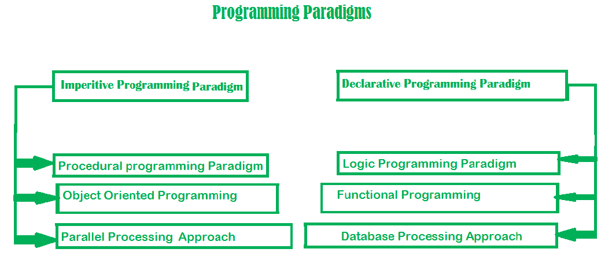

# Python 中的编程范例

> 原文:[https://www . geesforgeks . org/programming-parameters-in-python/](https://www.geeksforgeeks.org/programming-paradigms-in-python/)

范式也可以被称为解决某些问题或完成某些任务的方法。编程范例是一种使用某种编程语言来解决问题的方法，或者我们也可以说它是一种使用工具和技术来解决问题的方法，这些工具和技术是我们遵循某种方法可以获得的。有许多已知的编程语言，但是它们在实现时都需要遵循某种策略，这种方法/策略就是范例。除了各种编程语言之外，还有许多范例来满足每一个需求。



**Python 支持三种编程范式**

*   面向对象编程范例
*   面向过程的编程范例
*   函数式编程范例

## 面向对象编程范例

在面向对象的编程范式中，对象是范式的关键元素。对象可以简单地定义为包含数据成员和方法函数的类的实例。此外，面向对象的风格将支持[封装](https://www.geeksforgeeks.org/encapsulation-in-python/)的数据成员和方法函数联系起来，并且借助于[继承](https://www.geeksforgeeks.org/inheritance-in-python/)的概念，代码可以很容易地重用，但是面向对象编程范式的主要缺点是，如果代码写得不正确，那么程序就会变成一个怪物。

**优势**

*   与现实世界实体的关系
*   代码可重用性
*   抽象或数据隐藏

**缺点**

*   数据保护
*   不适合所有类型的问题
*   低速

**示例:**

```py
# class Emp has been defined here
class Emp:
    def __init__(self, name, age):
        self.name = name
        self.age = age

    def info(self):
        print("Hello, % s. You are % s old." % (self.name, self.age))

# Objects of class Emp has been 
# made here        
Emps = [Emp("John", 43),
    Emp("Hilbert", 16),
    Emp("Alice", 30)]

# Objects of class Emp has been
# used here
for emp in Emps:
    emp.info()
```

**输出:**

```py
Hello, John. You are 43 old.
Hello, Hilbert. You are 16 old.
Hello, Alice. You are 30 old.
```

**注:**更多信息请参考[Python 中的面向对象编程](https://www.geeksforgeeks.org/object-oriented-programming-in-python-set-1-class-and-its-members/)

## 过程编程范例

在面向过程的编程范例中，一系列计算步骤被划分为模块，这意味着代码被分组为函数，并且代码被一步一步地串行执行，因此基本上，它组合串行代码来指示计算机执行特定任务的每个步骤。这个范例有助于代码的模块化，模块化通常由功能实现来完成。这种编程范式有助于轻松组织相关项目，而不会有任何困难，因此每个文件都充当一个容器。

**优势**

*   通用程序设计
*   代码可重用性
*   可移植源代码

**缺点**

*   数据保护
*   不适用于真实世界的对象
*   更难写

**示例:**

```py
# Procedural way of finding sum 
# of a list 

mylist = [10, 20, 30, 40]

# modularization is done by 
# functional approach
def sum_the_list(mylist):
    res = 0
    for val in mylist:
        res += val
    return res

print(sum_the_list(mylist))
```

**输出:**

```py
100
```

## 函数式编程范例

函数式编程范式是一种范式，在这种范式中，一切都以纯数学函数的方式绑定。它被称为声明范式，因为它使用声明夸大。它使用数学函数，并将每个语句视为函数表达式，就像执行表达式以产生值一样。Lambda 函数或递归是实现它的基本方法。范式主要集中在“解决什么”而不是“如何解决”。将函数视为值并将它们作为参数传递的能力使代码更加易读和易懂。

**优势**

*   简单易懂
*   使调试和测试更加容易
*   增强代码的可理解性和可读性

**缺点**

*   低性能
*   编写程序是一项艰巨的任务
*   代码可读性低

**示例:**

```py
# Functional way of finding sum of a list 
import functools

mylist = [11, 22, 33, 44]

# Recursive Functional approach
def sum_the_list(mylist):

    if len(mylist) == 1:
        return mylist[0]
    else:
        return mylist[0] + sum_the_list(mylist[1:])

# lambda function is used
print(functools.reduce(lambda x, y: x + y, mylist))
```

**输出:**

```py
110
```

**注:**更多信息请参考[Python 中的函数编程](https://www.geeksforgeeks.org/functional-programming-in-python/)