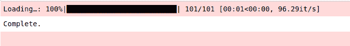
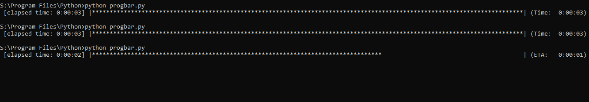

# Python 中的进度条

> 原文:[https://www.geeksforgeeks.org/progress-bars-in-python/](https://www.geeksforgeeks.org/progress-bars-in-python/)

可以理解的是，当我们不知道一个进程要花多长时间时，我们会有点不耐烦，例如，一个 for 循环或一个文件下载或一个应用程序启动。

为了分散我们的注意力，我们获得了 Python 语言的库 **tqdm** 和**进度条**，这允许我们使用进度条给出过程完成时间的可视化说明。当游戏运行所需的资源被获取到主存储器时，加载条经常出现在游戏屏幕上。

## 使用 tqdm

#### 它做什么

它用`tqdm`包裹一个物品，用 tqdm 内置的方法装饰它，并制作一个装载杆。这将使用户忘记这个过程需要多长时间才能完成。

#### 如何使用

我们所需要做的就是，通过在你的终端中键入这一行来安装`tqdm`包，并开始编写代码。

```py
->pip install tqdm
```

然后在编辑器中键入这段代码。

```py
from tqdm import tqdm

for i in tqdm (range (100), desc="Loading..."):
    pass
```

**输出:**


这给出了一个非常快的加载条，因为循环中没有任何东西。，您可以用您想在 for 循环中做的任何工作来替换 pass 关键字。

```py
from tqdm import tqdm
import time

for i in tqdm (range (101), 
               desc="Loading…", 
               ascii=False, ncols=75):
    time.sleep(0.01)

print("Complete.")
```

**输出:**



## 使用进度条

#### 如何安装

对于命令行界面

```py
pip install progressbar 
(or)
pip install progressbar2
```

#### 工作

它所做的一切都和`tqdm`包一样，就是用内置的小部件装饰 iterable，做成一个动画进度条，甚至是一个彩色进度条。小部件是根据进度条显示的对象。

然而，进度条和进度条 2 包比 tqdm 包有很多额外的、有用的方法。例如，我们可以制作一个动画加载条。

```py
import progressbar
import time

# Function to create 
def animated_marker():

    widgets = ['Loading: ', progressbar.AnimatedMarker()]
    bar = progressbar.ProgressBar(widgets=widgets).start()

    for i in range(50):
        time.sleep(0.1)
        bar.update(i)

# Driver's code
animated_marker()
```

**输出:**

<video class="wp-video-shortcode" id="video-385019-1" width="665" height="356" preload="metadata" controls=""><source type="video/mp4" src="https://media.geeksforgeeks.org/wp-content/uploads/20200304194841/prog4.py-Python-Visual-Studio-Code-2020-02-07-23-21-09.mp4?_=1">[https://media.geeksforgeeks.org/wp-content/uploads/20200304194841/prog4.py-Python-Visual-Studio-Code-2020-02-07-23-21-09.mp4](https://media.geeksforgeeks.org/wp-content/uploads/20200304194841/prog4.py-Python-Visual-Studio-Code-2020-02-07-23-21-09.mp4)</video>

在`progressbar.AnimatedMarker()`中，我们可以通过任意序列的角色来制作动画。默认参数是`'|/-\|'`

下面是另一个使用 ProgressBar 类中一些常用小部件的例子。

```py
import time
import progressbar

widgets = [' [',
         progressbar.Timer(format= 'elapsed time: %(elapsed)s'),
         '] ',
           progressbar.Bar('*'),' (',
           progressbar.ETA(), ') ',
          ]

bar = progressbar.ProgressBar(max_value=200, 
                              widgets=widgets).start()

for i in range(200):
    time.sleep(0.1)
    bar.update(i)
```

**输出:**
