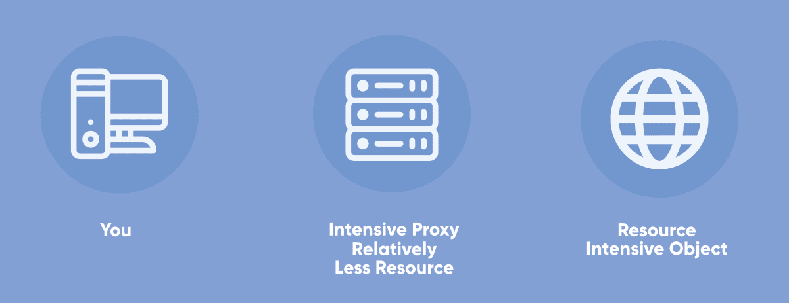
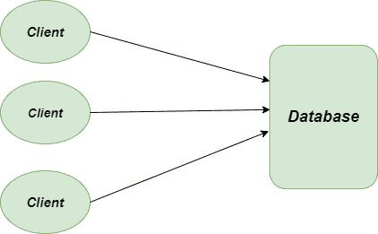
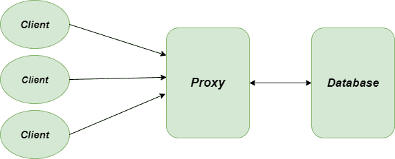
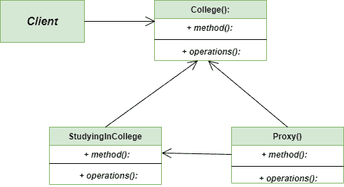

# 代理方法–Python 设计模式

> 原文:[https://www . geesforgeks . org/proxy-method-python-design-patterns/](https://www.geeksforgeeks.org/proxy-method-python-design-patterns/)

代理方法是 **[结构设计模式](https://www.geeksforgeeks.org/design-patterns-set-1-introduction/)** ，它允许您为另一个对象提供替换。这里，我们使用不同的类来表示另一个类的功能。最重要的部分是，我们在这里创建了一个具有原始对象功能的对象，以提供给外部世界。
单词 **Proxy** 的意思是“代替”或“代表”，直接解释了 **Proxy 方法**。

代理也被称为代理、句柄和包装器。它们在结构上与 **[适配器](https://www.geeksforgeeks.org/adapter-method-python-design-patterns/)** 和 **[装饰器](https://www.geeksforgeeks.org/decorator-pattern/)** 密切相关，但目的不同。



代理设计方法

现实世界中的一个例子是，支票或信用卡可以代表我们银行账户中的内容。它可以代替现金使用，并在需要时提供获取现金的方式。这正是代理模式所做的——“控制和管理对他们所保护的对象的访问”。

### 不使用代理方法的问题

让我们通过考虑学院数据库的例子来理解这个问题，该数据库负责所有学生的记录。例如，我们需要从数据库中找到那些余额超过 500 英镑的学生的名字。因此，如果我们遍历整个学生列表，对于每个学生对象，如果我们单独连接到数据库，那么这将被证明是一项昂贵的任务。



代理方法问题

### 使用代理方法的解决方案

**代理方法**来解决上述问题。我们将创建一个代理服务器，或者创建一个到数据库的代理连接，之后，我们不必为每个学生对象创建单独的到数据库的连接。
我们将简单地使用代理获取我们需要的数据，而不会为创建对象浪费大量内存。



代理方法解决方案

```py
class College:
    '''Resource-intensive object'''

    def studyingInCollege(self):
        print("Studying In College....")

class CollegeProxy:
    '''Relatively less resource-intensive proxy acting as middleman.
     Instantiates a College object only if there is no fee due.'''

    def __init__(self):

        self.feeBalance = 1000
        self.college = None

    def studyingInCollege(self):

        print("Proxy in action. Checking to see if the balance of student is clear or not...")
        if self.feeBalance <= 500:
            # If the balance is less than 500, let him study.
            self.college = College()
            self.college.studyingInCollege()
        else:

            # Otherwise, don't instantiate the college object.
            print("Your fee balance is greater than 500, first pay the fee")

"""main method"""

if __name__ == "__main__":

    # Instantiate the Proxy
    collegeProxy = CollegeProxy()

    # Client attempting to study in the college at the default balance of 1000.
    # Logically, since he / she cannot study with such balance,
    # there is no need to make the college object.
    collegeProxy.studyingInCollege()

    # Altering the balance of the student
    collegeProxy.feeBalance = 100

    # Client attempting to study in college at the balance of 100\. Should succeed.
    collegeProxy.studyingInCollege()
```

**输出:**

```py
Proxy in action. Checking to see if the balance of student is clear or not...
Your fee balance is greater than 500, first pay the fee

Proxy in action. Checking to see if the balance of student is clear or not...
Studying In College....

```

### 类图

下面是代理方法的类图:



代理方法类图

### 优势

*   **开放/封闭原则:**在不改变客户端代码的情况下，我们可以很容易地在应用程序中引入新的代理。
*   **平滑服务:**我们创建的代理即使在服务对象没有准备好或者在当前场景下不可用时也能工作。
*   **安全性:**代理方法也为系统提供了安全性。
*   **性能:**它通过避免复制可能很大且占用大量内存的对象来提高应用程序的性能。

### 不足之处

*   **响应慢:**服务可能会变慢或延迟。
*   **抽象层:**这种模式引入了另一个抽象层，如果一些客户端直接访问 RealSubject 代码，而其中一些客户端可能访问 Proxy 类，那么这个抽象层有时可能会成为问题
*   **复杂度增加:**由于大量新类的引入，我们的代码可能会变得非常复杂。

### 适应性

*   **虚拟代理:**最重要的是用在数据库中例如，数据库中存在某些消耗大量资源的数据，我们经常需要它。所以。这里我们可以使用代理模式，它将创建多个代理并指向对象。
*   **保护代理:**它在应用程序上创建了一个保护层，可以在学校或学院的场景中使用，在这些场景中，只有少数网站允许使用 WiFi 打开。
*   **远程代理:**特别是当服务对象位于远程服务器上时使用。在这种情况下，代理通过网络传递客户端请求，处理所有细节。
*   **智能代理:**它用于通过在对象将被访问时干预特定操作来为应用程序提供额外的安全性。

**进一步阅读–****[Java 中的代理设计方法](https://www.geeksforgeeks.org/proxy-design-pattern/)**