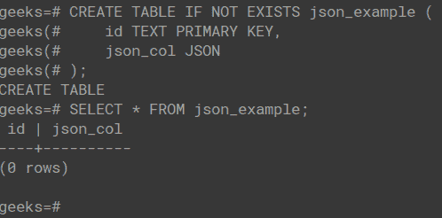
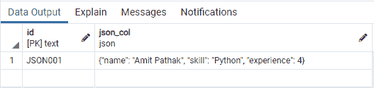
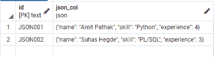

# Psycopg2–插入字典作为 JSON

> 原文:[https://www . geesforgeks . org/psycopg2-insert-dictionary-as-JSON/](https://www.geeksforgeeks.org/psycopg2-insert-dictionary-as-json/)

在本文中，我们将看到如何使用 Psycopg2 和 Python 将字典作为 JSON 插入。

Python dict 对象可以或者应该作为 JSON 数据类型存储在数据库表中。因为大多数 SQL 数据库都有一个 JSON 数据类型。这允许在前端或应用编程接口中使用这些对象或键值对来分别处理从它们发出的请求。

## 设置 PostgreSQL 数据库和表:

让我们在 PostgreSQL 中创建一个模式，并向其中添加一个至少包含一个 JSON 类型列的表。我们可以使用下面的 SQL 脚本来创建相同的。



在上面的 SQL 脚本中，我们创建了一个名为“极客”的模式。在由两列组成的模式中创建了一个表“json_example ”,其中一列是主键，列名为“id ”,而另一列名为“json_col ”,类型为 json。

### 使用 psycopg2 库在 PostgreSQL 表中插入 python dict 对象:

## 计算机编程语言

```
import json
import psycopg2

# SAVE THE DB CONFIG IN A DICT OBJECT
DATABASE_CONFIG = {
    "database": "geeks",
    "user": "postgres",
    "password": "password",
    "host": "localhost",
    "port":  5432,
}

def get_connection():

    # RETURN THE CONNECTION OBJECT
    return psycopg2.connect(
        database=DATABASE_CONFIG.get('database'),
        user=DATABASE_CONFIG.get('user'),
        password=DATABASE_CONFIG.get('password'),
        host=DATABASE_CONFIG.get('host'),
        port=DATABASE_CONFIG.get('port'),
    )

def dict_to_json(value: dict):

    # CONVERT DICT TO A JSON STRING AND RETURN
    return json.dumps(value)

def insert_value(id: str, json_col: str, conn):

    # CREATE A CURSOR USING THE CONNECTION OBJECT
    curr = conn.cursor()

    # EXECUTE THE INSERT QUERY
    curr.execute(f'''
        INSERT INTO
            json_table(id, json_col) 
        VALUES
            ('JSON001', '{json_col}')
    ''')

    # COMMIT THE ABOVE REQUESTS
    conn.commit()

    # CLOSE THE CONNECTION
    conn.close()

def main():

    # CREATE A PSYCOPG2 CONNECTION
    conn = get_connection()

    # CREATE A PYTHON DICT OBJECT FOR JSON COL
    dict_obj = {
        "name": "Amit Pathak",
        "skill": "Python",
        "experience": 4
    }

    # CONVERT DICT OBJECT TO JSON STRING
    json_obj = dict_to_json(value=dict_obj)

    # INSERT VALUES IN THE DATABASE TABLE
    insert_value(id='JSON001', json_col=json_obj,
                 conn=conn)

if __name__ == '__main__':
    main()
```

运行上述 python 文件后，我们可以前往 pgAdmin，在公共模式下的 ***json_table*** 表中查看以下输出。您可以在查询工具中运行以下 SQL 脚本–

```
$ SELECT * FROM json_table;
```



在 pgAdmin 中查看的输出

**说明:**

上面的代码是用函数格式编写的，以便更好地表示整个过程中发生的底层步骤。 ***get_connection()*** 函数将连接对象返回到 PostgreSQL 表中，使用该表我们可以建立到数据库的连接以进行操作。如果不能建立连接对象，将返回 ***假*** 。现在，我们有了一个以变量名 ***创建的 python dict 对象 dict_obj*** 。我们将把这个 dict 对象插入数据库。但是，在插入这个 dict 对象之前，我们需要将对象转换为 JSON 格式，因为数据库理解 JSON 格式，而不是 python dict 对象。Python 的内置模块 ***json*** 用于使用 ***dumps()*** 方法将 dict 对象转换为 json 字符串格式。现在我们有了 JSON 字符串和连接对象，我们可以将数据插入数据库表 ***json_table*** 中。为此，我们创建了一个函数名***insert _ value()***，它接受 3 个参数，即 id 为要插入 id 列的值， ***json_col*** 为需要插入 ***json_col*** 列的值，以及 ***conn*** 参数用于提供之前创建的连接对象。我们可以看到 insert_value()函数使用连接对象运行通常的 **INSERT** SQL 脚本。一旦将数据插入到表中，连接就会关闭。

## 使用 psycopg2 Json 自适应

下面的代码演示了如何使用 psycopg2 的 ***Json*** 改编来代替标准的 ***json.dumps()*** 。为了将 Python 对象作为查询参数传递给数据库，您可以使用从 ***导入的 ***Json*** 适配器。***

## 计算机编程语言

```
import psycopg2
from psycopg2.extras import Json

# CREATE A PSYCOPG2 CONNECTION
conn = psycopg2.connect(**{
    "database" : "geeks",
    "user"     : "postgres",
    "password" : "password",
    "host"     : "localhost",
    "port"     :  5432,
})

# CREATE DICT OBJECT TO BE INSERTED TO DB
dict_obj = {
    "name": "Suhas Hegde",
    "skill": "PL/SQL",
    "experience": 3
}

# CREATE A CURSOR USING THE CONNECTION OBJECT
curr = conn.cursor()

# EXECUTE THE INSERT QUERY
curr.execute(f'''
    INSERT INTO
        json_table(id, json_col) 
    VALUES
        ('JSON002', %s)
''', [Json(dict_obj)])

# COMMIT THE REQUESTS IN QUEUE
conn.commit()

# CLOSE THE CONNECTION
conn.close()
```

**输出:**



在 pgAdmin 中查看的输出

在上面的代码中，我们试图插入一个 id 为 **JSON002** 的新 JSON 条目。除了我们使用了***psycopg 2 . extras . Json***而不是 ***json.dumps*** 之外，整个过程与之前的代码相同。