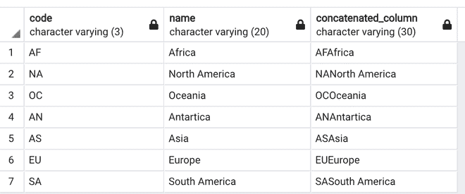

# Psycopg2–返回类似字典的值

> 原文:[https://www . geeksforgeeks . org/psycopg2-return-dictionary-like-values/](https://www.geeksforgeeks.org/psycopg2-return-dictionary-like-values/)

在本文中，我们将讨论如何使用 psycopg2 返回类似字典的值。

我们可以通过使用 psycopg2 PostgreSQL 驱动程序返回类似字典的值，可以使用也可以不使用 extras 模块，本文将讨论这两种情况。额外的东西为 Psycopg2 提供了各种各样的好东西。它保存助手函数和类，直到找到更好的分布位置。

## 不使用 psycopg。额外模块:



首先导入所需的包，并使用 [psycopg2.connect()](https://www.geeksforgeeks.org/insert-python-dictionary-in-postgresql-using-psycopg2/) 方法建立到 PostgreSQL 数据库的连接。和一个使用 cursor()类的游标，然后我们执行 select SQL 语句从表中检索行。cursor.fetchall()方法将输出作为元组给出，我们使用切片来获取值，并以字典的形式打印出来。

**示例:**使用 psycopg2 返回类似字典的值

## 蟒蛇 3

```py
import psycopg2

conn = psycopg2.connect(
    database="codes", user='postgres', password='pass',
    host='127.0.0.1', port='5432'
)

conn.autocommit = True
cursor = conn.cursor()

sql = '''CREATE TABLE continent_codes(code varchar(3), name char(20),
concatenated_column varchar(30));'''

cursor.execute(sql)

sql2 = '''COPY continent_codes(code,name,
concatenated_column)
FROM '/private/tmp/continent_codes.csv'
DELIMITER ','
CSV HEADER;'''

cursor.execute(sql2)

sql3 = '''select * from continent_codes;'''
cursor.execute(sql3)
results = cursor.fetchall()
for row in results:
    print("code: {}".format(row[0]))
    print("name: {}".format(row[1]))
    print("concatenated_column: {}".format(row[2]))
conn.commit()
conn.close()
```

**输出:**

```py
code: AF
name: Africa
concatenated_column: AFAfrica
code: NA
name: North America
concatenated_column: NANorth America
code: OC
name: Oceania
concatenated_column: OCOceania
code: AN
name: Antartica
concatenated_column: ANAntartica
code: AS
name: Asia
concatenated_column: ASAsia
code: EU
name: Europe
concatenated_column: EUEurope
code: SA
name: South America
concatenated_column: SASouth America
```

## 使用 psycopg.extras 模块

实数字典游标是一种使用实数字典作为行的基本类型的游标。此游标不允许普通索引获取数据。只能借助表的列名键来获取数据。

**语法:**

> cursor = conn . cursor(cursor _ factory = psycopg 2 . extras . realdictcursor)

游标子类作为 Cursor_factory 参数传递给 connect()，以便连接的 cursor()方法将生成该类的对象。cursor_factory 是 conn.cursor()类中的一个参数。

**语法:**

> psycopg 2 . extra . realdict cursor(* args、**kwargs)

该游标使用 realdict 作为行的基本类型。

**示例:**使用 psycopg2 返回类似字典的值

## 蟒蛇 3

```py
import psycopg2.extras

conn = psycopg2.connect(
    database="codes", user='postgres', password='pass',
    host='127.0.0.1', port='5432'
)

conn.autocommit = True
cursor = conn.cursor(cursor_factory=psycopg2.extras.RealDictCursor)
sql = '''CREATE TABLE continent_codes(code varchar(3), name char(20),
concatenated_column varchar(30));'''

cursor.execute(sql)

sql2 = '''COPY continent_codes(code,name,
concatenated_column)
FROM '/private/tmp/continent_codes.csv'
DELIMITER ','
CSV HEADER;'''

cursor.execute(sql2)

sql3 = '''select * from continent_codes;'''
cursor.execute(sql3)
results = cursor.fetchall()
for row in results:
    print("code: {}".format(row['code']))
    print("name: {}".format(row['name']))
    print("concatenated_column: {}".format(row['concatenated_column']))
conn.commit()
conn.close()
```

**输出:**

```py
code: AF
name: Africa
concatenated_column: AFAfrica
code: NA
name: North America
concatenated_column: NANorth America
code: OC
name: Oceania
concatenated_column: OCOceania
code: AN
name: Antartica
concatenated_column: ANAntartica
code: AS
name: Asia
concatenated_column: ASAsia
code: EU
name: Europe
concatenated_column: EUEurope
code: SA
name: South America
concatenated_column: SASouth America
```