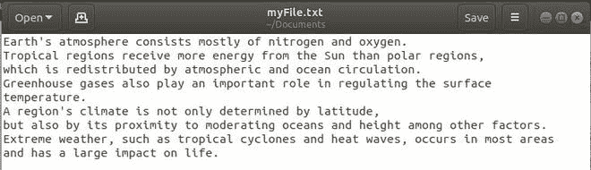
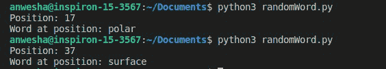

# 在 Python 中从文本文件的一行中抽取一个随机单词或字符串

> 原文:[https://www . geesforgeks . org/从 python 文本文件中的一行中拉出一个随机单词或字符串/](https://www.geeksforgeeks.org/pulling-a-random-word-or-string-from-a-line-in-a-text-file-in-python/)

[Python 中的文件处理](https://www.geeksforgeeks.org/file-handling-python/)真的很简单，很容易实现。为了从文本文件中提取随机单词或字符串，我们将首先在**读取**模式下打开文件，然后使用 Python 的**随机**模块中的方法来选择随机单词。

执行此操作有多种方法:

这是我们将从中读取的文本文件:



**方法一:使用** [**随机选择()**](https://www.geeksforgeeks.org/python-numbers-choice-function/)

**步骤:**

1.  使用**和**功能，以读取模式打开文件。带有功能的**负责自动关闭文件。**
2.  从文件中读取所有文本并存储在字符串中
3.  将字符串拆分成由空格分隔的单词。
4.  使用 **random.choice()** 选择一个单词或字符串。

## 计算机编程语言

```
# Python code to pick a random
# word from a text file
import random

# Open the file in read mode
with open("MyFile.txt", "r") as file:
    allText = file.read()
    words = list(map(str, allText.split()))

    # print random string
    print(random.choice(words))
```

注意:**拆分()**功能，默认情况下，按空格拆分。如果需要任何其他分隔符，如换行符，可以将其指定为参数。

**输出:**


两次样本运行的输出

只需像这样的一行代码就可以实现上述功能:

## 计算机编程语言

```
# import required module
import random

# print random word
print(random.choice(open("myFile.txt","r").readline().split()))
```

**方法二:使用**[**randint()**](https://www.geeksforgeeks.org/python-randint-function/)

****步骤:****

1.  **使用带有功能的**以读取模式打开文件****
2.  **将文件中的所有数据存储在一个字符串中，并将该字符串拆分成单词。**
3.  **数一数单词的总数。**
4.  **使用 **random.randint()** 生成一个介于 0 和*字数之间的随机数。***
5.  **在那个位置打印单词。**

## **计算机编程语言**

```
# using randint()
import random

# open file
with open("myFile.txt", "r") as file:
    data = file.read()
    words = data.split()

    # Generating a random number for word position
    word_pos = random.randint(0, len(words)-1)
    print("Position:", word_pos)
    print("Word at position:", words[word_pos])
```

****输出:****

**

两次样本运行的输出**