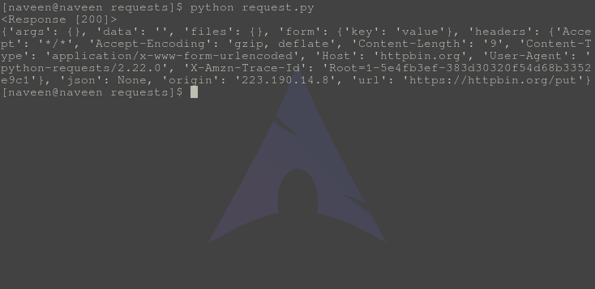

# PUT 方法–Python 请求

> 原文:[https://www.geeksforgeeks.org/put-method-python-requests/](https://www.geeksforgeeks.org/put-method-python-requests/)

请求库是 Python 向指定网址发出 HTTP 请求的重要方面之一。本文围绕如何使用 **requests.put()** 方法向指定的网址发出 PUT 请求展开。在检查 PUT 方法之前，让我们弄清楚什么是 Http PUT 请求–

#### PUT Http 方法

PUT 是万维网使用的 HTTP 支持的请求方法。PUT 方法要求将封闭实体存储在提供的 URI 下。如果 URI 引用了一个已经存在的资源，它将被修改，如果 URI 没有指向一个现有的资源，那么服务器可以用那个 URI 创建资源。

#### 如何通过 Python 请求发出 PUT 请求

Python 的请求模块提供了一个名为 **put()** 的内置方法，用于向指定的 URI 发出 put 请求。
**语法–**

```
requests.put(url, params={key: value}, args)
```

**示例–**
为了示例目的，让我们尝试向 httpbin 的 API 发出请求。

## 蟒蛇 3

```
import requests

# Making a PUT request
r = requests.put('https://httpbin.org / put', data ={'key':'value'})

# check status code for response received
# success code - 200
print(r)

# print content of request
print(r.content)
```

将此文件保存为 request.py 并通过终端运行，

```
python request.py
```

**输出–**



#### PUT 和 POST 方法之间的区别

<figure class="table">

| **PUT** | **开机自检** |
| --- | --- |
| 向特定资源发出 PUT 请求。如果请求-URI 引用了一个已经存在的资源，将会发生更新操作，否则如果请求-URI 是一个有效的资源 URI(假设允许客户端确定资源标识符)，将会发生创建操作。
**示例–**

```
PUT /article/{article-id}
```

 | POST 方法用于请求源服务器接受包含在
请求中的实体，将其作为请求行中由请求-URI 标识的资源的新从属。它本质上意味着 POST 请求-URI 应该是 URI 的集合。
**示例–**

```
POST /articles
```

 |
| PUT 方法是幂等的。因此，如果您多次发送重试请求，这应该相当于单个请求修改。 | 开机自检不是幂等的。因此，如果您重试请求 N 次，您将在服务器上创建 N 个具有 N 个不同 URIs 的资源。 |
| 当您想要修改已经是资源集合一部分的单个资源时，请使用 PUT。PUT 会覆盖整个资源。如果请求更新部分资源，请使用 PATCH。
 | 当您想要在资源集合下添加子资源时，请使用 POST。 |
| 通常，在实践中，总是使用 PUT 进行更新操作。 | 始终使用开机自检进行创建操作。 |

</figure>