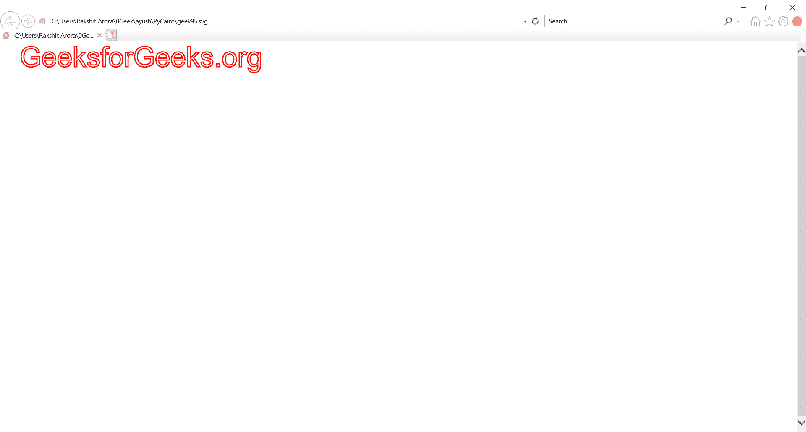
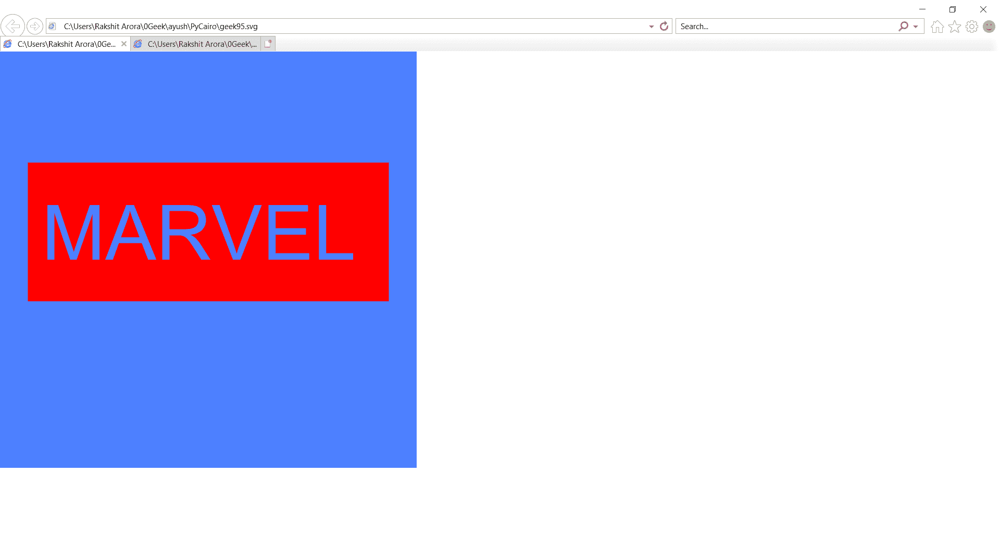

# 复制开罗–创建文本路径

> 原文:[https://www.geeksforgeeks.org/pycairo-creating-text-paths/](https://www.geeksforgeeks.org/pycairo-creating-text-paths/)

在本文中，我们将学习如何使用 python 中的 PyCairo 显示文本并将文本转换为路径。您可以将文本字符串转换为路径。一旦你有了路径，你就可以填充它(看起来就像正常显示文本一样)，或者只是勾勒出它，或者两者都有。

**PyCairo** : PyCairo 是一个为 cairo 图形库提供绑定的 Python 模块。这个库用于创建 SVG，即 python 中的矢量文件。打开 SVG 文件进行查看(只读)最简单快捷的方法是使用现代网络浏览器，如 Chrome、Firefox、Edge 或 Internet Explorer，几乎所有这些浏览器都应该为 SVG 格式提供某种渲染支持。

**SVG** 文件是使用由万维网联盟(W3C)创建的二维矢量图形格式的图形文件。它使用基于 XML 的文本格式描述图像。SVG 文件是作为在网络上显示矢量图形的标准格式开发的。

实施步骤:

1.  导入 Pycairo 模块。
2.  创建一个 SVG 表面对象并向其添加上下文。
3.  使用 set_font_size()设置文本字体大小和样式，选择 _font_face()
4.  使用 show_path()显示文本
5.  使用 set_source_rgb()设置路径颜色和宽度，set_line_width()

**下面是实现:**

## 蟒蛇 3

```py
# importing pycairo
import cairo

# creating a SVG surface
# here geek95 is file name & 700, 700 is dimension
with cairo.SVGSurface("geek95.svg", 700, 700) as surface:

    # creating a cairo context object for SVG surface
    # useing Context method
    Context = cairo.Context(surface)

    # setting color of the context
    Context.set_source_rgb(1, 0, 0)

    # approximate text height
    Context.set_font_size(50)

    # Font Style
    Context.select_font_face(
        "Arial", cairo.FONT_SLANT_NORMAL, cairo.FONT_WEIGHT_NORMAL)

    # position for the text
    Context.move_to(35, 45)

    # displays the text
    Context.text_path("GeeksforGeeks.org")

    # Width of outline
    Context.set_line_width(2)

    # stroke out the color and width property
    Context.stroke()

# printing message when file is saved
print("File Saved")
```

**输出:**



**例 2 :**

## 蟒蛇 3

```py
# importing pycairo
import cairo

# Defining surface area
WIDTH = 3
HEIGHT = 3
PIXEL_SCALE = 200

# creating a SVG surface
# here geek95 is file name
surface = cairo.SVGSurface('geek95.svg', WIDTH*PIXEL_SCALE, 
                           HEIGHT*PIXEL_SCALE)

# creating a cairo context object for SVG surface
# useing Context method
context = cairo.Context(surface)

# Scaleing Surface
context.scale(PIXEL_SCALE, PIXEL_SCALE)

# Creating Rectangle For Background
context.rectangle(0, 0, WIDTH, HEIGHT)

# Color of Rectangle For Background
context.set_source_rgb(0.3, 0.5, 1)

# Filling Color in Rectangle
context.fill()

# defining color
context.set_source_rgb(1, 0, 0)

# Font Style
context.set_font_size(0.55)

# font style
context.select_font_face(
    "Arial", cairo.FONT_SLANT_NORMAL, cairo.FONT_WEIGHT_NORMAL)

# Creating Rectangle
context.rectangle(0.2, 0.8, 2.6, 1)

# move to x, y percentage of surface
context.move_to(0.3, 1.5)

# Display Text
context.text_path("MARVEL")

# Filling the area
context.set_fill_rule(cairo.FILL_RULE_EVEN_ODD)

# Filling color
context.fill()

# stroke out the color and width property
context.stroke()

# printing message when file is saved
print("File Saved")
```

**输出:**

