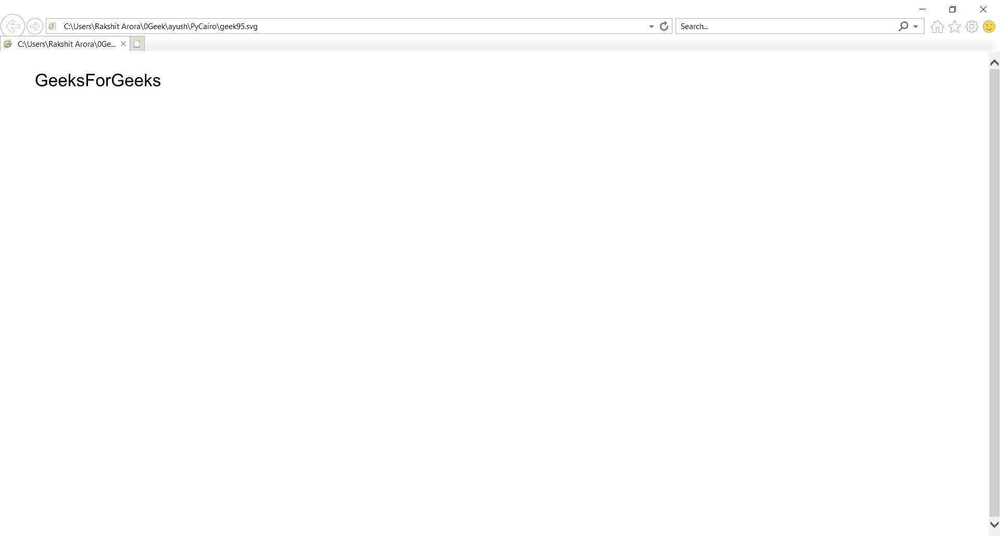

# 打印开罗–显示文本

> 原文:[https://www.geeksforgeeks.org/pycairo-displaying-text/](https://www.geeksforgeeks.org/pycairo-displaying-text/)

在本文中，我们将学习如何在 python 中使用 PyCairo 显示文本。

**PyCairo** : PyCairo 是一个为 cairo 图形库提供绑定的 Python 模块。这个库用于创建 SVG，即 python 中的矢量文件。打开 SVG 文件进行查看(只读)最简单快捷的方法是使用现代网络浏览器，如 Chrome、Firefox、Edge 或 Internet Explorer，几乎所有这些浏览器都应该为 SVG 格式提供某种渲染支持。

**SVG** 文件是使用由万维网联盟(W3C)创建的二维矢量图形格式的图形文件。它使用基于 XML 的文本格式描述图像。SVG 文件是作为在网络上显示矢量图形的标准格式开发的。

实施步骤:

1.  导入 Pycairo 模块。
2.  创建一个 SVG 表面对象，并向其添加上下文。
3.  使用 set_source_rgb()，set_font_size()，选择 _font_face()设置文本颜色、字体大小和样式
4.  使用 show_text()显示文本

**下面是实现:**

## 蟒蛇 3

```
# code
import cairo
print("GFG")
# importing pycairo

# creating a SVG surface
# here geek95 is file name & 700, 700 is dimension
with cairo.SVGSurface("geek95.svg", 700, 700) as surface:

    # creating a cairo context object for SVG surface
    # using Context method
    context = cairo.Context(surface)

    # setting color of the context
    context.set_source_rgb(0, 0, 0)

    # approximate text height
    context.set_font_size(25)

    # Font Style
    context.select_font_face(
        "Arial", cairo.FONT_SLANT_NORMAL, cairo.FONT_WEIGHT_NORMAL)

    # position for the text
    context.move_to(50, 50)

    # displays the text
    context.show_text("GeeksForGeeks")

    # stroke out the color and width property
    context.stroke()

# printing message when file is saved
print("File Saved")
```

**输出:**

