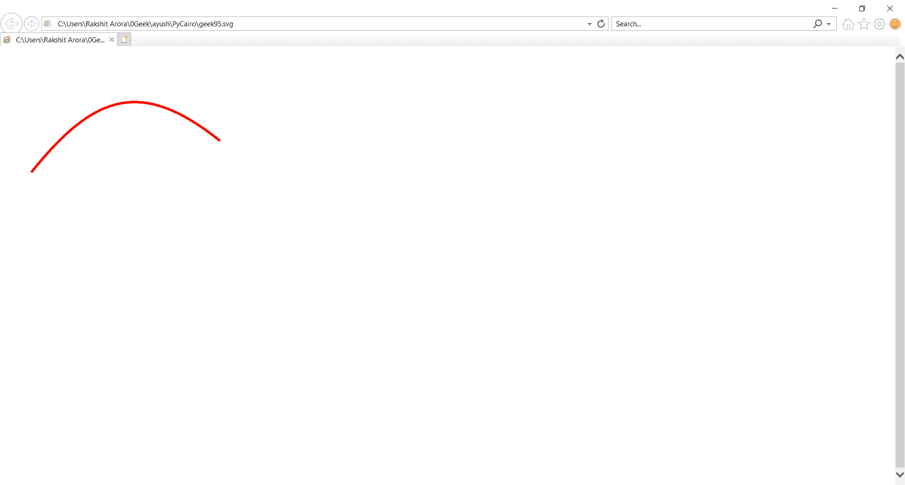

# 绘制贝塞尔曲线

> 原文:[https://www.geeksforgeeks.org/pycairo-drawing-bezier-curve/](https://www.geeksforgeeks.org/pycairo-drawing-bezier-curve/)

在本文中，我们将学习如何使用 python 中的 PyCairo 绘制简单的贝塞尔曲线。贝塞尔曲线是一种通用的数学曲线，可用于在矢量图形中创建各种不同的形状。

**PyCairo** : PyCairo 是一个为 cairo 图形库提供绑定的 Python 模块。这个库用于创建 SVG，即 python 中的矢量文件。打开 SVG 文件进行查看(只读)最简单快捷的方法是使用现代网络浏览器，如 Chrome、Firefox、Edge 或 Internet Explorer，几乎所有这些浏览器都应该为 SVG 格式提供某种渲染支持。

**SVG** 文件是使用由万维网联盟(W3C)创建的二维矢量图形格式的图形文件。它使用基于 XML 的文本格式描述图像。SVG 文件是作为在网络上显示矢量图形的标准格式开发的。

实施步骤:

1.  导入 Pycairo 模块。
2.  创建一个 SVG 表面对象并向其添加上下文。
3.  使用 curve_to()创建曲线
4.  设置上下文颜色和宽度

**下面是实现:**

## 蟒蛇 3

```py
# importing pycairo
import cairo

# creating a SVG surface
# here geek95 is file name & 700, 700 is dimension
with cairo.SVGSurface("geek95.svg", 700, 700) as surface:

    # creating a cairo context object for SVG surface
    # useing Context method
    context = cairo.Context(surface)

    # move the context to x,y position
    context.move_to(50, 200)
    # Drawing Curve
    context.curve_to(150, 75, 225, 50, 350, 150)
    # setting color of the context
    context.set_source_rgb(1, 0, 0)
    # setting width of the context
    context.set_line_width(4)
    # stroke out the color and width property
    context.stroke()

# printing message when file is saved
print("File Saved")
```

**输出:**

