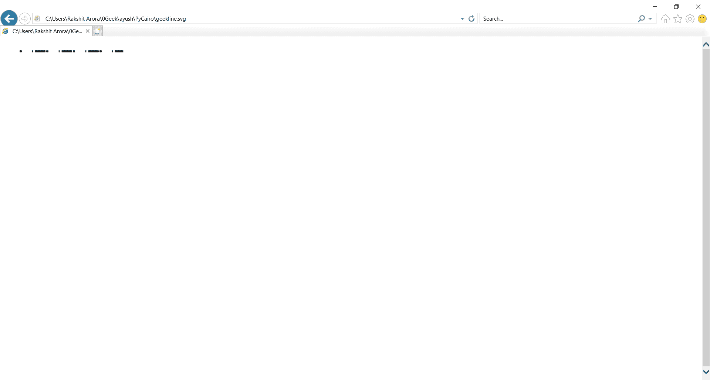
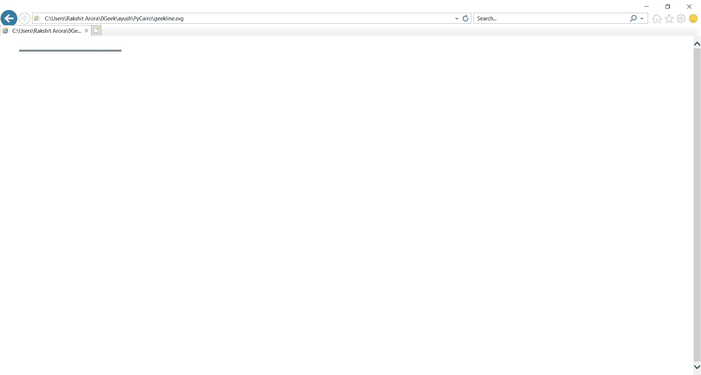

# PyCairo–绘制不同的钢笔虚线

> 原文:[https://www . geesforgeks . org/py cairo-drawing-differential-pen-破折号/](https://www.geeksforgeeks.org/pycairo-drawing-different-pen-dashes/)

每条线都可以用不同的笔划线。钢笔虚线可以定义为线条的样式。虚线图案由 ***set_dash( )*** 方法指定。模式由浮动值的破折号列表设置。他们可以设置模式中破折号的开和关部分。**笔划()**方法使用虚线创建线条图案。如果虚线的数量为 0，则禁用虚线，并且将绘制一条平面简单线。如果破折号数为 1，则假设对称模式，大小的交替开和关部分指定为破折号中的单个值。

**实施步骤:**

1.  导入 Pycairo 模块。
2.  创建一个 SVG 表面对象并向其添加上下文。
3.  设置上下文的颜色和线宽
4.  使用 set_dash()设置线型
5.  创建一条线。

**例 1 :**

## 蟒蛇 3

```py
# importing pycairo
import cairo

# creating a SVG surface 
# here geekline is file name & 700, 700 is dimension
with cairo.SVGSurface("geekline.svg", 700, 700) as surface:

    # creating a cairo context object
    context = cairo.Context(surface)

    # setting color of the context
    context.set_source_rgba(0, 0, 0, 1)

    # setting of line width
    context.set_line_width(4)

    # setting of line pattern
    context.set_dash([4.0, 21.0, 2.0])

    # move the context to x,y position
    context.move_to(40, 30) 

    #creating a line
    context.line_to(250, 30)

    # stroke out the color and width property
    context.stroke()

# printing message when file is saved
print("File Saved")
```

> context.set_dash ( [ 4.0，21.0，2.0 ])
> 
> 我们抽了 4 分，21 分没抽，2 分抽了，然后 4 分没抽，21 分抽。和 2 个未画出。

**输出:**



**例 2 :**

## 蟒蛇 3

```py
# importing pycairo
import cairo

# creating a SVG surface 
# here geekline is file name & 700, 700 is dimension
with cairo.SVGSurface("geekline.svg", 700, 700) as surface:

    # creating a cairo context object
    context = cairo.Context(surface)

    # setting color of the context
    context.set_source_rgba(0, 0, 0, 1)

    # setting of line width
    context.set_line_width(4)

    # setting of line pattern
    context.set_dash([14.0, 6.0])

    # move the context to x,y position
    context.move_to(40, 30) 

    #creating a line
    context.line_to(250, 30)

    # stroke out the color and width property
    context.stroke()

# printing message when file is saved
print("File Saved")
```

> context.set_dash ( [ 14.0，6.0 ])
> 
> 在这个模式中，我们总是画 14 个点，没有画 6 个点。

**输出:**


**例 3 :**

## 蟒蛇 3

```py
# importing pycairo
import cairo

# creating a SVG surface 
# here geekline is file name & 700, 700 is dimension
with cairo.SVGSurface("geekline.svg", 700, 700) as surface:

    # creating a cairo context object
    context = cairo.Context(surface)

    # setting color of the context
    context.set_source_rgba(0, 0, 0, 1)

    # setting of line width
    context.set_line_width(4)

    # setting of line pattern
    context.set_dash([1.0])

    # move the context to x,y position
    context.move_to(40, 30) 

    #creating a line
    context.line_to(250, 30)

    # stroke out the color and width property
    context.stroke()

# printing message when file is saved
print("File Saved")
```

> context.set_dash ( [ 1.0 ])
> 
> 我们创建了一个交替单个开和关点的对称模式的笔划线。

**输出:**

