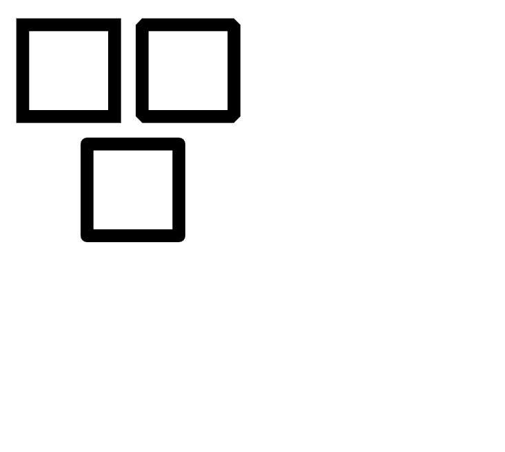

# 绘制不同类型的线连接

> 原文:[https://www . geesforgeks . org/py cairo-drawing-不同类型的线连接/](https://www.geeksforgeeks.org/pycairo-drawing-different-type-of-line-joins/)

在本文中，我们将学习如何使用 PyCairo 在 python 中使用不同的连接样式(如斜角、圆角和斜接)来连接线条。

**Pycairo** 是一个为 cairo 图形库提供绑定的 Python 模块。这个库用于创建 SVG，即 python 中的矢量文件。打开 SVG 文件进行查看(只读)最简单快捷的方法是使用现代网络浏览器，如 Chrome、Firefox、Edge 或 Internet Explorer，几乎所有这些浏览器都应该为 SVG 格式提供某种渲染支持。

要安装此模块，请在您的终端上运行以下命令:

```py
pip install pycairo
```

**进场:**

*   导入 Pycairo 模块。
*   创建一个 SVG 表面对象并向其添加上下文。
*   设置上下文的颜色和线宽
*   创建矩形
*   使用 set_line_join()设置线连接样式

**PyCairo 中的线连接样式有三种不同的方法。**

**方法#1:** 带 set_line_join(开罗。线 _ 连接 _ 斜接)。

## 蟒蛇 3

```py
# importing pycairo
import cairo

# creating a SVG surface 
# here geek94 is file name 
# & 700, 700 is dimension
with cairo.SVGSurface("geek94.svg", 700, 700) as surface:

    # creating a cairo context object
    # for SVG surface
    #useing Context method
    context = cairo.Context(surface)
    context.set_source_rgba(0, 0, 0, 1)
    context.set_line_width(14)

    context.rectangle(30, 30, 100, 100)   

    #Setting line join style
    context.set_line_join(cairo.LINE_JOIN_MITER)

    # stroke out the color and width property
    context.stroke()

    # printing message when file is saved
    print("File Saved")
```

**输出:**


**方法#2:** 带 set_line_join(开罗。LINE _ JOIN _ 斜角)。

**例**

## 蟒蛇 3

```py
import cairo

# creating a SVG surface 
# here geek94 is file name &
# 700, 700 is dimension
with cairo.SVGSurface("geek94.svg", 700, 700) as surface:

    # creating a cairo context object
    #for SVG surface
    #useing Context method
    context = cairo.Context(surface)
    context.set_source_rgba(0, 0, 0, 1)
    context.set_line_width(14)

    context.rectangle(30, 30, 100, 100)        

    #Setting line join style
    context.set_line_join(cairo.LINE_JOIN_BEVEL)

    # stroke out the color and width property
    context.stroke()

    # printing message when file is saved
    print("File Saved")
```

**输出:**


**方法#3:** 带 set_line_join(开罗。线路 _ 连接 _ 回合)

**示例:**

## 蟒蛇 3

```py
# importing pycairo
import cairo

# creating a SVG surface 
# here geek94 is file name &
# 700, 700 is dimension
with cairo.SVGSurface("geek94.svg", 700, 700) as surface:

    # creating a cairo context object
    # for SVG surface
    #useing Context method
    context = cairo.Context(surface)
    context.set_source_rgba(0, 0, 0, 1)
    context.set_line_width(14)    
    context.rectangle(30, 30, 100, 100)        

    #Setting line join style
    context.set_line_join(cairo.LINE_JOIN_ROUND)

    # stroke out the color and width property
    context.stroke()

    # printing message when file is saved
    print("File Saved")
```

**输出:**


**所有三种类型的线连接都可以在下面的 python 示例中看到，每个线连接的输出也可以进行比较**

**示例:**

## 蟒蛇 3

```py
# importing pycairo
import cairo

# creating a SVG surface 
# here geek94 is file name &
# 700, 700 is dimension
with cairo.SVGSurface("geek94.svg", 700, 700) as surface:

    # creating a cairo context object
    # for SVG surface
    #useing Context method
    context = cairo.Context(surface)
    context.set_source_rgba(0, 0, 0, 1)
    context.set_line_width(14)    
    context.rectangle(30, 30, 100, 100)  

    # Setting line join style as Miter
    context.set_line_join(cairo.LINE_JOIN_MITER)
    # stroke out the color and width property
    context.stroke()

    context.rectangle(160, 30, 100, 100)

    # Setting line join style as Bevel
    context.set_line_join(cairo.LINE_JOIN_BEVEL)
    # stroke out the color and width property
    context.stroke()
    context.rectangle(100, 160, 100, 100)

    # Setting line join style as Round
    context.set_line_join(cairo.LINE_JOIN_ROUND)
    # stroke out the color and width property
    context.stroke()

    # printing message when file is saved
    print("File Saved")
```

**输出:**

