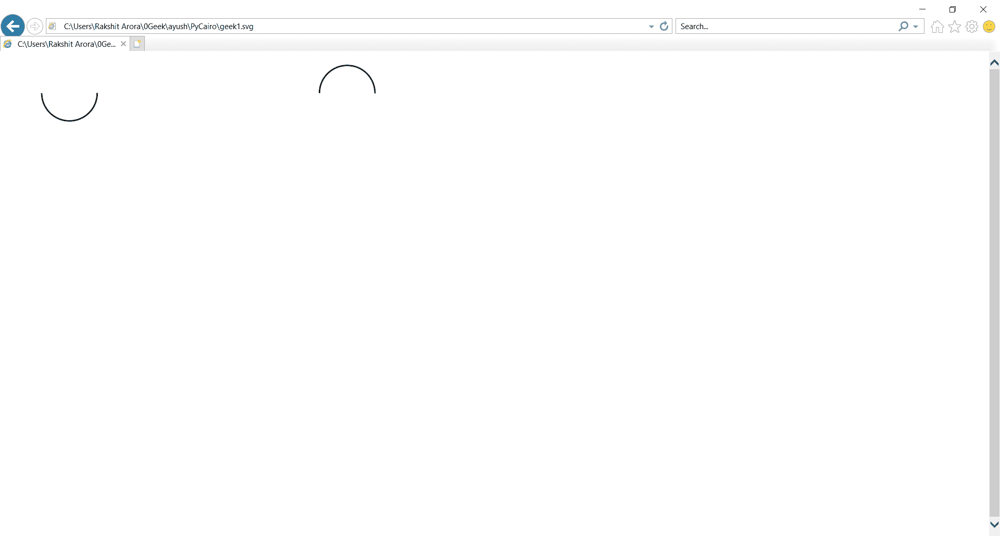

# PyCairo–绘制负弧

> 原文:[https://www.geeksforgeeks.org/pycairo-drawing-negative-arc/](https://www.geeksforgeeks.org/pycairo-drawing-negative-arc/)

在本文中，我们将学习如何使用 python 中的 PyCairo 绘制简单的负弧。向当前路径添加给定半径的圆弧。圆弧以(xc，yc)为中心，从角度 1 开始，沿角度减小的方向前进，到角度 2 结束。如果角度 2 大于角度 1，它将逐渐减小 2π，直到小于角度 1。

**PyCairo** : PyCairo 是一个为 cairo 图形库提供绑定的 Python 模块。这个库用于创建 SVG，即 python 中的矢量文件。打开 SVG 文件进行查看(只读)最简单快捷的方法是使用现代网络浏览器，如 Chrome、Firefox、Edge 或 Internet Explorer，几乎所有这些浏览器都应该为 SVG 格式提供某种渲染支持。

**SVG** 文件是使用由万维网联盟(W3C)创建的二维矢量图形格式的图形文件。它使用基于 XML 的文本格式描述图像。SVG 文件是作为在网络上显示矢量图形的标准格式开发的。

**实施步骤:**

1.  导入 Pycairo 模块。
2.  创建一个 SVG 表面对象并向其添加上下文。
3.  使用 arc_negative()创建负弧。

**下面是实现:**

## 蟒蛇 3

```
# importing pycairo
import cairo

# creating a SVG surface
# here geek1 is file name & 700, 700 is dimension
with cairo.SVGSurface("geek1.svg", 700, 700) as surface:

    # creating a cairo context object
    context = cairo.Context(surface)

    # creating a normal arc
    context.arc(100, 60, 40, 0, 1*22/7)

    # stroke the context to remove the moved pen
    context.stroke()

    # creating a negative arc
    context.arc_negative(500, 60, 40, 0, 1*22/7)

    # stroke the context to remove the moved pen
    context.stroke()

    # printing message when file is saved
print("File Saved")
```

**输出:**

