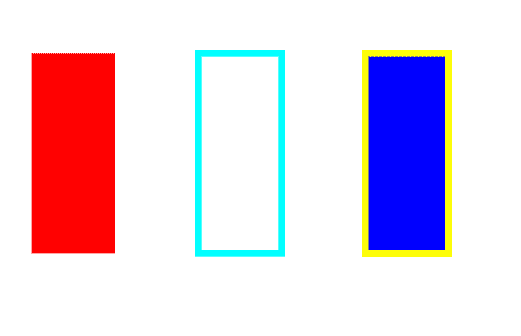

# PyCairo–绘制轮廓

> 原文:[https://www.geeksforgeeks.org/pycairo-drawing-the-outline/](https://www.geeksforgeeks.org/pycairo-drawing-the-outline/)

在本文中，我们将学习如何使用 python 中的 PyCairo 绘制实体表面的轮廓。轮廓基本上是对象的边框，它用来突出对象。

**PyCairo** : Pycairo 是一个为 Cairo 图形库提供绑定的 Python 模块。这个库用于创建 SVG，即 python 中的矢量文件。打开一个 SVG 文件进行查看(只读)最简单快捷的方法是使用像 Chrome、Firefox、Edge 或 Internet Explorer 这样的现代网络浏览器，几乎所有这些浏览器都应该为 SVG 格式提供某种渲染支持。

**SVG:** File 是一个图形文件，它使用了由万维网联盟(W3C)创建的二维矢量图形格式。它使用基于 XML 的文本格式描述图像。SVG 文件是作为在网络上显示矢量图形的标准格式开发的。

**实施步骤:**

*   导入 Pycairo 模块。
*   创建一个 SVG 表面对象，并向其添加上下文。
*   设置上下文的颜色和线宽
*   创建形状
*   保留对象的内部颜色，以便可以更改用作轮廓的边框颜色
*   设置边框的颜色和宽度，即轮廓

**例 1 :**

## 蟒蛇 3

```
# importing pycairo
import cairo

# creating a SVG surface 
# here geek95 is file name &
# 700, 700 is dimension
with cairo.SVGSurface("geek95.svg", 700, 700) as surface:

    # creating a cairo context
    #object for SVG surface
    # using Context method
    context= cairo.Context(surface)

    # Creating shape
    context.rectangle(25, 50, 50, 120)

    # setting color of the context
    context.set_source_rgb(1, 0, 0)

    # Fill the color inside 
    context.fill()

    # Creating shape
    context.rectangle(125, 50, 50, 120)

    # setting color of the context
    context.set_source_rgb(0, 1, 1)

    # Setting outline width
    context.set_line_width(4)

    # stroke out the color and width property
    context.stroke()

    # Creating shape
    context.rectangle(225, 50, 50, 120)

    # setting color of the context for inside
    context.set_source_rgb(0, 0, 1)

    # Preserving inside color of object
    context.fill_preserve()

    # setting color of the context for outline
    context.set_source_rgb(1, 1, 0)

    context.set_line_width(4)

    # stroke out the color and width property
    context.stroke()

# printing message when file is saved
print("File Saved")  
```

**输出:**



**例 2:**

## 蟒蛇 3

```
# importing pycairo
import cairo

# creating a SVG surface 
# here geek95 is file name & 700, 700 is dimension
with cairo.SVGSurface("geek95.svg", 700, 700) as surface:

  # creating a cairo context
  # object for SVG surface
  # using Context method
  context= cairo.Context(surface)

  # Creating shape
  context.arc(500, 60, 40, 0, 2*22/7)

  # setting color of the context for inside
  context.set_source_rgb(0, 0, 0)

  # Preserving inside color of object
  context.fill_preserve()

  # setting color of the context for outline
  context.set_source_rgb(1, 1, 0)

  # Setting outline width
  context.set_line_width(4)

  # stroke out the color and width property
  context.stroke()

# printing message when file is saved
print("File Saved")
```

**输出:**

