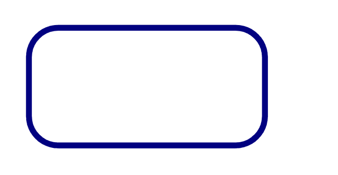

# 绘制圆形图

> 原文:[https://www . geesforgeks . org/py cairo-drawing-the-round rect/](https://www.geeksforgeeks.org/pycairo-drawing-the-roundrect/)

在本文中，我们将学习如何使用 python 中的 PyCairo 绘制一个简单的圆形。圆角是带有圆角的矩形

**PyCairo** : PyCairo 是一个为 cairo 图形库提供绑定的 Python 模块。这个库用于创建 SVG，即 python 中的矢量文件。打开 SVG 文件进行查看(只读)最简单快捷的方法是使用现代网络浏览器，如 Chrome、Firefox、Edge 或 Internet Explorer，几乎所有这些浏览器都应该为 SVG 格式提供某种渲染支持。

**SVG** 文件是使用由万维网联盟(W3C)创建的二维矢量图形格式的图形文件。它使用基于 XML 的文本格式描述图像。SVG 文件是作为在网络上显示矢量图形的标准格式开发的。

**实施步骤:**

*   导入 Pycairo 模块。
*   创建一个 SVG 表面对象，并向其添加上下文。
*   创建一个制作圆角形状的函数
*   用参数调用函数
*   设置上下文的颜色和线宽

**下面是实现:**

## 蟒蛇 3

```
# importing pycairo
import cairo
import math

# Creating function for make roundrect shape
def roundrect(context, x, y, width, height, r):
    context.arc(x+r, y+r, r,
                math.pi, 3*math.pi/2)

    context.arc(x+width-r, y+r, r,
                3*math.pi/2, 0)

    context.arc(x+width-r, y+height-r,
                r, 0, math.pi/2)

    context.arc(x+r, y+height-r, r,
                math.pi/2, math.pi)

    context.close_path()
    # creating a SVG surface
    # here geek95 is file name &
    # 700, 700 is dimension

with cairo.SVGSurface("geek95.svg", 700, 700) as surface:

    # creating a cairo context object for SVG surface
    # useing Context method
    context = cairo.Context(surface)

    # setting width of the context
    context.set_line_width(10)

    # setting color of the context
    context.set_source_rgb(0, 0, 0.5)

    # Call the function
    roundrect(context, 100, 100, 400, 200, 50)

    # stroke out the color and width property
    context.stroke()

# printing message when file is saved
print("File Saved")
```

**输出:**

