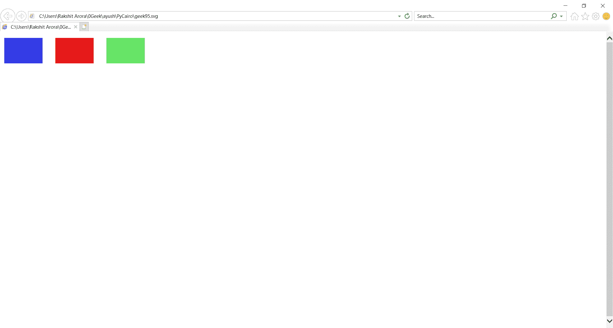

# PyCairo–填充纯色

> 原文:[https://www.geeksforgeeks.org/pycairo-fill-solid-colors/](https://www.geeksforgeeks.org/pycairo-fill-solid-colors/)

在本文中，我们将学习如何使用 python 中的 PyCairo 在封闭图案中填充颜色。Pycairo 是一个 Python 模块，为 cairo 图形库提供绑定。这个库用于创建 SVG，即 python 中的矢量文件。打开 SVG 文件进行查看(只读)最简单快捷的方法是使用现代网络浏览器，如 Chrome、Firefox、Edge 或 Internet Explorer，几乎所有这些浏览器都应该为 SVG 格式提供某种渲染支持。

这里我们将使用**填充()**方法。

颜色是表示红色、绿色和蓝色(RGB)强度值组合的对象。PyCairo 有效的 RGB 值在 0 到 1 的范围内。

实施步骤:

1.  导入 PyCairo 模块。
2.  创建一个 SVG 表面对象并向其添加上下文。
3.  设置上下文的颜色和线宽
4.  创建矩形
5.  该源用于通过调用 fill()方法填充矩形的内部。

**示例:**

## 计算机编程语言

```py
# importing pycairo
import cairo

# creating a SVG surface
# here geek95 is file name & 700, 700 is dimension
with cairo.SVGSurface("geek95.svg", 700, 700) as surface:

    # creating a cairo context object for SVG surface
    # useing Context method
    context = cairo.Context(surface)

    # setting color of the context
    context.set_source_rgb(0.2, 0.23, 0.9)
    # creating a rectangle
    context.rectangle(10, 15, 90, 60)

    # Fill the color inside the rectangle
    context.fill()

    # setting color of the context
    context.set_source_rgb(0.9, 0.1, 0.1)
    # creating a rectangle
    context.rectangle(130, 15, 90, 60)

    # Fill the color inside the rectangle
    context.fill()

    # setting color of the context
    context.set_source_rgb(0.4, 0.9, 0.4)
    # creating a rectangle
    context.rectangle(250, 15, 90, 60)

    # Fill the color inside the rectangle
    context.fill()

    # printing message when file is saved
    print("File Saved")
```

**输出:**



**注意:**set _ source _ RGB()方法将源设置为不透明的颜色。参数是红色、绿色和蓝色强度值。