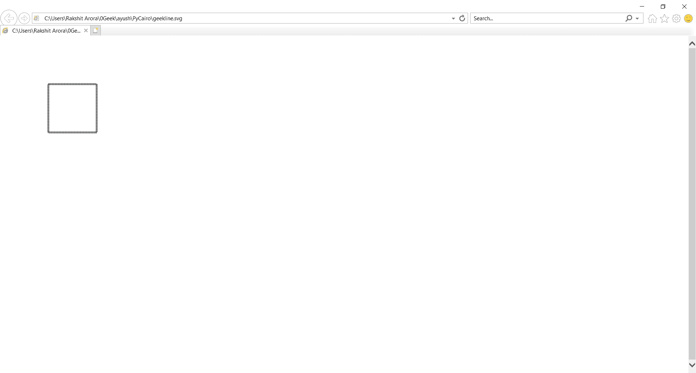

# 复制开罗–如何创建上下文对象

> 原文:[https://www . geesforgeks . org/py cairo-如何创建上下文对象/](https://www.geeksforgeeks.org/pycairo-how-to-create-context-object/)

在本文中，我们将看到如何在 pycairo python 中创建上下文对象。Pycairo 是一个 Python 模块，为 cairo 图形库提供绑定。这个库用于创建 SVG，即 python 中的矢量文件。打开 SVG 文件进行查看(只读)最简单快捷的方法是使用现代网络浏览器，如 Chrome、Firefox、Edge 或 Internet Explorer，几乎所有这些浏览器都应该为 SVG 格式提供某种渲染支持。上下文是使用 cairo 绘制时使用的主要对象。要使用 cairo 进行绘制，您需要创建一个上下文，设置目标表面，以及上下文的绘制选项，使用 context.set_source_rgba()，context.set_line_width()，context.set_dash()，context.move_to()，context.rectangle()或 context.stroke()等函数创建形状。

> 为此，我们将使用上下文方法
> 
> **语法:**开罗。背景(表面)
> 
> **参数:**以目标面为上下文
> 
> **返回:**返回新分配的上下文

## 计算机编程语言

```py
# importing pycairo
import cairo

# creating a SVG surface
# here geekline is file name & 700, 700 is dimension
with cairo.SVGSurface("geekline.svg", 700, 700) as surface:

    # creating a cairo context object for SVG surface
    # useing Context method
    context = cairo.Context(surface)

    # setting color of the context
    context.set_source_rgba(0, 0, 0, 1)

    # setting of line width
    context.set_line_width(4)

    # setting of line pattern
    context.set_dash([1.0])

    # move the context to x,y position
    context.move_to(40, 30)

    # creating a rectangle(square)
    context.rectangle(100, 100, 100, 100)

    # stroke out the color and width property
    context.stroke()

# printing message when file is saved
print("File Saved")
```

**输出:**

