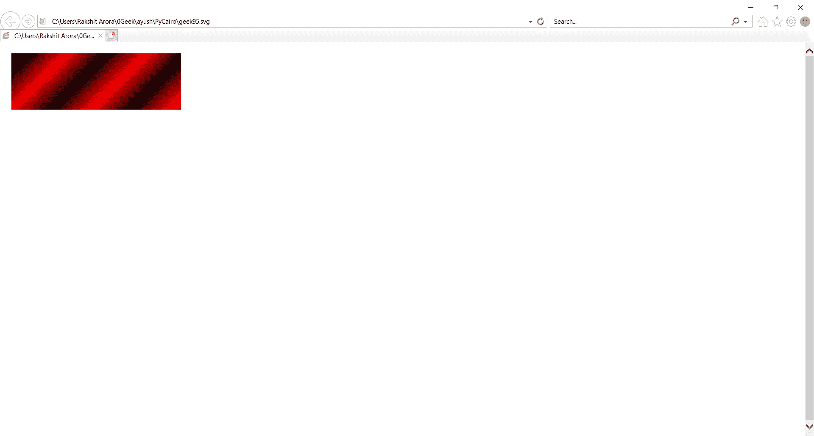
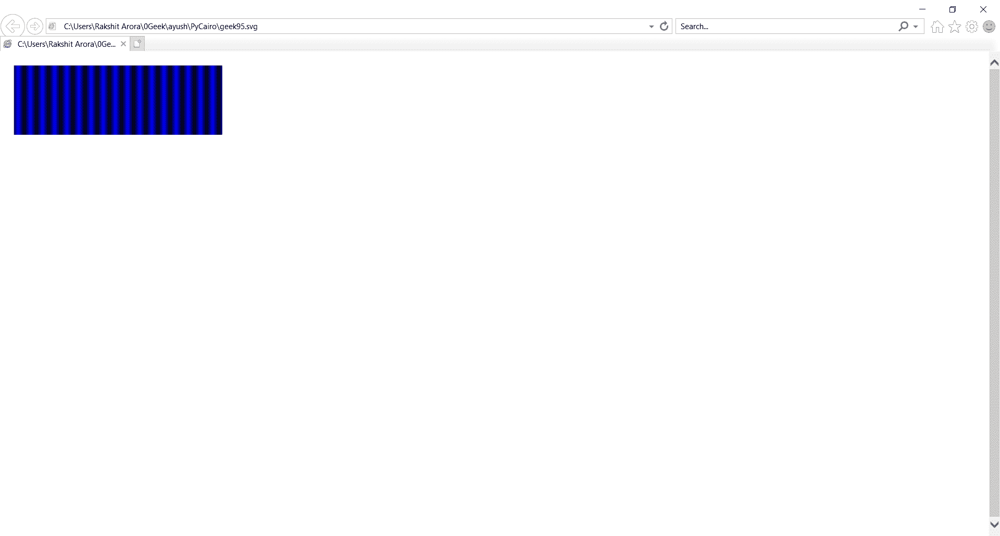
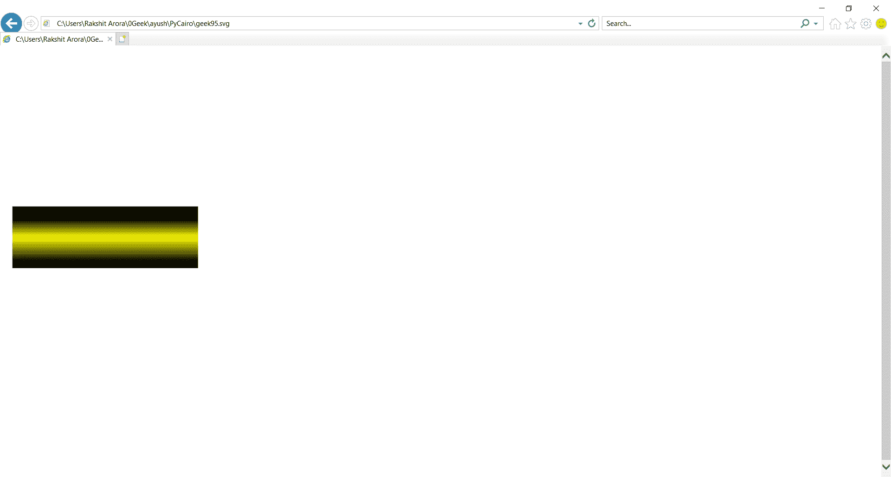

# PyCairo–线性梯度

> 原文:[https://www.geeksforgeeks.org/pycairo-linear-gradients/](https://www.geeksforgeeks.org/pycairo-linear-gradients/)

在本文中，我们将学习使用 PyCairo 通过 python 绘制 Liner 渐变。Pycairo 是一个 Python 模块，为 cairo 图形库提供绑定。这个库用于创建 SVG，即 python 中的矢量文件。打开 SVG 文件进行查看(只读)最简单快捷的方法是使用现代网络浏览器，如 Chrome、Firefox、Edge 或 Internet Explorer，几乎所有这些浏览器都应该为 SVG 格式提供某种渲染支持。渐变线由包含渐变图像的框的中心和角度定义。渐变的颜色由两个或多个点决定:起点、终点，以及介于两者之间的可选颜色停止点。

线性渐变是沿着一条线的颜色或色调的混合。他们以开罗为代表。PyCairo 中的线性渐变类。

实施步骤:

1.  导入 PyCairo 模块。
2.  创建一个 SVG 表面对象并向其添加上下文。
3.  创建线性渐变对象。
4.  定义循环或条件，用于添加彩色条纹
5.  创建形状
6.  该源用于通过调用 fill()方法填充矩形的内部。

**例 1 :**

## 计算机编程语言

```
# importing pycairo
import cairo

# creating a SVG surface
# here geek95 is file name & 700, 700 is dimension
with cairo.SVGSurface("geek95.svg", 700, 700) as surface:

    # creating a cairo context object for SVG surface
    # useing Context method
    context = cairo.Context(surface)

    # Creating a liner gradient object.
    lg1 = cairo.LinearGradient(0.0, 0.0, 350.0, 350.0)

    # Creating Loops for adding color stripes
    count = 1
    i = 0.1
    while i < 1.0:
        if count % 2:
            lg1.add_color_stop_rgba(i, 0, 0, 0, 1)
        else:
            lg1.add_color_stop_rgba(i, 1, 0, 0, 1)
        i = i + 0.1
        count = count + 1

    # Creating Shape
    context.rectangle(20, 20, 300, 100)

    #
    context.set_source(lg1)
    # Fill the color inside the rectangle
    context.fill()

    # printing message when file is saved
print("File Saved")
```

**输出:**



**例 2 :**

## 蟒蛇 3

```
# code
import cairo
print("GFG")
# importing pycairo

# creating a SVG surface
# here geek95 is file name & 700, 700 is dimension
with cairo.SVGSurface("geek95.svg", 700, 700) as surface:

    # creating a cairo context object for SVG surface
    # useing Context method
    context = cairo.Context(surface)

    # Creating a liner gradient object.
    lg2 = cairo.LinearGradient(0.0, 0.0, 350.0, 0.0)

    count = 1
    i = 0.05
    # Creating Loops for adding color stripes
    while i < 0.95:
        if count % 2:
            lg2.add_color_stop_rgba(i, 0, 0, 0, 1)
        else:
            lg2.add_color_stop_rgba(i, 0, 0, 1, 1)
        i = i + 0.025
        count = count + 1
    # Creating Shape
    context.rectangle(20, 20, 300, 100)
    context.set_source(lg2)
    # Fill the color inside the rectangle
    context.fill()
# printing message when file is saved
print("File Saved")
```

**输出:**



**例 3 :**

## 蟒蛇 3

```
# importing pycairo
import cairo

# creating a SVG surface
# here geek95 is file name & 700, 700 is dimension
with cairo.SVGSurface("geek95.svg", 700, 700) as surface:

    # creating a cairo context object for SVG surface
    # useing Context method
    context = cairo.Context(surface)

    # Creating a liner gradient object.
    lg3 = cairo.LinearGradient(20.0, 260.0,  20.0, 360.0)

    # adding color stripes
    lg3.add_color_stop_rgba(0.2, 0, 0, 0, 1)
    lg3.add_color_stop_rgba(0.5, 1, 1, 0, 1)
    lg3.add_color_stop_rgba(0.9, 0, 0, 0, 1)

    # Creating Shape
    context.rectangle(20, 260, 300, 100)
    context.set_source(lg3)

    # Fill the color inside the rectangle
    context.fill()

# printing message when file is saved
print("File Saved")
```

**输出:**

