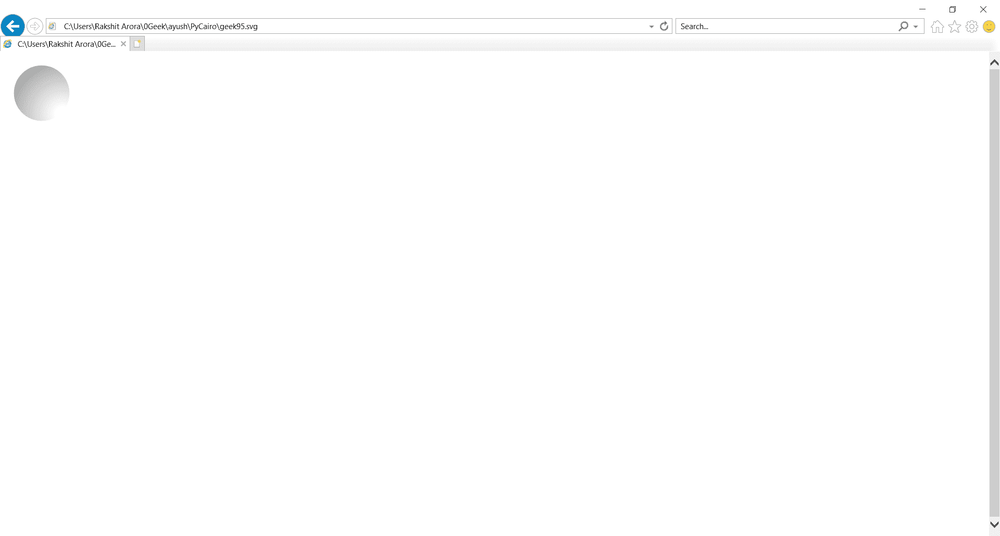
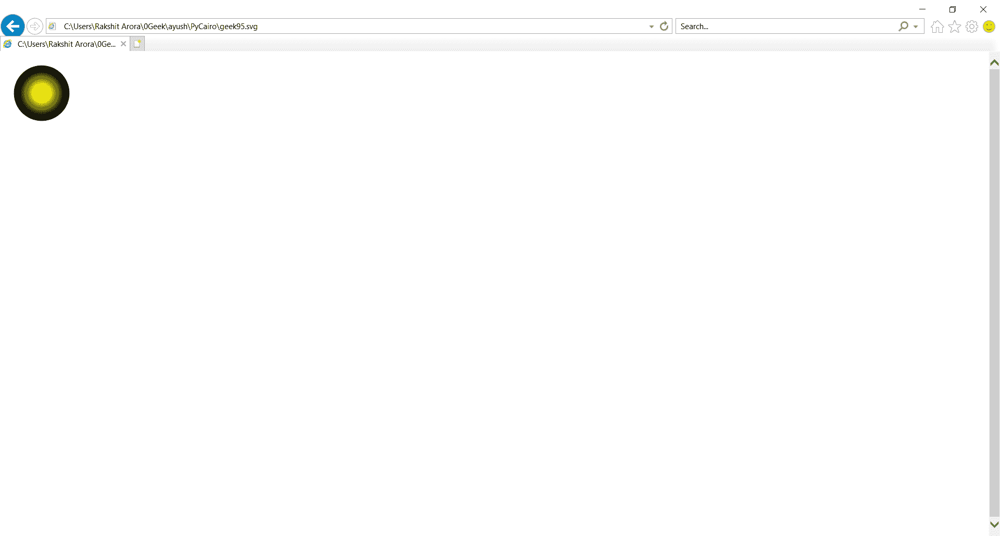

# PyCairo–径向梯度

> 原文:[https://www.geeksforgeeks.org/pycairo-radial-gradients/](https://www.geeksforgeeks.org/pycairo-radial-gradients/)

在本文中，我们将学习使用 PyCairo 通过 python 绘制径向渐变。Pycairo 是一个 Python 模块，为 cairo 图形库提供绑定。这个库用于创建 SVG，即 python 中的矢量文件。打开 SVG 文件进行查看(只读)最简单快捷的方法是使用现代网络浏览器，如 Chrome、Firefox、Edge 或 Internet Explorer，几乎所有这些浏览器都应该为 SVG 格式提供某种渲染支持。

径向渐变由一个中心点、一个结束形状和两个或多个颜色停止点定义。

实施步骤:

1.  导入 PyCairo 模块。
2.  创建一个 SVG 表面对象并向其添加上下文。
3.  创建径向渐变对象。
4.  定义循环或条件，用于添加彩色条纹
5.  创建形状
6.  该源用于通过调用 fill()方法填充矩形的内部。

**例 1:**

## 蟒蛇 3

```
# importing pycairo
import cairo

# creating a SVG surface
# here geek95 is file name & 700, 700 is dimension
with cairo.SVGSurface("geek95.svg", 700, 700) as surface:

    # creating a cairo context object for SVG surface
    # useing Context method
    context = cairo.Context(surface)
    context.set_source_rgba(0, 0, 0, 1)
    context.set_line_width(12)

    # Translate the context
    context.translate(60, 60)

    # Creating a Radial gradient object.
    r1 = cairo.RadialGradient(30, 30, 10, 30, 30, 90)
    r1.add_color_stop_rgba(0, 1, 1, 1, 1)
    r1.add_color_stop_rgba(1, 0.6, 0.6, 0.6, 1)
    context.set_source(r1)

    # Creating Circle
    context.arc(0, 0, 40, 0, 3.14 * 2)

    # Fill the color inside the Circle
    context.fill()

  # printing message when file is saved
print("File Saved")
```

**输出:**



**例 2 :**

## 蟒蛇 3

```
# importing pycairo
import cairo

# creating a SVG surface
# here geek95 is file name & 700, 700 is dimension
with cairo.SVGSurface("geek95.svg", 700, 700) as surface:

    # creating a cairo context object for SVG surface
    # useing Context method
    context = cairo.Context(surface)
    context.set_source_rgba(0, 0, 0, 1)
    context.set_line_width(12)

    # Translate the context
    context.translate(60, 60)

    # Creating a Radial gradient object.
    r2 = cairo.RadialGradient(0, 0, 10, 0, 0, 40)
    r2.add_color_stop_rgb(0, 1, 1, 0)
    r2.add_color_stop_rgb(0.8, 0, 0, 0)
    context.set_source(r2)

    # Creating Circle
    context.arc(0, 0, 40, 0, 3.14 * 2)

    # Fill the color inside the Circle
    context.fill()

  # printing message when file is saved
print("File Saved")
```

**输出:**

