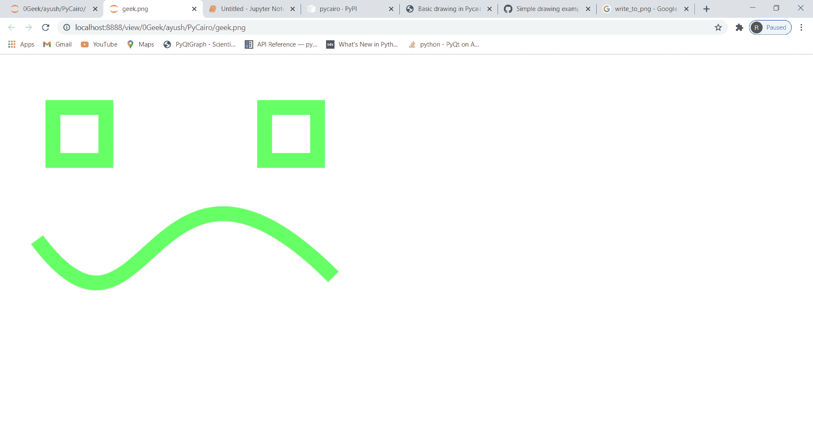

# PyCairo–将 SVG 图像文件保存为 PNG 文件

> 原文:[https://www . geesforgeks . org/py cairo-saving-SVG-image-file-to-png-file/](https://www.geeksforgeeks.org/pycairo-saving-svg-image-file-to-png-file/)

在本文中，我们将看到如何使用 Python 中的 PyCairo 将 SVG 文件保存为 PNG 文件。我们可以使用 SVGSurface 方法创建一个 SVG 文件。一个 **SVG** 文件是一个使用由万维网联盟(W3C)创建的二维矢量图形格式的图形文件。它使用基于 XML 的文本格式描述图像。SVG 文件是作为在网络上显示矢量图形的标准格式开发的。

**PNG :** 便携式网络图形是一种支持无损数据压缩的光栅图形文件格式。巴布亚新几内亚是作为图形交换格式的改进的非专利替代品开发的。PNG 支持基于调色板的图像、灰度图像和全色非基于调色板的 RGB 或 RGBA 图像。

**PyCairo :** PyCairo 是一个 Python 模块，为 cairo 图形库提供绑定。这个库用于创建 SVG，即 python 中的矢量文件。打开 SVG 文件进行查看(只读)最简单快捷的方法是使用现代网络浏览器，如 Chrome、Firefox、Edge 或 Internet Explorer，几乎所有这些浏览器都应该为 SVG 格式提供某种渲染支持。

> 为此，我们将使用 write_to_png 方法和 SVGSurface 对象
> **语法:**surface . write _ to _ png(' geeks . png ')
> **参数:**要保存的文件名
> **返回:**它返回 None

下面是实现。

## 蟒蛇 3

```py
# importing pycairo
import cairo

# creating a SVG surface
# here geek is file name & 700, 700 is dimension
with cairo.SVGSurface("geek.svg", 700, 700) as surface:

    # creating a cairo context object
    context = cairo.Context(surface)

    # creating a rectangle(square) for left eye
    context.rectangle(100, 100, 100, 100)

    # creating a rectangle(square) for right eye
    context.rectangle(500, 100, 100, 100)

    # creating position for the curves
    x, y, x1, y1 = 0.1, 0.5, 0.4, 0.9
    x2, y2, x3, y3 = 0.4, 0.1, 0.9, 0.6

    # setting scale of the context
    context.scale(700, 700)

    # setting line width of the context
    context.set_line_width(0.04)

    # move the context to x,y position
    context.move_to(x, y)

    # draw the curve for smile
    context.curve_to(x1, y1, x2, y2, x3, y3)

    # setting color of the context
    context.set_source_rgba(0.4, 1, 0.4, 1)

    # stroke out the color and width property
    context.stroke()

    # Save as a SVG and PNG
    surface.write_to_png('geek.png')

# printing message when file is saved
print("File Saved")
```

**输出:**

 