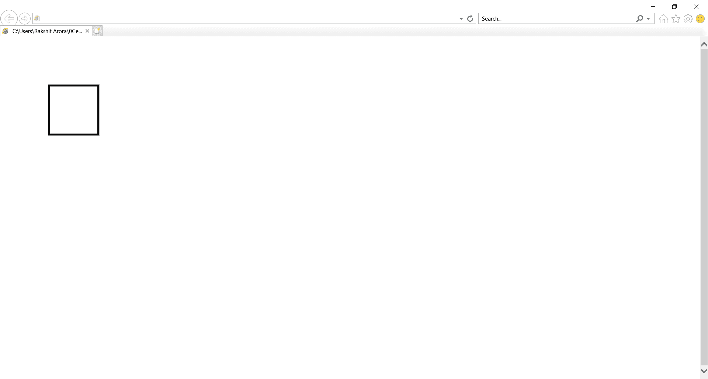
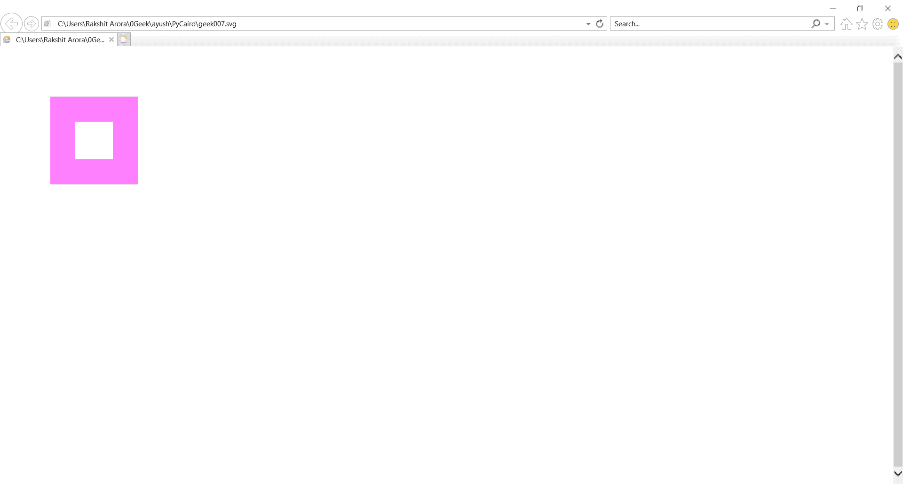
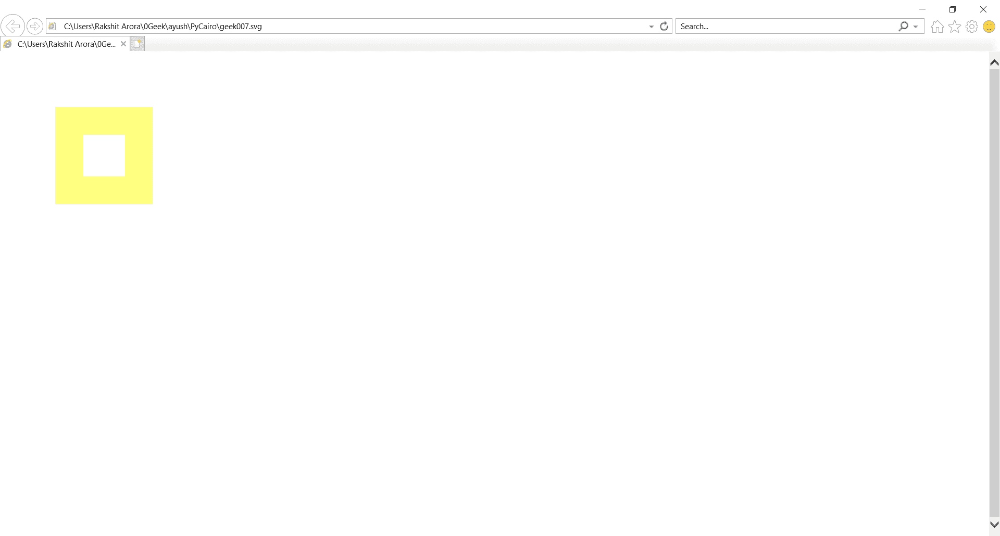

# PyCairo–设置上下文颜色

> 原文:[https://www . geesforgeks . org/py cairo-setting-context-color/](https://www.geeksforgeeks.org/pycairo-setting-context-color/)

在本文中，我们将看到如何在 pycairo Python 中设置上下文颜色。Pycairo 是一个 Python 模块，为 cairo 图形库提供绑定。这个库用于创建 SVG，即 python 中的矢量文件。打开 SVG 文件进行查看(只读)最简单快捷的方法是使用现代网络浏览器，如 Chrome、Firefox、Edge 或 Internet Explorer，几乎所有这些浏览器都应该为 SVG 格式提供某种渲染支持。颜色可以使用 RGBA 模式设置，RGBA 代表红色绿色蓝色阿尔法。虽然它有时被描述为一个颜色空间，但它实际上是由第四个 alpha 通道补充的三通道 RGB 颜色模型。

> 为此，我们将对上下文对象使用 set_source_rgba 方法
> 
> **语法:** context.set_source_rgba(0，0，0，1)
> 
> **参数:**采用 RGBA 模型中的颜色格式
> 
> **返回:**返回无

**例 1 :**

## 计算机编程语言

```
# importing pycairo
import cairo

# creating a SVG surface
# here geek007 is file name & 700, 700 is dimension
with cairo.SVGSurface("geek007.svg", 700, 700) as surface:

    # creating a cairo context object for SVG surface
    # useing Context method
    context = cairo.Context(surface)

    # setting color of the context
    context.set_source_rgba(0, 0, 0, 1)

    # setting of line width
    context.set_line_width(4)

    # move the context to x,y position
    context.move_to(40, 30)

    # creating a rectangle(square)
    context.rectangle(100, 100, 100, 100)

    # stroke out the color and width property
    context.stroke()

# printing message when file is saved
print("File Saved")
```

> 设置上下文的颜色
> 
> context.set_source_rgba (0，0，0，1)

**输出:**



**例 2 :**

## 蟒蛇 3

```
# importing pycairo
import cairo

# creating a SVG surface 
# here geek007 is file name & 700, 700 is dimension
with cairo.SVGSurface("geek007.svg", 700, 700) as surface:

    # creating a cairo context object for SVG surface
    #useing Context method
    context = cairo.Context(surface)

    # setting color of the context
    context.set_source_rgba(4, 0, 4, 0.5)

    # setting of line width
    context.set_line_width(40)

    # move the context to x,y position
    context.move_to(40, 30) 

     #creating a rectangle(square)
    context.rectangle(100, 100, 100, 100)

    # stroke out the color and width property
    context.stroke()

# printing message when file is saved
print("File Saved")
```

> 设置上下文的颜色
> 
> context.set_source_rgba (4，0，4，0.5)

**输出:**



**例 3 :**

## 蟒蛇 3

```
# importing pycairo
import cairo

# creating a SVG surface
# here geek007 is file name & 700, 700 is dimension
with cairo.SVGSurface("geek007.svg", 700, 700) as surface:

    # creating a cairo context object for SVG surface
    # useing Context method
    context = cairo.Context(surface)

    # setting color of the context
    context.set_source_rgba(180, 150, 0, 0.5)

    # setting of line width
    context.set_line_width(40)

    # move the context to x,y position
    context.move_to(40, 30)

    # creating a rectangle(square)
    context.rectangle(100, 100, 100, 100)

    # stroke out the color and width property
    context.stroke()

# printing message when file is saved
print("File Saved")
```

> 设置上下文的颜色
> 
> context.set_source_rgba (180，150，0，0.5)

**输出:**

