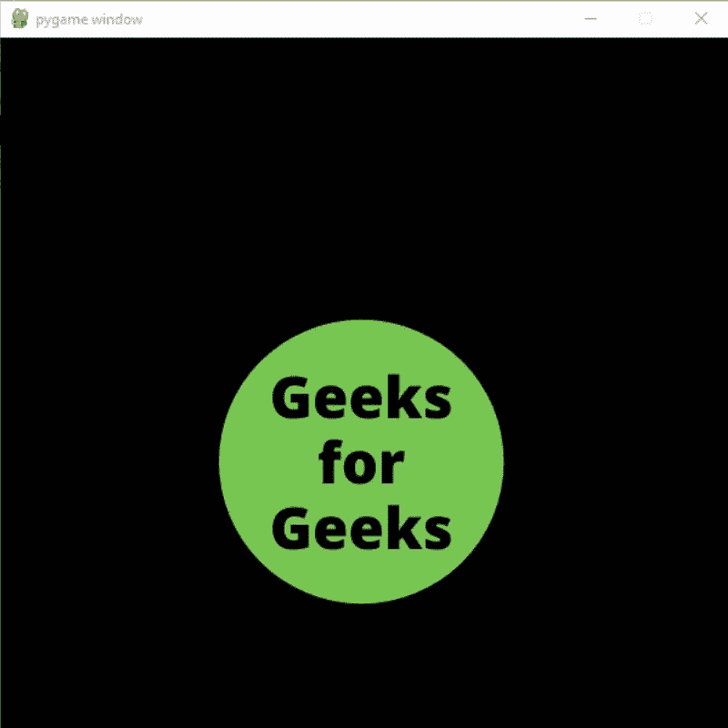
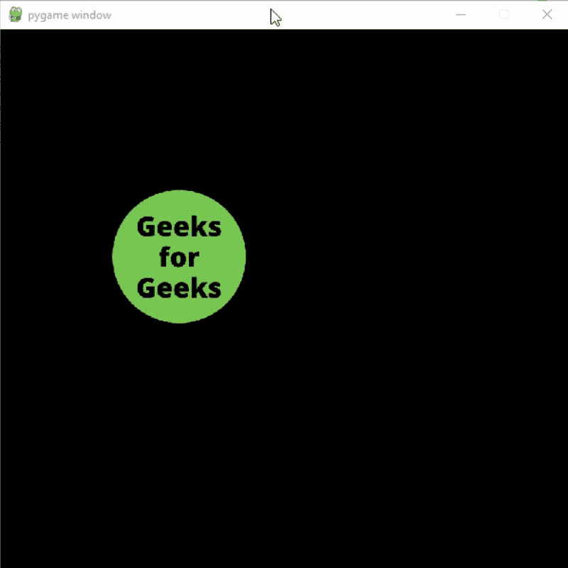

# Pygame–角色动画

> 原文:[https://www.geeksforgeeks.org/pygame-character-animation/](https://www.geeksforgeeks.org/pygame-character-animation/)

PyGame 是一个用于设计视频游戏的免费开源 python 库。在本文中，我们将学习如何为角色添加不同的动画。

## 简单动画

我们可以按照以下步骤在 pygame 项目中轻松添加简单的动画。

*   创建精灵列表
*   遍历列表
*   在屏幕上显示精灵

 

#### 下面是实现:

## 蟒蛇 3

```py
# Importing the pygame module
import pygame
from pygame.locals import *

# Initiate pygame and give permission
# to use pygame's functionality
pygame.init()

# Create a display surface object
# of specific dimension
window = pygame.display.set_mode((600, 600))

# Create a list of different sprites
# that you want to use in the animation
image_sprite = [pygame.image.load("Sprite1.png"),
                pygame.image.load("Sprite2.png")]

# Creating a new clock object to
# track the amount of time
clock = pygame.time.Clock()

# Creating a new variable
# We will use this variable to
# iterate over the sprite list
value = 0

# Creating a boolean variable that
# we will use to run the while loop
run = True

# Creating an infinite loop
# to run our game
while run:

    # Setting the framerate to 3fps just
    # to see the result properly
    clock.tick(3)

    # Setting 0 in value variable if its
    # value is greater than the length
    # of our sprite list
    if value >= len(image_sprite):
        value = 0

    # Storing the sprite image in an
    # image variable
    image = image_sprite[value]

    # Creating a variable to store the starting
    # x and y coordinate
    x = 150

    # Changing the y coordinate
    # according the the value stored
    # in our value variable
    if value == 0:
        y = 200
    else:
        y = 265

    # Displaying the image in our game window
    window.blit(image, (x, y))

    # Updating the display surface
    pygame.display.update()

    # Filling the window with black color
    window.fill((0, 0, 0))

    # Increasing the value of value variable by 1
    # after every iteration
    value += 1
```

**输出:**



**说明:**

*   创建特定尺寸的显示表面对象
*   然后创建一个您想要在动画中使用的不同精灵的列表，然后创建一个新的时钟对象来跟踪时间量。
*   创建一个布尔变量，我们将使用它来运行 while 循环，然后创建一个无限循环来运行我们的游戏。将帧率设置为 3fps 只是为了正确查看结果。如果值变量的值大于子画面列表的长度，则在该值变量中设置 0。
*   将精灵图像存储在图像变量中，然后创建一个变量来存储起始 x 和 y 坐标。根据我们的值变量中存储的值更改 y 坐标。
*   然后在我们的游戏窗口中显示图像并更新显示表面，并用黑色填充窗口。

## 移动动画

如果您只想在角色移动或用户按下特定按钮时显示动画，则可以通过以下步骤来实现:

*   创建一个变量来检查字符是否在移动。
*   创建精灵列表
*   如果角色正在移动，则迭代子画面列表，并在屏幕上显示子画面。
*   如果字符没有移动，显示存储在列表第 0 个索引处的精灵。

#### 使用的图像:

   

#### 下面是实现:

## 蟒蛇 3

```py
# Importing the pygame module
import pygame
from pygame.locals import *

# Initiate pygame and give permission
# to use pygame's functionality
pygame.init()

# Create a display surface object
# of specific dimension
window = pygame.display.set_mode((600, 600))

# Create a list of different sprites
# that you want to use in the animation
image_sprite = [pygame.image.load("Sprite1.png"),
                pygame.image.load("Sprite2.png"),
                pygame.image.load("Sprite3.png"),
                pygame.image.load("Sprite4.png")]

# Creating a new clock object to
# track the amount of time
clock = pygame.time.Clock()

# Creating a new variable
# We will use this variable to
# iterate over the sprite list
value = 0

# Creating a boolean variable that
# we will use to run the while loop
run = True

# Creating a boolean variable to
# check if the character is moving
# or not
moving = False

# Creating a variable to store
# the velocity
velocity = 12

# Starting coordinates of the sprite
x = 100
y = 150

# Creating an infinite loop
# to run our game
while run:

    # Setting the framerate to 10fps just
    # to see the result properly
    clock.tick(10)

    # iterate over the list of Event objects
    # that was returned by pygame.event.get() method.
    for event in pygame.event.get():

        # Closing the window and program if the
        # type of the event is QUIT
        if event.type == pygame.QUIT:
            run = False
            pygame.quit()
            quit()

        # Checking event key if the type
        # of the event is KEYUP i.e.
        # keyboard button is released
        if event.type == pygame.KEYUP:

            # Setting the value of moving to False
            # and the value f value variiable to 0
            # if the button released is
            # Left arrow key or right arrow key
            if event.key == pygame.K_LEFT or event.key == pygame.K_RIGHT:
                moving = False
                value = 0

    # Storing the key pressed in a
    # new variable using key.get_pressed()
    # method
    key_pressed_is = pygame.key.get_pressed()

    # Changing the x coordinate
    # of the player and setting moving
    # variable to True
    if key_pressed_is[K_LEFT]:
        x -= 8
        moving = True
    if key_pressed_is[K_RIGHT]:
        x += 8
        moving = True

    # If moving variable is True
    # then increasing the value of
    # value variable by 1
    if moving:
        value += 1

    # Setting 0 in value variable if its
    # value is greater than the length
    # of our sprite list
    if value >= len(image_sprite):
        value = 0

    # Storing the sprite image in an
    # image variable
    image = image_sprite[value]

    # Scaling the image
    image = pygame.transform.scale(image, (180, 180))

    # Displaying the image in our game window
    window.blit(image, (x, y))

    # Updating the display surface
    pygame.display.update()

    # Filling the window with black color
    window.fill((0, 0, 0))
```

**输出:**



**说明:**

*   创建特定尺寸的显示表面对象，然后创建要在动画中使用的不同精灵的列表。
*   创建一个新的时钟对象来跟踪时间量并创建一个新的变量。我们将使用这个变量迭代 sprite 列表。创建一个布尔变量，我们将使用它来运行 while 循环，并创建一个布尔变量来检查角色是否在移动，创建一个变量来存储 sprite 的速度起始坐标，并创建一个无限循环来运行我们的游戏，并将帧率设置为 10fps 只是为了正确地查看结果，迭代 pygame.event.get()方法返回的 Event 对象列表。如果事件类型为“退出”，请关闭窗口和程序。
*   如果事件的类型是 KEYUP，即键盘按钮被释放，检查事件键，如果释放的按钮是左箭头键或右箭头键，将移动值设置为 False，将值变量的值设置为 0。
*   使用 key.get_pressed()方法将按下的键存储在新变量中。更改玩家的 x 坐标，并将移动变量设置为真。如果移动变量为真，则将值变量的值增加 1。如果值变量的值大于子画面列表的长度，则在该值变量中设置 0。将精灵图像存储在图像变量中，然后缩放图像