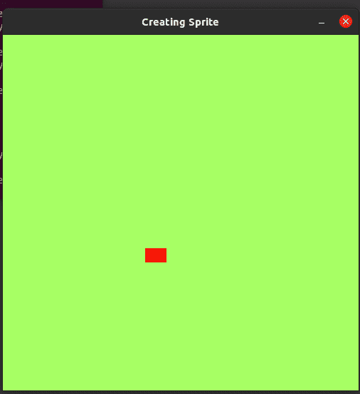

# Pygame–创建精灵

> 原文:[https://www.geeksforgeeks.org/pygame-creating-sprites/](https://www.geeksforgeeks.org/pygame-creating-sprites/)

**精灵**是物体，有不同的属性，比如高度、宽度、颜色等。，以及向右、向左、上下、跳跃等方法。在本文中，我们希望创建一个对象，用户可以在其中控制该对象，并使用箭头键将其向前、向后、向上和向下移动。

让我们先来看看我们的第一类，即定义我们的 sprite 的类，我们将把那个类称为 Sprite。这个 Sprite 类定义了它的位置(x 和 y 坐标)、对象的尺寸、颜色等。首先，我们将调用我们的 ***__init__()*** 方法。它被称为类的构造函数。

**示例:**创建精灵类

## 蟒蛇 3

```
import pygame

# GLOBAL VARIABLES
COLOR = (255, 100, 98)
SURFACE_COLOR = (167, 255, 100)
WIDTH = 500
HEIGHT = 500

# Object class
class Sprite(pygame.sprite.Sprite):
    def __init__(self, color, height, width):
        super().__init__()

        self.image = pygame.Surface([width, height])
        self.image.fill(SURFACE_COLOR)
        self.image.set_colorkey(COLOR)

        pygame.draw.rect(self.image,
                         color,
                         pygame.Rect(0, 0, width, height))

        self.rect = self.image.get_rect()
```

现在，该类已经创建，我们可以从该类创建对象。它使我们能够使用同一个类创建任意多的对象。现在我们将使用类精灵创建一个对象。

**语法:**

> 对象=精灵(红色、宽度、高度)

默认情况下，对象将位于位置(0，0)，即屏幕的左上角。我们可以改变对象的 x 和 y 属性。

**语法:**

> object.rect.x =值
> 
> object.rect.y =值

我们可以定义 n 个我们想要创建的精灵，但是为了便于理解，让我们简化一下。这里我们已经创建了一个特定维度的矩形精灵，我们可以在上面执行不同的操作来执行精灵，如前进、后退、跳跃、减速、加速等。

**示例:**创建精灵

## 蟒蛇 3

```
import pygame
import random

# GLOBAL VARIABLES
COLOR = (255, 100, 98)
SURFACE_COLOR = (167, 255, 100)
WIDTH = 500
HEIGHT = 500

# Object class
class Sprite(pygame.sprite.Sprite):
    def __init__(self, color, height, width):
        super().__init__()

        self.image = pygame.Surface([width, height])
        self.image.fill(SURFACE_COLOR)
        self.image.set_colorkey(COLOR)

        pygame.draw.rect(self.image,color,pygame.Rect(0, 0, width, height))

        self.rect = self.image.get_rect()

pygame.init()

RED = (255, 0, 0)

size = (WIDTH, HEIGHT)
screen = pygame.display.set_mode(size)
pygame.display.set_caption("Creating Sprite")

all_sprites_list = pygame.sprite.Group()

object_ = Sprite(RED, 20, 30)
object_.rect.x = 200
object_.rect.y = 300

all_sprites_list.add(object_)

exit = True
clock = pygame.time.Clock()

while exit:
    for event in pygame.event.get():
        if event.type == pygame.QUIT:
            exit = False

    all_sprites_list.update()
    screen.fill(SURFACE_COLOR)
    all_sprites_list.draw(screen)
    pygame.display.flip()
    clock.tick(60)

pygame.quit()
```

**输出:**

