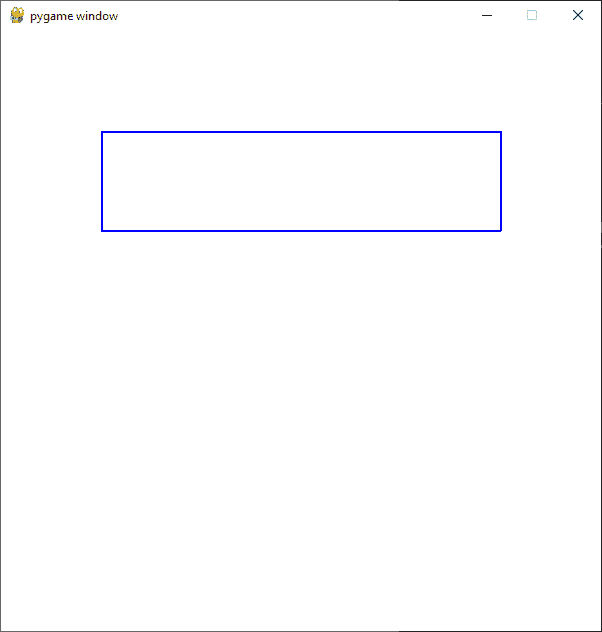
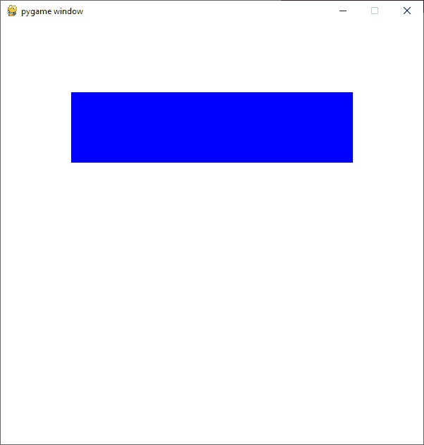
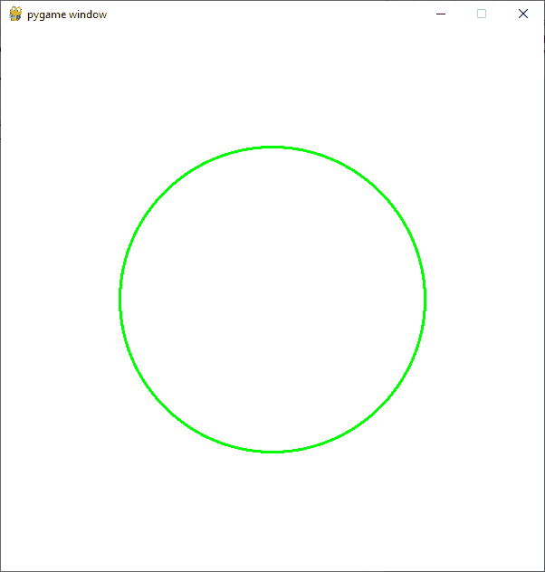
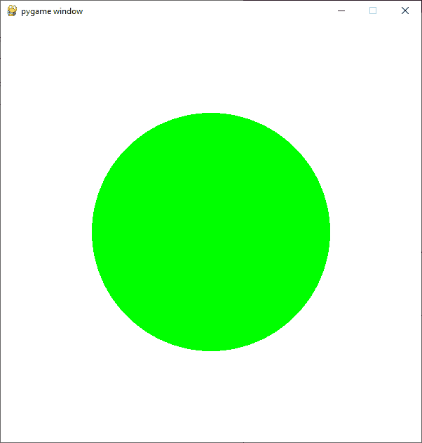
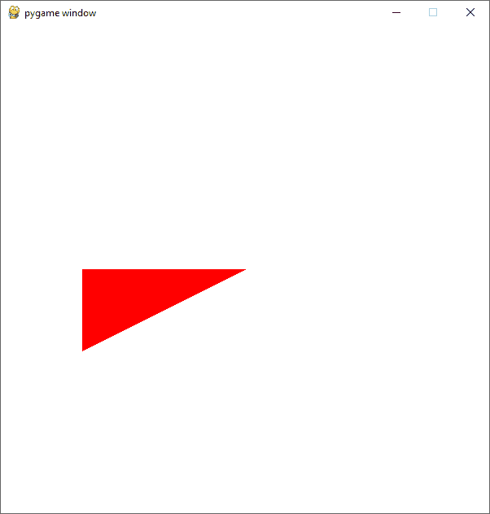
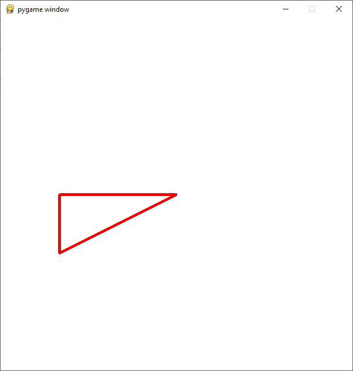
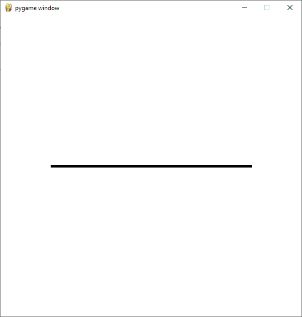
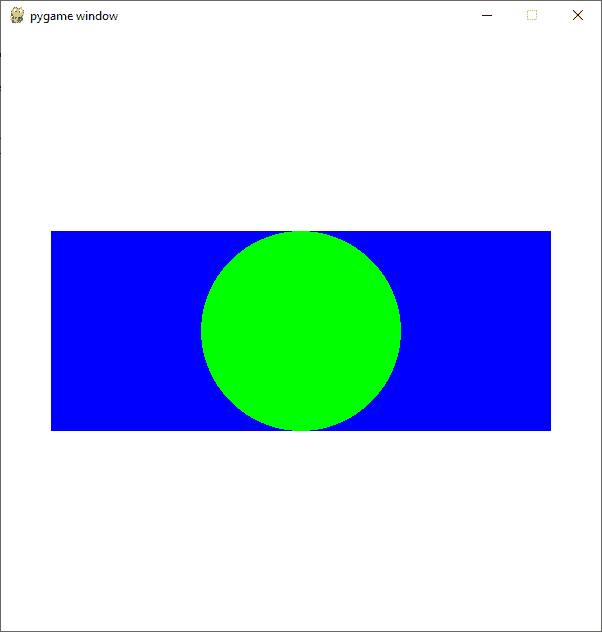

# Pygame–绘制对象和形状

> 原文:[https://www . geesforgeks . org/pygame-drawing-objects-and-shapes/](https://www.geeksforgeeks.org/pygame-drawing-objects-and-shapes/)

在本文中，我们将看到如何使用 Pygame 绘制一个对象。可以有两个版本来绘制任何形状，它可以是一个实体或只是它的轮廓。

## 在 PyGame 中绘制对象和形状

使用 pygame 的绘制方法，可以在 pygame 中轻松绘制基本形状。

### 绘制矩形形状:

要在 pygame 项目中绘制矩形，可以使用 draw.rect()函数。

> **语法:** pygame.draw.rect(表面、颜色、矩形、宽度)
> 
> **参数:**
> 
> *   曲面:-在这里，我们可以通过要在其上绘制矩形的曲面。在上面的例子中，我们创建了一个名为“窗口”的表面对象。
> *   颜色:-这里我们可以传递矩形的颜色。在我们的例子中，我们使用蓝色。
> *   rect :-这里我们可以传递矩形、位置和尺寸。
> *   宽度:-这里我们可以通过线条粗细。我们也可以通过改变这个宽度参数的值来创建一个实心矩形。让我们看看这个。

首先，导入所需的模块并初始化 pygame。现在，使用 pygame 的 display.set_mode()方法创建特定尺寸的表面对象。使用 pygame 的 Fill()函数用白色填充表面对象的背景。使用 pygame 的 draw.rect()方法创建一个矩形。更新曲面对象。

**示例 1:** 使用 pygame 绘制轮廓矩形。

## 蟒蛇 3

```
# Importing pygame module
import pygame
from pygame.locals import *

# initiate pygame and give permission
# to use pygame's functionality.
pygame.init()

# create the display surface object
# of specific dimension.
window = pygame.display.set_mode((600, 600))

# Fill the scree with white color
window.fill((255, 255, 255))

# Using draw.rect module of
# pygame to draw the outlined rectangle
pygame.draw.rect(window, (0, 0, 255),
                 [100, 100, 400, 100], 2)

# Draws the surface object to the screen.
pygame.display.update()
```

**输出:**



我们可以通过将宽度参数设置为 0 来创建一个实心矩形，方法的其余部分保持不变。

**示例 2:** 绘制实心矩形。

## 蟒蛇 3

```
# Importing pygame module
import pygame
from pygame.locals import *

# initiate pygame and give permission
# to use pygame's functionality.
pygame.init()

# create the display surface object
# of specific dimension.
window = pygame.display.set_mode((600, 600))

# Fill the scree with white color
window.fill((255, 255, 255))

# Using draw.rect module of
# pygame to draw the solid rectangle
pygame.draw.rect(window, (0,   0, 255),
                 [100, 100, 400, 100], 0)

# Draws the surface object to the screen.
pygame.display.update()
```

**输出:**



### 绘制圆形:

要在 pygame 项目中画一个圆，可以使用 draw.circle()函数。整个方法与上面相同，只是功能和参数相应地改变。

> **语法:** pygame.draw.circle(表面、颜色、中心、半径、宽度)
> 
> **参数:**
> 
> *   曲面:-在这里，我们可以通过要在其上绘制圆的曲面。在上面的例子中，我们创建了一个名为“窗口”的表面对象。
> *   颜色:-在这里，我们可以传递我们的圆的颜色。在我们的例子中，我们使用绿色。
> *   中心:-这里我们可以传递圆心的(x，y)坐标。
> *   半径:-这里我们可以通过我们的圆的半径。
> *   宽度:-这里我们可以通过线条粗细。我们也可以通过改变这个宽度参数的值来创建一个实心圆。让我们看看这个。

**例 1:** 画一个空心圆。

## 蟒蛇 3

```
# Importing pygame module
import pygame
from pygame.locals import *

# initiate pygame and give permission
# to use pygame's functionality.
pygame.init()

# create the display surface object
# of specific dimension.
window = pygame.display.set_mode((600, 600))

# Fill the scree with white color
window.fill((255, 255, 255))

# Using draw.rect module of
# pygame to draw the solid circle
pygame.draw.circle(window, (0, 255, 0),
                   [300, 300], 170, 3)

# Draws the surface object to the screen.
pygame.display.update()
```

**输出:**



我们可以通过将宽度参数设置为 0 来创建实心圆。

**示例 2:** 绘制实心圆

## 蟒蛇 3

```
# Importing pygame module
import pygame
from pygame.locals import *

# initiate pygame and give permission
# to use pygame's functionality.
pygame.init()

# create the display surface object
# of specific dimension.
window = pygame.display.set_mode((600, 600))

# Fill the scree with white color
window.fill((255, 255, 255))

# Using draw.rect module of
# pygame to draw the solid circle
pygame.draw.circle(window, (0, 255, 0),
                   [300, 300], 170, 0)

# Draws the surface object to the screen.
pygame.display.update()
```

**输出:**



同样，您也可以使用 pygame 的 draw 模块绘制其他基本形状。

### 绘制多边形形状:

可以使用 polygon()函数绘制所需的多边形。

> **语法:**多边形(表面、颜色、点、宽度)

同样，方法保持不变，只是函数和参数发生变化。

**示例 1:** 绘制实心多边形

## 蟒蛇 3

```
# Importing pygame module
import pygame
from pygame.locals import *

# initiate pygame and give permission
# to use pygame's functionality.
pygame.init()

# create the display surface object
# of specific dimension.
window = pygame.display.set_mode((600, 600))

# Fill the scree with white color
window.fill((255, 255, 255))

# Using draw.rect module of
# pygame to draw the outlined polygon
pygame.draw.polygon(window, (255, 0, 0),
                    [[300, 300], [100, 400],
                     [100, 300]])

# Draws the surface object to the screen.
pygame.display.update()
```

**输出:**



**示例 2:** 绘制空心多边形

## 蟒蛇 3

```
# Importing pygame module
import pygame
from pygame.locals import *

# initiate pygame and give permission
# to use pygame's functionality.
pygame.init()

# create the display surface object
# of specific dimension.
window = pygame.display.set_mode((600, 600))

# Fill the scree with white color
window.fill((255, 255, 255))

# Using draw.rect module of
# pygame to draw the outlined polygon
pygame.draw.polygon(window, (255, 0, 0),
                    [[300, 300], [100, 400],
                     [100, 300]], 5)

# Draws the surface object to the screen.
pygame.display.update()
```

**输出:**



### 绘制线条形状:

线是最基本的绘图实体，可以在 pygame 中使用 line()函数绘制。

> **语法:** pygame.draw.line(表面、颜色、起始位置、结束位置、宽度)

**例 1:** 画线

## 蟒蛇 3

```
# Importing pygame module
import pygame
from pygame.locals import *

# initiate pygame and give permission
# to use pygame's functionality.
pygame.init()

# create the display surface object
# of specific dimension.
window = pygame.display.set_mode((600, 600))

# Fill the scree with white color
window.fill((255, 255, 255))

# Using draw.rect module of
# pygame to draw the line
pygame.draw.line(window, (0, 0, 0),
                 [100, 300],
                 [500, 300], 5)

# Draws the surface object to the screen.
pygame.display.update()
```

**输出:**



## 绘制多个形状:

您可以在同一个曲面对象上绘制多个形状。为此，首先需要导入模块，并初始化 pygame。现在，使用 pygame 的 display.set_mode()方法创建一个特定尺寸的表面对象。使用 pygame 的 Fill()函数用白色填充表面对象的背景。创建所需的形状如上所述。更新曲面对象

**例 1:** 在矩形内画圆。

## 蟒蛇 3

```
# Importing pygame module
import pygame
from pygame.locals import *

# initiate pygame and give permission
# to use pygame's functionality.
pygame.init()

# create the display surface object
# of specific dimension.
window = pygame.display.set_mode((600, 600))

# Fill the scree with white color
window.fill((255, 255, 255))

# Using draw.rect module of
# pygame to draw the rectangle
pygame.draw.rect(window, (0, 0, 255),
                 [50, 200, 500, 200])

# Using draw.rect module of
# pygame to draw the circle inside the rectangle
pygame.draw.circle(window, (0, 255, 0),
                   [300, 300], 100)

# Draws the surface object to the screen.
pygame.display.update()
```

**输出:**



**示例 2:** 在一个矩形内绘制另一个矩形。

## 蟒蛇 3

```
# Importing pygame module
import pygame
from pygame.locals import *

# initiate pygame and give permission
# to use pygame's functionality.
pygame.init()

# create the display surface object
# of specific dimension.
window = pygame.display.set_mode((600, 600))

# Fill the scree with white color
window.fill((255, 255, 255))

# Creating a list of different rects
rectangle_list = [pygame.Rect(50, 100, 500, 200),
                  pygame.Rect(70, 120, 460, 160),
                  pygame.Rect(90, 140, 420, 120),
                  pygame.Rect(110, 160, 380, 80),
                  pygame.Rect(130, 180, 340, 40)
                  ]

# Creating list of different colors
color_list = [(0,   0,   0),
              (255, 255, 255),
              (0,   0, 255),
              (0, 255,   0),
              (255,   0,   0)
              ]

# Creating a variable which we will use
# to iterate over the color_list
color_var = 0

# Iterating over the rectangle_list using
# for loop
for rectangle in rectangle_list:

    # Drawing the rectangle
    # using the draw.rect() method
    pygame.draw.rect(window, color_list[color_var],
                     rectangle)

    # Increasing the value of color_var
    # by 1 after every iteration
    color_var += 1

# Draws the surface object to the screen.
pygame.display.update()
```

**输出:**


## 编写自己的绘图函数:

你可以很容易地在 pygame 中创建自己的专用绘图功能。

这可以通过遵循给定的程序来完成。创建以起始位置、宽度和高度为参数的绘图函数。绘制所需的形状如上所述。调用 drawfunction()

## 蟒蛇 3

```
# Importing pygame module
import pygame
from pygame.locals import *

# Creating Drawing function

def drawingfunction(x, y, width, height):

    # Creating rectangle using the draw.rect() method
    pygame.draw.rect(window, (0, 0, 255), [x, y, width, height])

    # Calculation the center of the circle
    circle_x = width/2 + x
    circle_y = height/2 + y

    # Calculating the radius of the circle
    if height < width:
        radius = height/2
    else:
        radius = width/2

    # Drawing the circle
    pygame.draw.circle(window, (0, 255, 0), [circle_x, circle_y], radius)

# initiate pygame and give permission
# to use pygame's functionality.
pygame.init()

# create the display surface object
# of specific dimension.
window = pygame.display.set_mode((600, 600))

# Fill the scree with white color
window.fill((255, 255, 255))

# Calling the drawing function
drawingfunction(50, 200, 500, 200)

# Draws the surface object to the screen.
pygame.display.update()
```

**输出:**


## 用鼠标绘制形状:

现在让我们看看如何在用户单击鼠标时创建形状。我们将在下一个示例中创建圆，但是您可以创建任何您想要的形状。

创建一个列表来存储要绘制的形状的位置。创建一个变量来存储形状的颜色。创建一个变量，我们将使用它来运行 while 循环和创建 while 循环。迭代从 pygame.event.get()接收的所有事件。如果事件类型为退出，则将 run 变量设置为 false。如果事件的类型是 MOUSEBUTTONDOWN(当用户按下鼠标按钮时发生该事件)，那么获取变量中的当前位置，然后将该位置追加到我们的 circle_positions 列表中。迭代使用 for 循环创建的数组中的所有位置。继续画形状。更新曲面对象。

## 蟒蛇 3

```
# Importing pygame module
import pygame
from pygame.locals import *

# initiate pygame and give permission
# to use pygame's functionality.
pygame.init()

# create the display surface object
# of specific dimension.
window = pygame.display.set_mode((600, 600))

# Fill the scree with white color
window.fill((255, 255, 255))

# creating list in which we will store
# the position of the circle
circle_positions = []

# radius of the circle
circle_radius = 60

# Color of the circle
color = (0, 0, 255)

# Creating a variable which we will use
# to run the while loop
run = True

# Creating a while loop
while run:

    # Iterating over all the events received from
    # pygame.event.get()
    for event in pygame.event.get():

        # If the type of the event is quit
        # then setting the run variable to false
        if event.type == QUIT:
            run = False

        # if the type of the event is MOUSEBUTTONDOWN
        # then storing the current position
        elif event.type == MOUSEBUTTONDOWN:
            position = event.pos
            circle_positions.append(position)

    # Using for loop to iterate
    # over the circle_positions
    # list
    for position in circle_positions:

        # Drawing the circle
        pygame.draw.circle(window, color, position,
                           circle_radius)

    # Draws the surface object to the screen.
    pygame.display.update()
```

**输出:**

