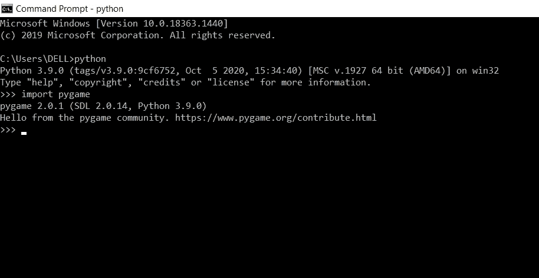
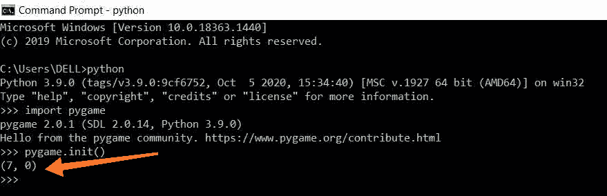
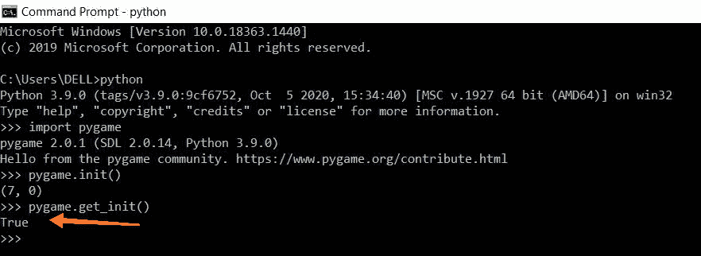

# PyGame–导入并初始化

> 原文:[https://www.geeksforgeeks.org/pygame-import-and-initialize/](https://www.geeksforgeeks.org/pygame-import-and-initialize/)

在本文中，我们将看到如何导入和初始化 PyGame。

### 装置

安装 pygame 的最好方法是使用 pip 工具，我们可以使用以下命令安装 pygame:

```py
pip install pygame
```

### **导入 Pygame 库**

要导入 pygame 库，请确保您已经安装了 pygame。使用下面给出的命令，打开您要使用的终端或集成开发环境，并导入此库以检查 pygame 是否已安装:

```py
import pygame 
```

该库将所有可用的 pygame 模块导入 pygame 包。下图显示了如何在命令提示符的帮助下执行该操作。如果您没有发现任何错误，并获得如图所示的消息，这意味着 pygame 库导入成功，现在您可以继续了。



### **初始化 Pygame 库**

在我们使用 pygame 做很多事情之前，我们首先需要初始化它。只需调用下面给出的方法来初始化它。

```py
pygame.init()
```

这个方法初始化所有必要的 pygame 模块。这个方法没有任何参数，它返回一个元组，该元组分别返回成功初始化的模块数和失败的模块数。



如图所示 **pygame.init()** 方法返回一个元组 **(7，0)** ，表示 7 个模块初始化成功，0 初始化失败。

### **检查所有模块是否初始化成功**

有一个名为 **pygame.get_init()** 的方法，显示所有 pygame 模块是否初始化成功。如果所有模块初始化成功，该方法返回**真**。

