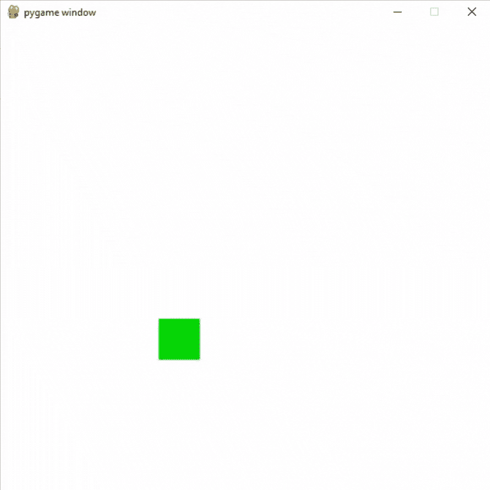
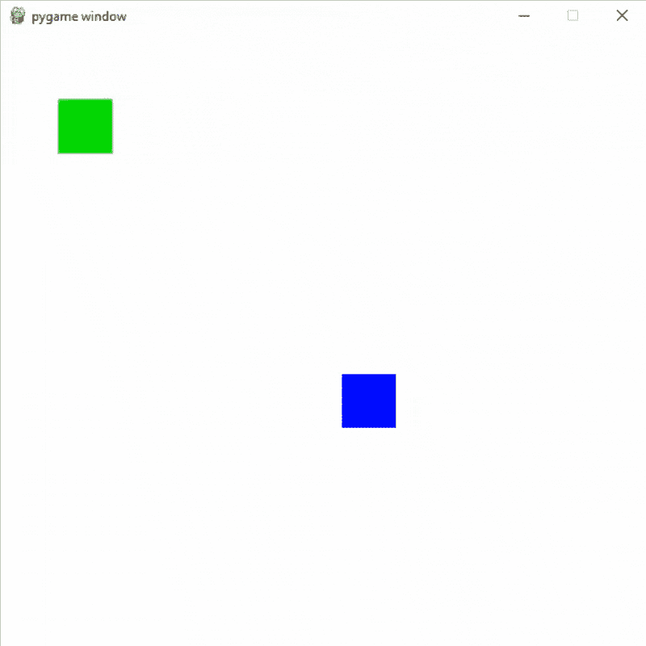

# Pygame–物体的随机移动

> 原文:[https://www . geesforgeks . org/pygame-随机移动对象/](https://www.geeksforgeeks.org/pygame-random-movement-of-object/)

**先决条件:** [如何在 Pygame 中绘制矩形？](https://www.geeksforgeeks.org/how-to-draw-rectangle-in-pygame/)

在本文中，我们将学习如何使用 Python 中的 PyGame 在对象中添加随机移动。

## 单个物体的随机运动

要在我们的对象中添加随机移动，我们将使用[随机模块](https://www.geeksforgeeks.org/python-random-module/)的[随机点](https://www.geeksforgeeks.org/python-randint-function/)方法。

> **语法:** random.randint(a，b)
> 
> **参数:**
> 
> a 和 b:两个整数
> 
> **返回:**返回一个介于 a 和 b 之间的随机整数

首先，创建一个带有必要调整的框架，然后在窗口上放置一个对象来描述移动。现在通过使用 randint()和设置其他相关参数，我们可以随机改变对象的位置。

**示例:**一个物体的随机运动

## 蟒蛇 3

```
# Importing the pygame module
import pygame
from pygame.locals import *

# Import randint method random module
from random import randint

# Initiate pygame and give permission
# to use pygame's functionality
pygame.init()

# Create a display surface object
# of specific dimension
window = pygame.display.set_mode((600, 600))

# Creating a new clock object to
# track the amount of time
clock = pygame.time.Clock()

# Creating a variable for direction
direction = 1

# Creating a new rect for player
player_rect = Rect(100, 100, 50, 50)

# Starting speed
speed_x = 5
speed_y = 4

# Creating a boolean variable that
# we will use to run the while loop
run = True

# Creating an infinite loop
# to run our game
while run:

    # Setting the framerate to 60fps
    clock.tick(60)

    # Changing the direction and x,y coordinate
    # of the object if the coordinate of left
    # side is less than equal to 20 or right side coordinate
    # is greater than equal to 580
    if player_rect.left <= 20 or player_rect.right >= 580:
        direction *= -1
        speed_x = randint(0, 8) * direction
        speed_y = randint(0, 8) * direction

        # Changing the value if speed_x
        # and speed_y both are zero
        if speed_x == 0 and speed_y == 0:
            speed_x = randint(2, 8) * direction
            speed_y = randint(2, 8) * direction

    # Changing the direction and x,y coordinate
    # of the object if the coordinate of top
    # side is less than equal to 20 or bottom side coordinate
    # is greater than equal to 580
    if player_rect.top <= 20 or player_rect.bottom >= 580:
        direction *= -1
        speed_x = randint(0, 8) * direction
        speed_y = randint(0, 8) * direction

        # Changing the value if speed_x
        # and speed_y both are zero
        if speed_x == 0 and speed_y == 0:
            speed_x = randint(2, 8) * direction
            speed_y = randint(2, 8) * direction

    # Adding speed_x and speed_y
    # in left and top coordinates of object
    player_rect.left += speed_x
    player_rect.top += speed_y

    # Drawing player rect
    pygame.draw.rect(window, (0,   255,   0), player_rect)

    # Updating the display surface
    pygame.display.update()

    # Filling the window with white color
    window.fill((255, 255, 255))
```

**输出:**



## 不止一个物体的随机运动

要在多个对象中添加随机移动，我们将为这些对象创建单独的速度和方向变量。然后我们将借助对撞机()方法检查物体是否发生碰撞。

> **语法：**pygame。直肠 1，直肠 2
> 
> **参数:**
> 
> 它将采用两个矩形作为参数。
> 
> **返回:**
> 
> 如果任一矩形的任何部分重叠，则返回 true。

**示例:**两个物体的随机运动

## 蟒蛇 3

```
# Importing the pygame module
import pygame
from pygame.locals import *

# Import randint method random module
from random import randint

# Initiate pygame and give permission
# to use pygame's functionality
pygame.init()

# Create a display surface object
# of specific dimension
window = pygame.display.set_mode((600, 600))

# Creating a new clock object to
# track the amount of time
clock = pygame.time.Clock()

# Creating a variable for direction
# of object 1
direction_a = 1

# Creating a variable for direction
# of object 2
direction_b = 1

# Creating a new rect for first object
player_rect = Rect(100, 100, 50, 50)

# Creating a new rect for second object
player_rect2 = Rect(200, 200, 50, 50)

# Starting speed for object 1
speed_x1 = 5
speed_y1 = 4

# Starting speed for object 2
speed_x2 = 5
speed_y2 = 4

# Creating a boolean variable that
# we will use to run the while loop
run = True

# Creating an infinite loop
# to run our game
while run:

    # Setting the framerate to 60fps
    clock.tick(60)

    # Changing the direction and x,y coordinate
    # of the object if the coordinate of left
    # side is less than equal to 20 or right side coordinate
    # is greater than equal to 580
    if player_rect.left <= 20 or player_rect.right >= 580:
        direction_a *= -1
        speed_x1 = randint(0, 8)
        speed_y1 = randint(0, 8)

        # Changing the value if speed_x
        # and speed_y both are zero
        if speed_x1 == 0 and speed_y1 == 0:
            speed_x1 = randint(2, 8)
            speed_y1 = randint(2, 8)

    # Changing the direction and x,y coordinate
    # of the object if the coordinate of top
    # side is less than equal to 20 or bottom side coordinate
    # is greater than equal to 580
    if player_rect.top <= 20 or player_rect.bottom >= 580:
        direction_a *= -1
        speed_x1 = randint(0, 8)
        speed_y1 = randint(0, 8)

        # Changing the value if speed_x
        # and speed_y both are zero
        if speed_x1 == 0 and speed_y1 == 0:
            speed_x1 = randint(2, 8)
            speed_y1 = randint(2, 8)

    # Changing the direction and x,y coordinate
    # of the object2 if the coordinate of left
    # side is less than equal to 20 or right side coordinate
    # is greater than equal to 580
    if player_rect2.left <= 20 or player_rect2.right >= 580:
        direction_b *= -1
        speed_x2 = randint(0, 8)
        speed_y2 = randint(0, 8)

        # Changing the value if speed_x
        # and speed_y both are zero
        if speed_x2 == 0 and speed_y2 == 0:
            speed_x2 = randint(2, 8)
            speed_y2 = randint(2, 8)

    # Changing the direction and x,y coordinate
    # of the object2 if the coordinate of top
    # side is less than equal to 20 or bottom side coordinate
    # is greater than equal to 580
    if player_rect2.top <= 20 or player_rect2.bottom >= 580:
        direction_b *= -1
        speed_x2 = randint(0, 8)
        speed_y2 = randint(0, 8)

        # Changing the value if speed_x
        # and speed_y both are zero
        if speed_x2 == 0 and speed_y2 == 0:
            speed_x2 = randint(2, 8)
            speed_y2 = randint(2, 8)

    # Adding speed_x1 and speed_y1
    # in left and top coordinates of object
    # ad multiplying with direction_a
    player_rect.left += speed_x1 * direction_a
    player_rect.top += speed_y1 * direction_a

    # Adding speed_x2 and speed_y2
    # in left and top coordinates of object2
    # and multiplying with direction_b
    player_rect2.left += speed_x2 * direction_b
    player_rect2.top += speed_y2 * direction_b

    # Checking if player is colliding
    # with platform or not using the
    # colliderect() method.
    # It will return a boolean value
    collide = pygame.Rect.colliderect(player_rect, player_rect2)

    # If the objects are colliding
    # then changing their direction
    if collide:
        direction_a *= -1
        direction_b *= -1

    # Drawing player rect
    pygame.draw.rect(window, (0,   255,   0), player_rect)
    # Drawing player rect2
    pygame.draw.rect(window, (0,   0,   255), player_rect2)

    # Updating the display surface
    pygame.display.update()

    # Filling the window with white color
    window.fill((255, 255, 255))
```

**输出:**

