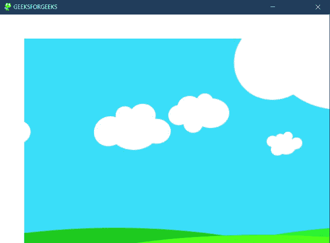

# Pygame–surface . blit()函数

> 原文:[https://www.geeksforgeeks.org/pygame-surface-blit-function/](https://www.geeksforgeeks.org/pygame-surface-blit-function/)

**surface.blit()** 函数将源曲面绘制到该曲面上。可以用 dest 参数定位绘图。dest 参数可以是表示 blit 左上角位置的一对坐标，也可以是 Rect，其中矩形的左上角将用作 blit 的位置。目标矩形的大小不影响 blit。

> **语法** : blit(源、目标、区域=无，特殊标志=0) - > Rect
> 
> **参数:**
> 
> *   源–将源曲面绘制到该曲面上
> *   dest–可以用 dest 参数定位抽签。
> *   区域-矩形也可以作为目的地传递，矩形的顶角将作为块传送的位置

## 蟒蛇 3

```py
# import pygame module
import  pygame

pygame.init()

# width
width = 680

# height
height = 480

#store he screen size
z = [width,height]

# store the color
white = (255, 255, 255)
screen_display = pygame.display

# Set caption of screen
screen_display.set_caption('GEEKSFORGEEKS')

# setting the size of the window
surface = screen_display.set_mode(z)

# set the image which to be displayed on screen
python = pygame.image.load('bg.jpg')

# set window true
window = True
while window:
    for event in pygame.event.get():
        if event.type == pygame.QUIT:
            window = False

            # display white on screen other than image
    surface.fill(white)

# draw on image onto another
    surface.blit(python,(50, 50))
    screen_display.update()

pygame.quit()
```

**输出:**

