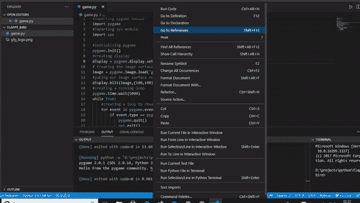
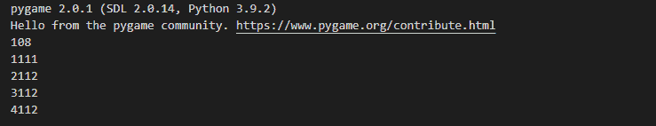
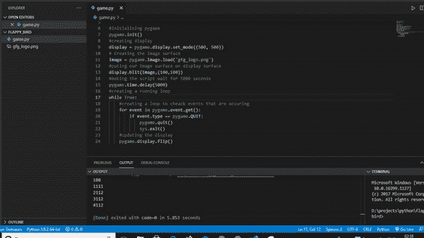
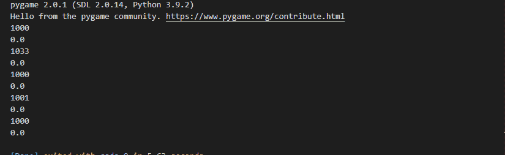

# 游戏–时间

> 原文:[https://www.geeksforgeeks.org/pygame-time/](https://www.geeksforgeeks.org/pygame-time/)

在使用 pygame 时，我们有时需要执行某些操作，包括时间的使用。比如找出我们的程序已经运行了多长时间，暂停程序一段时间，等等。对于这种操作，我们需要使用 pygame 的时间方法。在本文中，我们将讨论可用于执行这些操作的各种方法。

我们将讨论的功能是:-

*   **pygame.time.wait**
*   **pygame.time.get_ticks**
*   **pygame.time.delay**
*   **pygame.time.Clock**

## pygame.time .等等

该功能用于暂停程序运行几秒钟。它以毫秒为单位作为参数。例如，为了演示这个功能，我们将编写一个简单的程序，使 geeksforgeeks 徽标仅在 5 秒钟后出现在屏幕上。这方面的代码是:

## 计算机编程语言

```
# importing pygame module
import pygame

# importing sys module
import sys

# initialising pygame
pygame.init()

# creating display
display = pygame.display.set_mode((500, 500))

# Creating the image surface
image = pygame.image.load('gfg_logo.png')

# putting our image surface on display surface
display.blit(image,(100,100))

# making the script wait for 5000 seconds
pygame.time.wait(5000)

# creating a running loop
while True:

      # creating a loop to check events that are occurring
    for event in pygame.event.get():
        if event.type == pygame.QUIT:
            pygame.quit()
            sys.exit()
    # updating the display
    pygame.display.flip()
```

**输出:**



这样做的结果是，脚本将等待 5 秒钟，然后更新显示，以显示 geeksforgeeks 徽标。

它比 pygame.time.delay 稍差一些，我们将在本文后面讨论，因为它使用休眠，但另一个使用处理器。

## pygame.time.get_ticks

这个函数给出了以毫秒为单位运行的时间。例如，如果我们想编写一个简单的代码来演示这个例子，它可以是:

## 计算机编程语言

```
# importing pygame module
import pygame

# initialising pygame
pygame.init()

# creating a variable
i=0
while i<5:

    # storing the time in ticks variable
    ticks=pygame.time.get_ticks()

    # printing the variable ticks
    print(ticks)

    # increasing the value of i by 1
    i=i+1

    # pausing the script for 1 second
    pygame.time.wait(1000)
```

**输出:**



每次迭代都会打印时间，包括我们在每次迭代中暂停脚本的时间。

## pygame.time.delay

这个函数的工作原理与 pygame.time.wait 函数相同，不同的是这个函数将使用处理器(而不是休眠)来使延迟更精确。只需替换名称:
，就可以编写与 pygame.time.wait 函数相同的示例代码

## 计算机编程语言

```
# importing pygame module
import pygame

# importing sys module
import sys

# initialising pygame
pygame.init()

# creating display
display = pygame.display.set_mode((500, 500))

# Creating the image surface
image = pygame.image.load('gfg_logo.png')

# putting our image surface on display surface
display.blit(image,(100,100))

# making the script wait for 5000 seconds
pygame.time.delay(5000)

# creating a running loop
while True:

      # creating a loop to check events that are occurring
    for event in pygame.event.get():
        if event.type == pygame.QUIT:
            pygame.quit()
            sys.exit()
    # updating the display
    pygame.display.flip()
```

**输出:**



## 游戏。时间。时钟

该函数用于创建一个时钟对象，该对象可用于记录时间。时钟对象的各种方法如下:

> **tick()** :每帧应该调用一次这个方法。它将计算自上次调用以来已经过去了多少毫秒。如果您传递可选的帧速率参数，该函数将延迟，以保持游戏运行速度低于每秒给定的节拍。例如，如果我们将 10 作为参数，程序的运行速度将永远不会超过每秒 10 帧。
> 
> **get_time():** 用于获取两个 tick()之间使用的毫秒数。
> 
> **get_fps()** :给出关于时钟帧率的信息。它以浮点值返回输出。

演示该功能的简单程序可以是:

## 计算机编程语言

```
# importing the pygame module
import pygame

# initialising the pygame
pygame.init()

# declaring a variable i with value 0
i=0

# creating a clock object
clock=pygame.time.Clock()

# creating a loop for 5 iterations
while i<5:

    # setting fps of program to max 1 per second
    clock.tick(1)

    # printing time used in the previous tick
    print(clock.get_time())

    # printing compute the clock framerate
    print(clock.get_fps())
    i=i+1
```

**输出:**



由于我们在 tick 方法中传递了 1，因此它将最大 fps 设置为 1。这导致每帧之间的时间接近 1000 毫秒。