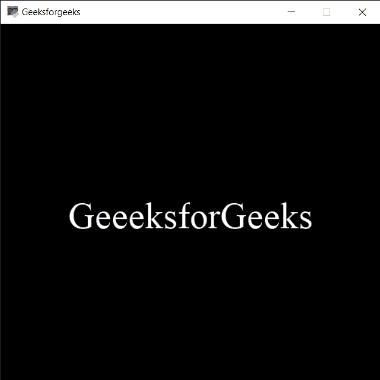

# PYGLET–激活窗口

> 原文:[https://www.geeksforgeeks.org/pyglet-activating-window/](https://www.geeksforgeeks.org/pyglet-activating-window/)

在本文中，我们将看到如何在 python 的 PYGLET 模块中激活一个窗口。Pyglet 是一个易于使用但功能强大的库，用于开发视觉上丰富的图形用户界面应用程序，如游戏、多媒体等。窗口是占用操作系统资源的“重量级”对象。窗口可能显示为浮动区域，或者可以设置为充满整个屏幕(全屏)。激活窗口意味着试图将键盘焦点恢复到窗口。根据窗口管理器或操作系统，这可能不会成功。例如，在 Windows XP 上，不允许一个应用程序从另一个应用程序“窃取”焦点。

我们可以在下面命令的帮助下创建一个窗口

```py
 pyglet.window.Window(width, height, title)

```

> 为了创建窗口，我们使用`activate`方法与窗口对象
> **语法:**窗口。激活()
> 
> **论证:**不需要论证
> 
> **返回:**返回无

下面是实现

```py
# importing pyglet module
import pyglet

# width of window
width = 500

# height of window
height = 500

# caption i.e title of the window
title = "Geeksforgeeks"

# creating a window
window = pyglet.window.Window(width, height, title)

# text 
text = "GeeksforGeeks"

# creating a label with font = times roman
# font size = 36
# aligning it to the centre
label = pyglet.text.Label(text,
                          font_name ='Times New Roman',
                          font_size = 36,
                          x = window.width//2, y = window.height//2,
                          anchor_x ='center', anchor_y ='center')

# drawing label
@window.event
def on_draw():
    window.clear()
    label.draw()

# try to restore keyboard focus to the window
window.activate()

# start running the application
pyglet.app.run()
```

**输出:**
