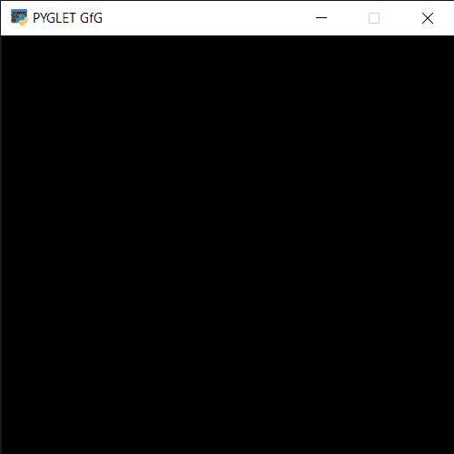

# PYGLET–创建窗口

> 原文:[https://www.geeksforgeeks.org/pyglet-creating-window/](https://www.geeksforgeeks.org/pyglet-creating-window/)

在本文中，我们将看到如何在 python 的 PYGLET 模块中创建一个窗口。Pyglet 是一个易于使用但功能强大的库，用于在 Windows、Mac OS 和 Linux 上开发视觉丰富的图形用户界面应用程序，如游戏、多媒体等。这个库完全是用 Python 创建的，它支持许多功能，如窗口、用户界面事件处理、操纵杆、OpenGL 图形、加载图像和视频以及播放声音和音乐。窗口是占用操作系统资源的“重量级”对象。窗口可能显示为浮动区域，或者可以设置为充满整个屏幕(全屏)。浮动时，窗口可能会显示为无边框或用特定于平台的框架装饰(例如，包括标题栏、最小化和关闭按钮、调整大小手柄等)。

> 为了创建窗口，我们使用 window 方法与 pyglet.window
> **语法:** pyglet.window.Window(宽度、高度、标题)
> **参数:**它接受可选参数，即窗口的宽度、高度和标题
> **返回:**它返回 pyglet . Window . win32 Window 对象

**注:**要么我们不提供参数，要么我们必须证明所有三个参数，否则错误将产生
**例:**

## 蟒蛇 3

```py
# importing pyglet module
from pyglet import *

# width of window
width = 400

# height of window
height = 400

# caption i.e title of the window
title = "PYGLET GfG"

# creating a window
win = window.Window(width, height, title)

# start running the application
app.run()
```

**输出:**



**另一个例子:**

## 蟒蛇 3

```py
# importing pyglet module
import pyglet

# width of window
width = 500

# height of window
height = 500

# caption i.e title of the window
title = "Geeksforgeeks"

# creating a window
window = pyglet.window.Window(width, height, title)

# creating alabel
label = pyglet.text.Label('GeeeksforGeeks',
                          font_name ='Times New Roman',
                          font_size = 36,
                          x = window.width//2, y = window.height//2,
                          anchor_x ='center', anchor_y ='center')

# drawing label
@window.event
def on_draw():
    window.clear()
    label.draw()

# start running the application
pyglet.app.run()
```

