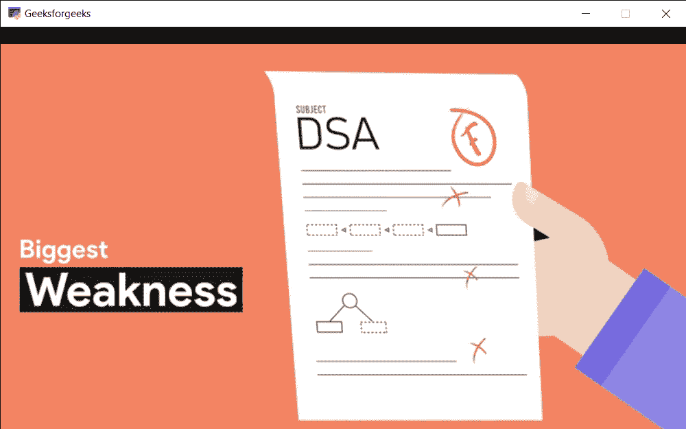

# PYGLET–玩家电流源耗尽事件

> 原文:[https://www . geesforgeks . org/pyglet-current-source-耗尽-玩家事件/](https://www.geeksforgeeks.org/pyglet-current-source-ran-out-event-of-player/)

在本文中，我们将看到如何在 python 中触发 PYGLET 模块的播放器的当前源耗尽事件。Pyglet 是一个易于使用但功能强大的库，用于开发视觉上丰富的图形用户界面应用程序，如游戏、多媒体等。窗口是占用操作系统资源的“重量级”对象。窗口可能显示为浮动区域，或者可以设置为充满整个屏幕(全屏)。该模块允许应用程序指定资源的搜索路径。Pyglet 可以播放 WAV 文件，如果安装了 FFmpeg，还可以播放许多其他音频和视频格式。播放由 Player 类处理，该类从 Source 对象读取原始数据，并提供暂停、查找、调整音量等方法。当前源用尽数据时，会触发此事件。如果循环属性设置为假，默认行为是前进到播放列表中的下一个源。如果循环属性设置为真，当前源将再次开始播放，直到调用 next_source()或循环设置为假。

我们可以借助下面给出的命令创建一个窗口和播放器对象

```py
# creating a window
window = pyglet.window.Window(width, height, title)

# creating a player for media
player = pyglet.media.Player()

```

下面是事件的语法

```py
# end of source event
@window.event
def on_eos():
    # printing some message
    print("Current Source ended")

```

下面是实现

```py
# importing pyglet module
import pyglet

# width of window 
width = 800

# height of window 
height = 500

# caption i.e title of the window 
title = "Geeksforgeeks"

# creating a window 
window = pyglet.window.Window(width, height, title) 

# creating a media player object
player = pyglet.media.Player()

# loading a new media
media = pyglet.media.load("media.mp4")

# video path
vidPath ="gfg.mp4"

# add this media in the queue
player.queue(media)

# creating a source object
source = pyglet.media.StreamingSource()

# load the media from the source
MediaLoad = pyglet.media.load(vidPath)

# add this media in the queue
player.queue(MediaLoad)

# play the video
player.play()

# on draw event
@window.event
def on_draw():

    # clea the window
    window.clear()

    # if player source exist
    # and video format exist
    if player.source and player.source.video_format:

        # get the texture of video and
        # make surface to display on the screen
        player.get_texture().blit(0, 0)

# key press event     
@window.event 
def on_key_press(symbol, modifier): 

    # key "p" get press 
    if symbol == pyglet.window.key.P: 

        # pause the video
        player.pause()

        # printing message
        print("Video is paused")

    # key "r" get press 
    if symbol == pyglet.window.key.R: 

        # resume the video
        player.play()

        # printing message
        print("Video is resumed")

# end of source event
@window.event
def on_eos():
    # printing some message
    print("Current Source ended")

# run the pyglet application
pyglet.app.run()

```

**输出:**
