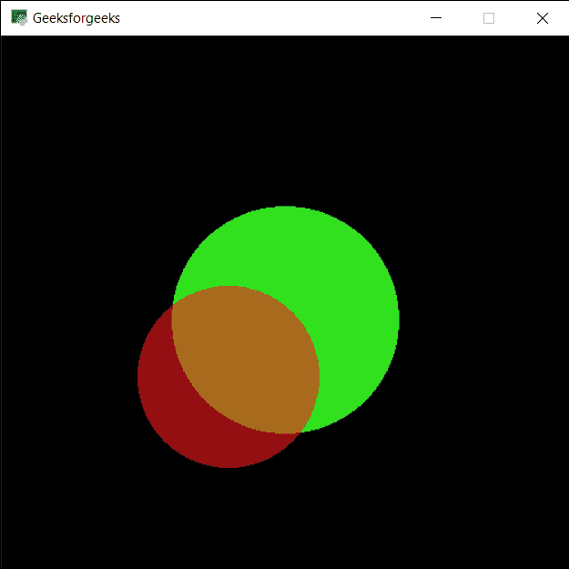

# PYGLET–画圆

> 原文:[https://www.geeksforgeeks.org/pyglet-drawing-circle/](https://www.geeksforgeeks.org/pyglet-drawing-circle/)

在本文中，我们将看到如何在 python 的 PYGLET 模块中在窗口上画圆。Pyglet 是一个易于使用但功能强大的库，用于开发视觉上丰富的图形用户界面应用程序，如游戏、多媒体等。窗口是占用操作系统资源的“重量级”对象。窗口可能显示为浮动区域，或者可以设置为充满整个屏幕(全屏)。圆是一种形状，由平面上距给定点(中心)给定距离的所有点组成；等效地，它是由在平面内移动的一个点描绘出来的曲线，因此它与给定点的距离是恒定的。圆是借助 pyglet 中的 shapes 模块绘制的。
我们可以借助下面给出的命令
创建一个窗口

```
# creating a window
window = pyglet.window.Window(width, height, title)
```

> 为了创建窗口，我们使用圆形方法与皮格莱特. shapes
> **语法:**形状。圆(x，y，大小，颜色)
> **参数:**取前两个整数即圆的位置，第三个整数为圆的大小，第四个是元组即圆的颜色作为参数
> **返回:**返回 Circle 对象

下面是实现

## 蟒蛇 3

```
# importing pyglet module
import pyglet

# importing shapes from the pyglet
from pyglet import shapes

# width of window
width = 500

# height of window
height = 500

# caption i.e title of the window
title = "Geeksforgeeks"

# creating a window
window = pyglet.window.Window(width, height, title)

# creating a batch object
batch = pyglet.graphics.Batch()

# properties of circle
# co-ordinates of circle
circle_x = 250
circle_y = 250

# size of circle
# color = green
size_circle = 100

# creating a circle
circle1 = shapes.Circle(circle_x, circle_y, size_circle, color =(50, 225, 30), batch = batch)

# changing opacity of the circle1
# opacity is visibility (0 = invisible, 255 means visible)
circle1.opacity = 250

# creating another circle with other properties
# new position = circle1_position - 50
# new size = previous radius -20
# new color = red
circle2 = shapes.Circle(circle_x-50, circle_y-50, size_circle-20, color =(250, 25, 30), batch = batch)

# changing opacity of the circle2
circle2.opacity = 150

# window draw event
@window.event
def on_draw():

    # clear the window
    window.clear()

    # draw the batch
    batch.draw()

# run the pyglet application
pyglet.app.run()
```

