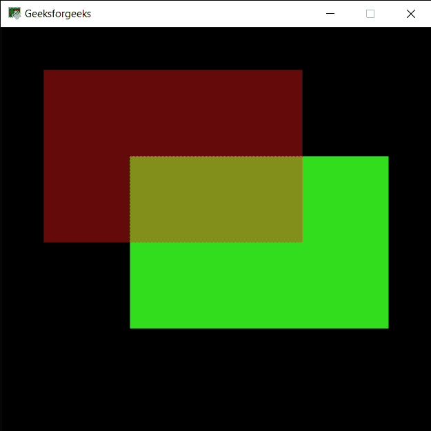

# PYGLET–绘制矩形

> 原文:[https://www.geeksforgeeks.org/pyglet-drawing-rectangle/](https://www.geeksforgeeks.org/pyglet-drawing-rectangle/)

在本文中，我们将看到如何在 python 的 PYGLET 模块中在窗口上绘制矩形。Pyglet 是一个易于使用但功能强大的库，用于开发视觉上丰富的图形用户界面应用程序，如游戏、多媒体等。窗口是占用操作系统资源的“重量级”对象。窗口可能显示为浮动区域，或者可以设置为充满整个屏幕(全屏)。矩形是一个四边形，每个角都是直角(90°)。相对的两边也是平行的，长度相等。矩形是借助 pyglet 中的 shapes 模块绘制的。
我们可以借助下面给出的命令
创建一个窗口

```
# creating a window
window = pyglet.window.Window(width, height, title)
```

> 为了创建窗口，我们使用矩形方法与 pyglet.shapes
> **语法:**形状。矩形(x，y，宽度，高度，颜色=(255，255，255)，批次=无)
> **参数:**取位置即矩形的整数对，宽度和高度，矩形的颜色，最后是批次对象
> **返回:**返回 Line 对象

下面是实现

## 蟒蛇 3

```
# importing pyglet module
import pyglet

# importing shapes from the pyglet
from pyglet import shapes

# width of window
width = 500

# height of window
height = 500

# caption i.e title of the window
title = "Geeksforgeeks"

# creating a window
window = pyglet.window.Window(width, height, title)

# creating a batch object
batch = pyglet.graphics.Batch()

# properties of rectangle
# co-ordinates of rectangle
co_x = 150
co_y = 150

# width of rectangle
width = 300

# height of rectangle
height = 200

# color = green
color = (50, 225, 30)

# creating a rectangle
rec1 = shapes.Rectangle(co_x, co_y, width, height, color = color, batch = batch)

# changing opacity of the rect1
# opacity is visibility (0 = invisible, 255 means visible)
rec1.opacity = 250

# creating another rectangle with properties
# x, y co ordinate : 50, 250
# width, height of rectangle : 300, 200
# color = red
color = (255, 25, 25)

# creating rectangle
rec2 = shapes.Rectangle(50, 250, 300, 200, color = color, batch = batch)

# changing opacity of the rec2
# opacity is visibility (0 = invisible, 255 means visible)
rec2.opacity = 100

# window draw event to draw rectangles
@window.event
def on_draw():

    # clear the window
    window.clear()

    # draw the batch
    batch.draw()

# run the pyglet application
pyglet.app.run()
```

