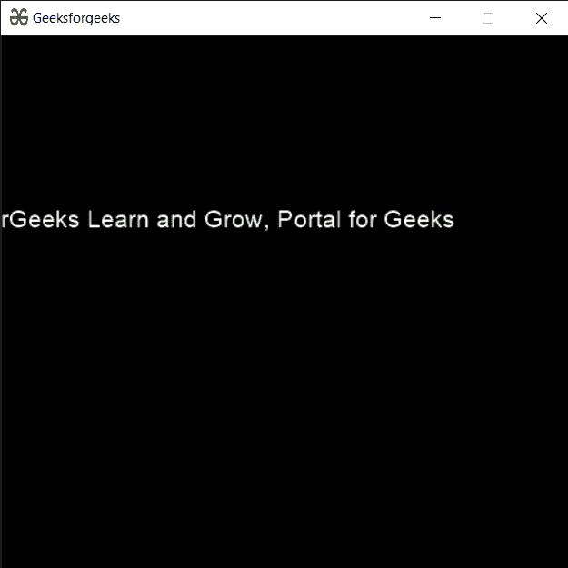

# PYGLET–确保 x 在增量文本布局中可见

> 原文:[https://www . geeksforgeeks . org/pyglet-确保-x-增量文本中可见-布局/](https://www.geeksforgeeks.org/pyglet-ensure-x-visible-in-incremental-text-layout/)

在本文中，我们将看到如何在 python 的 PYGLET 模块中确保视图-x (X-Coordinate)在增量文本布局对象中可见。Pyglet 是一个易于使用但功能强大的库，用于开发视觉上丰富的图形用户界面应用程序，如游戏、多媒体等。窗口是占用操作系统资源的“重量级”对象。窗口可能显示为浮动区域，或者可以设置为充满整个屏幕(全屏)。增量文本布局显示适合交互式编辑和/或滚动大文档的文本。与文本布局和滚动文本布局不同，这个类只为可见的文本行生成顶点列表。随着文档的滚动，视情况删除和创建顶点列表，以将视频内存使用降至最低并提高渲染速度。确保 X 可见调整 view_x，使给定的 X 坐标可见。X 坐标是相对于当前视图 X 给出的。
我们可以借助下面给出的命令
创建一个窗口和增量文本布局

```
# creating a window
window = pyglet.window.Window(width, height, title)

# creating a in
layout = pyglet.text.layout.IncrementalTextLayout(document, width, height)
```

> 为了创建窗口，我们使用了保证 _x_visible 方法
> **语法:**布局.保证 _x_visible(x)
> **参数:**它以整数作为参数
> **返回:**它返回 None

下面是实现

## 蟒蛇 3

```
# importing pyglet module
import pyglet
import pyglet.window.key

# width of window
width = 500

# height of window
height = 500

# caption i.e title of the window
title = "Geeksforgeeks"

# creating a window
window = pyglet.window.Window(width, height, title)

# text
text = "GeeksforGeeks Learn and Grow, Portal for Geeks"

# batch object
batch = pyglet.graphics.Batch()

# creating a formatted document
# unlike unformatted document it is formatted
document = pyglet.text.document.FormattedDocument(text)

# setting style to the document
document.set_style(0, len(document.text), dict(font_name ='Arial', font_size = 16, color =(255, 255, 255, 255)))

# creating a incremental text layout
layout = pyglet.text.layout.IncrementalTextLayout(document, 400, 350, batch = batch)

# creating a caret
caret = pyglet.text.caret.Caret(layout, color =(150, 255, 150))

# caret to window push handlers
window.push_handlers(caret)

# setting caret style
caret.set_style(dict(font_name ="Arial"))

# on draw event
@window.event
def on_draw():

    # clear the window
    window.clear()

    # draw the batch
    batch.draw()

    # caret to window push handlers
    window.push_handlers(caret)

# key press event   
@window.event
def on_key_press(symbol, modifier):

    # key "C" get press
    if symbol == pyglet.window.key.C:

        # closing the window
        # window.close()
        pass

# image for icon
img = pyglet.resource.image("gfg.png")

# setting image as icon
window.set_icon(img)

# ensuring x co-odinate is visible
layout.ensure_x_visible(600)

# start running the application
pyglet.app.run()
```

**输出:**

