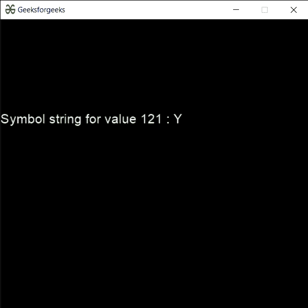

# PYGLET–按键符号串

> 原文:[https://www.geeksforgeeks.org/pyglet-key-symbol-string/](https://www.geeksforgeeks.org/pyglet-key-symbol-string/)

在本文中，我们将看到如何获得 python 中 PYGLET 模块中的修改符的关键符号字符串。Pyglet 易于使用，但功能强大的库，用于开发视觉丰富的 GUI 应用程序，如游戏、多媒体等。窗口是占用操作系统资源的“重量级”对象。Windows 可能显示为浮动区域，或者可以设置为填充整个屏幕(全屏幕)。密钥状态处理程序类是一个简单的处理程序，用于跟踪键盘上密钥的状态。如果按下某个键，则此处理程序为其保留 True 值。符号串是 pyglet 模块可识别的密钥符号。
我们可以借助下面给出的命令
创建一个窗口

```
# creating a window
window = pyglet.window.Window(width, height, title)
```

> 为了创建窗口，我们将 symbol_string 方法用于 pyglet.window.key
> **语法:**key . symbol _ string(symbol)
> **参数:**它以整数作为参数
> **返回:**它返回字符串

下面是实现

## 蟒蛇 3

```
# importing pyglet module
import pyglet
import pyglet.window.key as key

# width of window
width = 500

# height of window
height = 500

# caption i.e title of the window
title = "Geeksforgeeks"

# creating a window
window = pyglet.window.Window(width, height, title)

# text 
text = "Welcome to GeeksforGeeks Have a nice day"

# batch object
batch = pyglet.graphics.Batch()

# creating document
document = pyglet.text.document.FormattedDocument(text)

# setting style to the document
document.set_style(0, len(document.text), dict(
                         font_name ='Arial', font_size = 16, 
                         color =(255, 255, 255, 255)))

# creating a incremental text layout
layout = pyglet.text.layout.IncrementalTextLayout(
               document, 400, 350, batch = batch)

# making layout to display multiline
layout.multiline = True

# creating a caret
caret = pyglet.text.caret.Caret(layout, color =(255, 255, 255))

# caret to window push handlers
window.push_handlers(caret)

# setting caret style
caret.set_style(dict(font_name ="Arial"))

# on draw event
@window.event
def on_draw():

    # clear the window
    window.clear()

    # draw the batch
    batch.draw()

    # caret to window push handlers
    window.push_handlers(caret)

# creating a key state handler
key_handler = pyglet.window.key.KeyStateHandler()

# key press event    
@window.event
def on_key_press(symbol, modifier):

    # key "C" get press
    if symbol == key.C:

        # printing the message
        print("Key : C is pressed")

# image for icon
img = image = pyglet.resource.image("gfg.png")

# getting symbol string
value = key.symbol_string(121)

# creating text from the value
text = "Symbol string for value 121 : " + str(value)

# setting this text to the document
document.text = text

# setting image as icon
window.set_icon(img)

# start running the application
pyglet.app.run()
```

**输出:**

