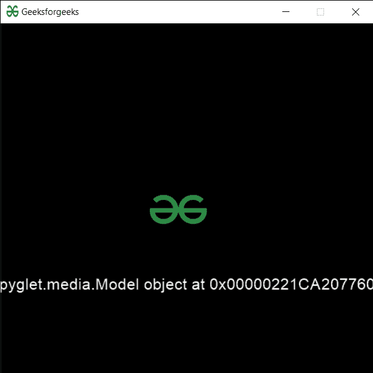

# PYGLET–加载三维模型

> 原文:[https://www.geeksforgeeks.org/pyglet-loading-3-d-model/](https://www.geeksforgeeks.org/pyglet-loading-3-d-model/)

在本文中，我们将看到如何在 python 的 PYGLET 模块中加载三维模型。Pyglet 是一个易于使用但功能强大的库，用于开发视觉丰富的图形用户界面应用程序，如游戏、多媒体等。窗口是占用操作系统资源的“重量级”对象。窗口可能显示为浮动区域，或者可以设置为充满整个屏幕(全屏)。为了加载一个文件即资源，我们使用 pyglet 的资源模块。该模块允许应用程序指定资源的搜索路径。相对路径被认为是相对于应用程序的 __main__ 模块的。3D 文件格式用于存储关于 3D 模型的信息。你可能听说过最流行的 STL 格式，OBJ，FBX，COLLADA 等。它们广泛应用于 3D 打印、视频游戏、电影、建筑、学术、医学、工程和地球科学。

我们可以借助下面给出的命令创建一个窗口对象

```
# creating a window
window = pyglet.window.Window(width, height, title)
```

> 为此，我们将 model 方法与 pyglet.resource
> **一起使用语法:**resource . model(file _ name)
> **参数:**它将字符串即文件名作为参数
> **返回:**它返回 Model 对象

下面是实现

## 蟒蛇 3

```
# importing pyglet module
import pyglet
import pyglet.window.key as key

# width of window
width = 500

# height of window
height = 500

# caption i.e title of the window
title = "Geeksforgeeks"

# creating a window
window = pyglet.window.Window(width, height, title)

# text 
text = "Welcome to GeeksforGeeks"

# creating label with following properties
# font = cooper
# position = 250, 150
# anchor position = center
label = pyglet.text.Label(text,
                          font_name ='Cooper',
                          font_size = 16,
                          x = 250, 
                          y = 150,
                          anchor_x ='center', 
                          anchor_y ='center')

# creating a batch
batch = pyglet.graphics.Batch()

# loading geeksforgeeks image
image = pyglet.image.load('gfg.png')

# creating sprite object
# it is instance of an image displayed on-screen
sprite = pyglet.sprite.Sprite(image, x = 200, y = 230)

# on draw event
@window.event
def on_draw():

    # clear the window
    window.clear()

    # draw the label
    label.draw()

    # draw the image on screen
    sprite.draw()

# key press event    
@window.event
def on_key_press(symbol, modifier):

    # key "C" get press
    if symbol == key.C:

        # printing the message
        print("Key : C is pressed")

# image for icon
img = image = pyglet.resource.image("gfg.png")

# setting image as icon
window.set_icon(img)

# loading3-model file
value = pyglet.resource.model("model.stl")

# setting text  of label
label.text = str(value)

# start running the application
pyglet.app.run()
```

**输出:**

