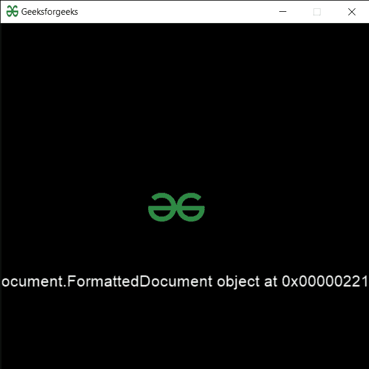

# PYGLET–加载 HTML 文档

> 原文:[https://www.geeksforgeeks.org/pyglet-loading-html-document/](https://www.geeksforgeeks.org/pyglet-loading-html-document/)

在本文中，我们将看到如何在 python 的 PYGLET 模块中加载一个 html 文档。Pyglet 是一个易于使用但功能强大的库，用于开发视觉上丰富的图形用户界面应用程序，如游戏、多媒体等。窗口是占用操作系统资源的“重量级”对象。窗口可能显示为浮动区域，或者可以设置为充满整个屏幕(全屏)。为了加载一个文件即资源，我们使用 pyglet 的资源模块。该模块允许应用程序指定资源的搜索路径。相对路径被认为是相对于应用程序的 __main__ 模块的。一个 HTML 文档是一个包含超文本标记语言的文件，它的文件名通常以。html 扩展。超文本标记语言文档是由网络浏览器读入并呈现在屏幕上的文本文档。

我们可以借助下面给出的命令创建一个窗口对象

```py
# creating a window
window = pyglet.window.Window(width, height, title)
```

> 为此，我们将 html 方法与 pyglet.resource
> **一起使用语法:**resource . html(file _ name)
> **参数:**它以字符串即文件名作为参数
> **返回:**它返回 formateddocument

下面是实现

## 蟒蛇 3

```py
# importing pyglet module
import pyglet
import pyglet.window.key as key

# width of window
width = 500

# height of window
height = 500

# caption i.e title of the window
title = "Geeksforgeeks"

# creating a window
window = pyglet.window.Window(width, height, title)

# text 
text = "Welcome to GeeksforGeeks"

# creating label with following properties
# font = cooper
# position = 250, 150
# anchor position = center
label = pyglet.text.Label(text,
                          font_name ='Cooper',
                          font_size = 16,
                          x = 250, 
                          y = 150,
                          anchor_x ='center', 
                          anchor_y ='center')

# creating a batch
batch = pyglet.graphics.Batch()

# loading geeksforgeeks image
image = pyglet.image.load('gfg.png')

# creating sprite object
# it is instance of an image displayed on-screen
sprite = pyglet.sprite.Sprite(image, x = 200, y = 230)

# on draw event
@window.event
def on_draw():

    # clear the window
    window.clear()

    # draw the label
    label.draw()

    # draw the image on screen
    sprite.draw()

# key press event    
@window.event
def on_key_press(symbol, modifier):

    # key "C" get press
    if symbol == key.C:

        # printing the message
        print("Key : C is pressed")

# image for icon
img = image = pyglet.resource.image("gfg.png")

# setting image as icon
window.set_icon(img)

# loading html file
value = pyglet.resource.html("geeks.html")

# setting text  of label
label.text = str(value)

# start running the application
pyglet.app.run()
```

**输出:**

