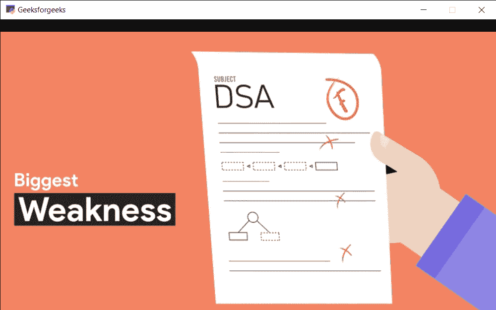

# PYGLET–在播放器中播放下一个媒体

> 原文:[https://www . geesforgeks . org/pyglet-play-next-media-in-player/](https://www.geeksforgeeks.org/pyglet-play-next-media-in-player/)

在本文中，我们将看到如何播放 python 中 PYGLET 模块播放器队列中的下一个媒体。Pyglet 是一个易于使用但功能强大的库，用于开发视觉上丰富的图形用户界面应用程序，如游戏、多媒体等。窗口是占用操作系统资源的“重量级”对象。窗口可能显示为浮动区域，或者可以设置为充满整个屏幕(全屏)。该模块允许应用程序指定资源的搜索路径。Pyglet 可以播放 WAV 文件，如果安装了 FFmpeg，还可以播放许多其他音频和视频格式。播放由 Player 类处理，该类从 Source 对象读取原始数据，并提供暂停、查找、调整音量等方法。下一个媒体会将播放器立即移动到当前播放列表中的下一个源。如果播放列表为空，则将其丢弃，并检查是否有另一个播放列表在排队。重新填充音频缓冲区时，播放可能会有间隙。
我们可以借助下面给出的命令
来创建一个窗口和玩家对象

```py
# creating a window
window = pyglet.window.Window(width, height, title)

# creating a player for media
player = pyglet.media.Player()
```

> 为此，我们对玩家对象使用 next_source play 方法
> **语法:** player.next_source()
> **参数:**不需要参数
> **返回:**返回 None

下面是实现

## 蟒蛇 3

```py
# importing pyglet module
import pyglet

# width of window
width = 800

# height of window
height = 500

# caption i.e title of the window
title = "Geeksforgeeks"

# creating a window
window = pyglet.window.Window(width, height, title)

# video path
vidPath ="gfg.mp4"

# creating a media player object
player = pyglet.media.Player()

# creating a source object
source = pyglet.media.StreamingSource()

# load the media from the source
MediaLoad = pyglet.media.load(vidPath)

# add this media in the queue
player.queue(MediaLoad)

# loading a new media
media = pyglet.media.load("media.mp4")

# add this media in the queue
player.queue(media)

# play the video
player.play()

# on draw event
@window.event
def on_draw():

    # clea the window
    window.clear()

    # if player source exist
    # and video format exist
    if player.source and player.source.video_format:

        # get the texture of video and
        # make surface to display on the screen
        player.get_texture().blit(0, 0)

# key press event    
@window.event
def on_key_press(symbol, modifier):

    # key "p" get press
    if symbol == pyglet.window.key.P:

        # pause the video
        player.pause()

        # printing message
        print("Video is paused")

    # key "r" get press
    if symbol == pyglet.window.key.R:

        # resume the video
        player.play()

        # printing message
        print("Video is resumed")

# play the next source
player.next_source()

# run the pyglet application
pyglet.app.run()
```

**输出:**

