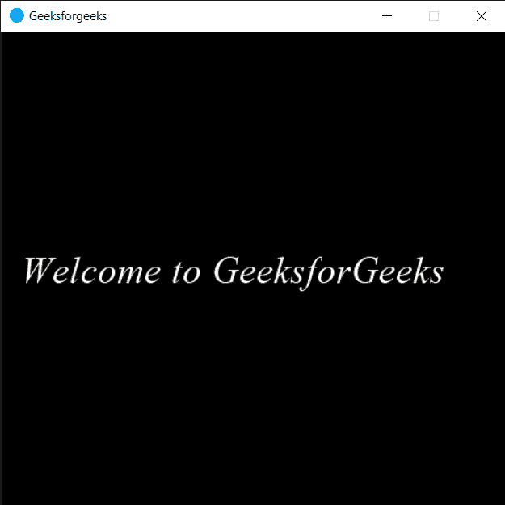

# PYGLET–设置标签样式

> 原文:[https://www.geeksforgeeks.org/pyglet-setting-label-style/](https://www.geeksforgeeks.org/pyglet-setting-label-style/)

在本文中，我们将看到如何在 python 的 PYGLET 模块中设置标签样式。Pyglet 是一个易于使用但功能强大的库，用于开发视觉上丰富的图形用户界面应用程序，如游戏、多媒体等。窗口是占用操作系统资源的“重量级”对象。窗口可能显示为浮动区域，或者可以设置为充满整个屏幕(全屏)。为了显示文本或消息，我们使用 html 标签对象。标签是在窗体上显示文本的图形控件元素。它通常是静态控件；没有交互性。标签通常用于标识附近的文本框或其他小部件。标签样式是标签文本的特定属性，如粗体、斜体等。

我们可以在下面给出的命令的帮助下创建一个窗口和标签

```py
# creating window
window = pyglet.window.Window(width, height, title)

# creating a label
label = pyglet.text.Label(text, font_name, font_size, x, y)

```

> 为了创建窗口，我们对标签对象使用`set_style`方法
> 
> **语法:** label.set_style(名称，值)
> 
> **参数:**它以字符串和根据样式的特定值作为参数
> 
> **返回:**返回无

下面是实现

```py
# importing pyglet module
import pyglet
import pyglet.window.key

# width of window
width = 500

# height of window
height = 500

# caption i.e title of the window
title = "Geeksforgeeks"

# creating a window
window = pyglet.window.Window(width, height, title)

# text 
text = "Welcome to GeeksforGeeks"

# creating a label with font = times roman
# font size = 36
# aligning it to the centre
label = pyglet.text.Label(text,
                          font_name ='Times New Roman',
                          font_size = 28,
                          x = 20, y = window.height//2, )

# setting style to the label
label.set_style("italic", True)

# on draw event
@window.event
def on_draw():    

    # clearing the window
    window.clear()

    # drawing the label on the window
    label.draw()

# key press event    
@window.event
def on_key_press(symbol, modifier):

    # key "C" get press
    if symbol == pyglet.window.key.C:

        # closing the window
        window.close()

# image for icon
img = image = pyglet.resource.image("logo.png")

# setting image as icon
window.set_icon(img)

# start running the application
pyglet.app.run()
```

**输出:**
