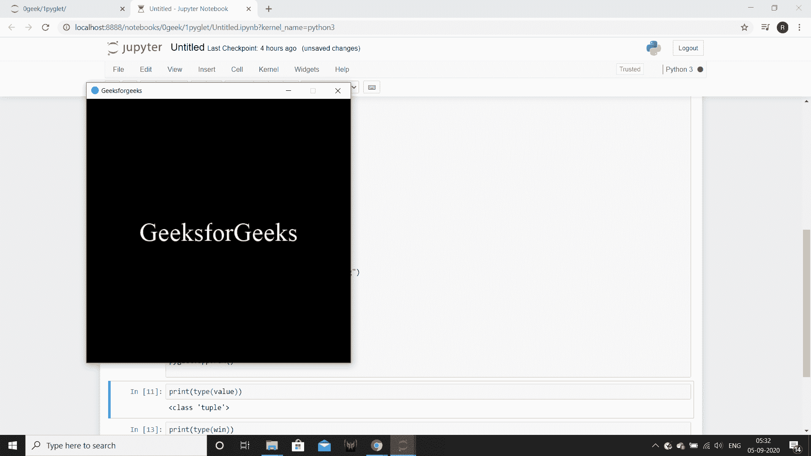

# PYGLET–设置最小窗口尺寸

> 原文:[https://www . geeksforgeeks . org/pyglet-setting-minimum-window-size/](https://www.geeksforgeeks.org/pyglet-setting-minimum-window-size/)

在本文中，我们将看到如何在 python 的 PYGLET 模块中设置最小窗口大小。Pyglet 是一个易于使用但功能强大的库，用于开发视觉上丰富的图形用户界面应用程序，如游戏、多媒体等。窗口是占用操作系统资源的“重量级”对象。窗口可能显示为浮动区域，或者可以设置为充满整个屏幕(全屏)。一旦设置了最小尺寸，用户将无法将窗口调整为小于给定尺寸。没有办法删除窗口的最小大小限制(但是可以将其设置为 0，0)。如果最小大小设置为大于窗口的当前大小，则行为未定义。

我们可以在下面命令的帮助下创建一个窗口

```
 pyglet.window.Window(width, height, title)

```

> 为了创建窗口，我们对窗口对象使用`set_minimum_size`方法
> 
> **语法:**窗口. set_minimum_size(宽度，高度)
> 
> **自变量:**取两个整数作为自变量
> 
> **返回:**返回无

下面是实现

```
# importing pyglet module
import pyglet
import pyglet.window.key

# width of window
width = 500

# height of window
height = 500

# caption i.e title of the window
title = "Geeksforgeeks"

# creating a window
window = pyglet.window.Window(width, height, title)

# text 
text = "GeeksforGeeks"

# creating a label with font = times roman
# font size = 36
# aligning it to the centre
label = pyglet.text.Label(text,
                          font_name ='Times New Roman',
                          font_size = 36,
                          x = window.width//2, y = window.height//2,
                          anchor_x ='center', anchor_y ='center')

# on draw event
@window.event
def on_draw():

    # clearing the window
    window.clear()

    # drawing the label on the window
    label.draw()

# key press event    
@window.event
def on_key_press(symbol, modifier):

    # key "C" get press
    if symbol == pyglet.window.key.C:

        # close the window
        window.close()

# image for icon
img = image = pyglet.resource.image("logo.png")

# setting image as icon
window.set_icon(img)

# setting minimum size of the window
window.set_minimum_size(500, 500)

# start running the application
pyglet.app.run()
```

**输出:**
