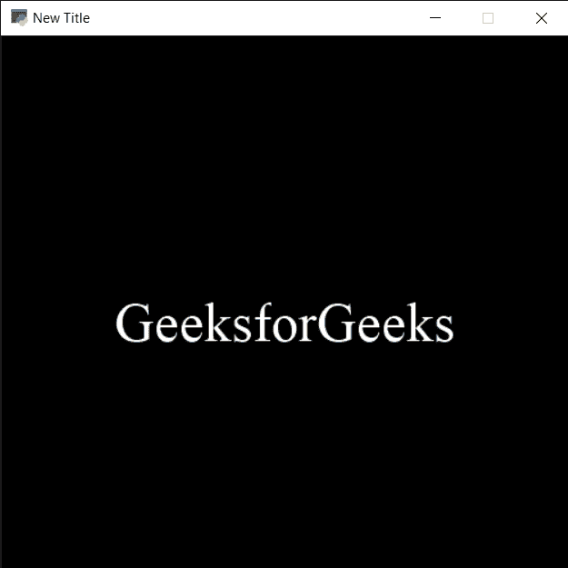

# PYGLET–设置窗口标题

> 原文:[https://www . geesforgeks . org/pyglet-setting-window-caption/](https://www.geeksforgeeks.org/pyglet-setting-window-caption/)

在本文中，我们将看到如何在 python 的 PYGLET 模块中设置或更改窗口标题。Pyglet 是一个易于使用但功能强大的库，用于开发视觉上丰富的图形用户界面应用程序，如游戏、多媒体等。窗口是占用操作系统资源的“重量级”对象。窗口可能显示为浮动区域，或者可以设置为充满整个屏幕(全屏)。窗口标题基本上是窗口的标题，我们可以在创建窗口时设置标题虽然我们可以随时更改标题，但这个标题会出现在窗口的任务栏中。

我们可以在下面命令的帮助下创建一个窗口

```
 pyglet.window.Window(width, height, title)

```

> 为了创建窗口，我们对窗口对象使用`set_caption`方法
> 
> **语法:** window.set_caption(标题)
> 
> **自变量:**以字符串为自变量
> 
> **返回:**返回无

下面是实现

```
# importing pyglet module
import pyglet
import pyglet.window.key

# width of window
width = 500

# height of window
height = 500

# caption i.e title of the window
title = "Geeksforgeeks"

# creating a window
window = pyglet.window.Window(width, height, title)

# text 
text = "GeeksforGeeks"

# creating a label with font = times roman
# font size = 36
# aligning it to the centre
label = pyglet.text.Label(text,
                          font_name ='Times New Roman',
                          font_size = 36,
                          x = window.width//2, y = window.height//2,
                          anchor_x ='center', anchor_y ='center')

# on draw event
@window.event
def on_draw():

    # clearing the window
    window.clear()

    # drawing the label on the window
    label.draw()

# key press event    
@window.event
def on_key_press(symbol, modifier):

    # key "C" get press
    if symbol == pyglet.window.key.C:

        # close the window
        window.close()

# title / caption
title = "New Title"

# setting title of the window
window.set_caption(title)

# start running the application
pyglet.app.run()
```

**输出:**
