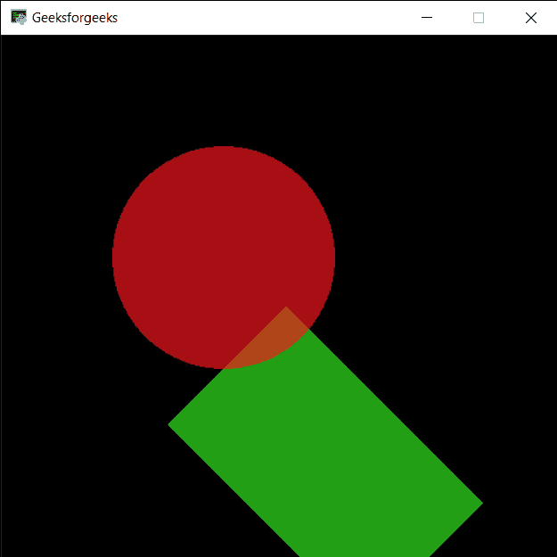

# PYGLET–形状旋转

> 原文:[https://www.geeksforgeeks.org/pyglet-shape-rotation/](https://www.geeksforgeeks.org/pyglet-shape-rotation/)

在本文中，我们将看到如何在 python 的 PYGLET 模块中访问形状的旋转。Pyglet 是一个易于使用但功能强大的库，用于开发视觉上丰富的图形用户界面应用程序，如游戏、多媒体等。窗口是占用操作系统资源的“重量级”对象。窗口可能显示为浮动区域，或者可以设置为充满整个屏幕(全屏)。形状是对象或其外部边界、轮廓或外部表面的形式，与颜色、纹理或材质类型等其他属性相反。许多形状都是借助 pyglet 的形状模块绘制的。旋转是物体围绕旋转中心的圆周运动。三维物体总是可以绕着无限多条被称为旋转轴的假想线旋转。如果轴穿过物体的质心，则称物体自行旋转或自转。
我们可以借助下面给出的命令
创建一个窗口

```py
# creating a window
window = pyglet.window.Window(width, height, title)
```

> 为了创建窗口，我们将旋转属性用于形状
> **语法:**形状.旋转
> **参数:**它不需要参数
> **返回:**它返回 int 或 float

**注意:**形状像圆形没有旋转属性
下面是实现

## 蟒蛇 3

```py
# importing pyglet module
import pyglet

# importing shapes from the pyglet
from pyglet import shapes

# width of window
width = 500

# height of window
height = 500

# caption i.e title of the window
title = "Geeksforgeeks"

# creating a window
window = pyglet.window.Window(width, height, title)

# creating a batch object
batch = pyglet.graphics.Batch()

# properties of rectangle
# co-ordinates of rectangle
co_x = 150
co_y = 150

# width of rectangle
width = 250

# height of rectangle
height = 150

# color = green
color = (50, 225, 30)

# creating a rectangle
rec = shapes.Rectangle(co_x, co_y, width, height, color = color, batch = batch)

# changing opacity of the rect1
# opacity is visibility (0 = invisible, 255 means visible)
rec.opacity = 180

# creating another rectangle with properties
# x, y co ordinate : 50, 250
# width, height of rectangle : 300, 200
# color = red
color = (255, 25, 25)

# properties of circle
# co-ordinates of circle
circle_x = 200
circle_y = 300

# size of circle
# color = green
size_circle = 100

# creating a circle
circle = shapes.Circle(circle_x, circle_y, size_circle, color =(250, 22, 30), batch = batch)

# changing opacity of the circle1
# opacity is visibility (0 = invisible, 255 means visible)
circle.opacity = 170

# window draw event
@window.event
def on_draw():

    # clear the window
    window.clear()

    # draw the batch
    batch.draw()

# rotating the rectangle
rec.rotation = 45

# run the pyglet application
pyglet.app.run()
```

**输出:**

